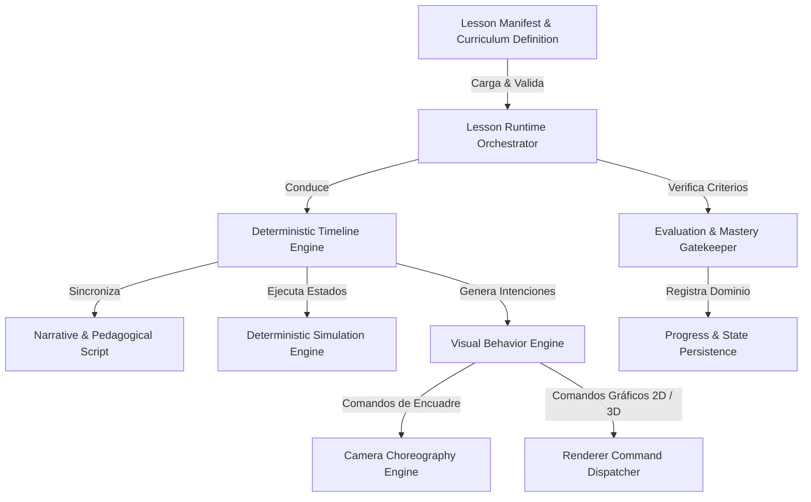
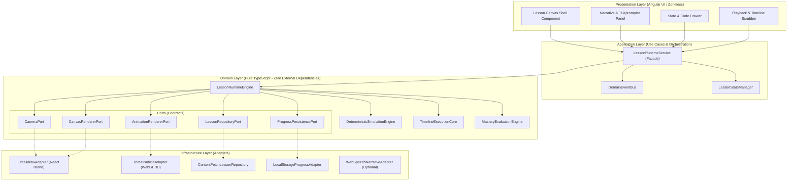
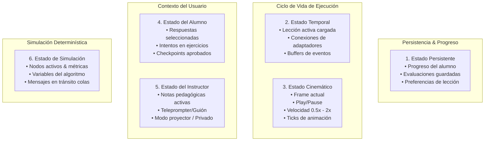
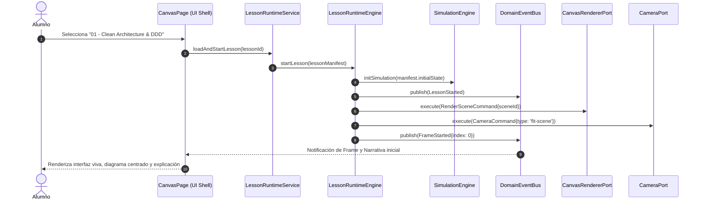
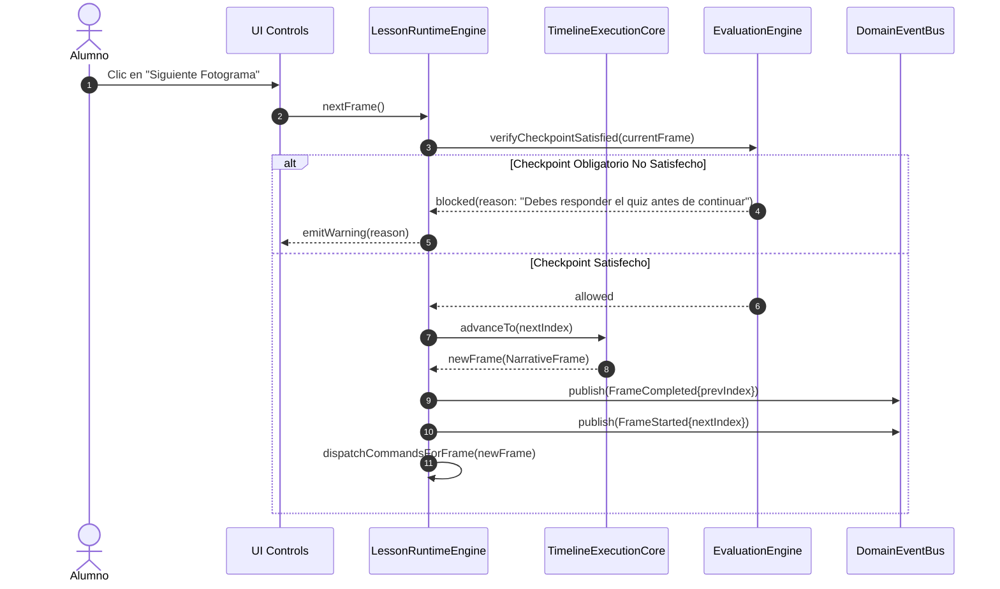
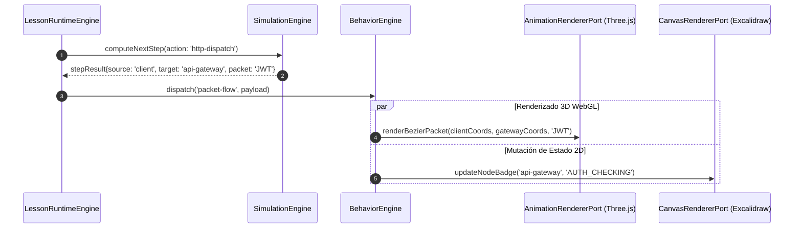
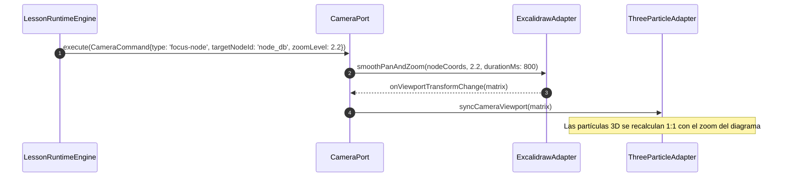
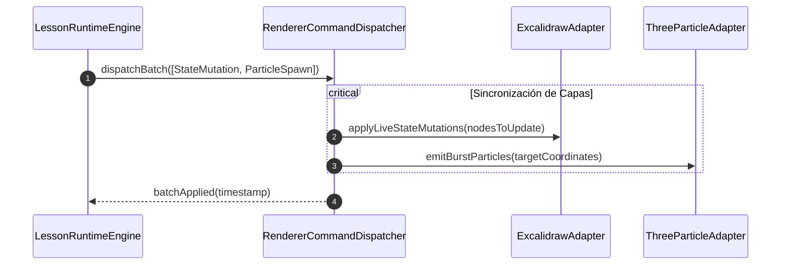
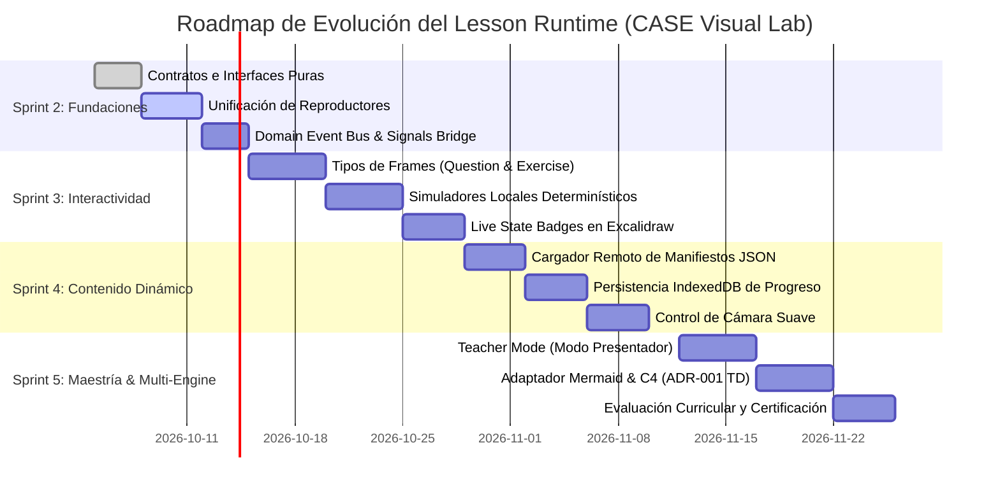

# ADR 003: Lesson Runtime Architecture — Motor de Ejecución Pedagógica y Simulación Determinística

- **Estado:** Propuesto / Aceptado
- **Fecha:** 2026-10-05
- **Sprint:** Sprint 2 — Fundaciones del Runtime Pedagógico
- **Autores / Decisores:** Principal Software Architect, Software Architect, Staff Frontend Engineer, Product Architect, Engineering Manager
- **Contexto:** Evolución de CASE Visual Lab desde un visor/editor de diagramas hacia un motor de ejecución de lecciones interactivas, offline-first y determinísticas para ingeniería de software y sistemas distribuidos.

---

## 1. Contexto y Declaración del Problema

CASE Visual Lab nació como un entorno visual para diagramar arquitecturas dentro del ecosistema CASE OS. Sin embargo, su propósito estratégico de largo plazo no es competir con herramientas de dibujo vectorial libre (Excalidraw, Draw.io, Miro), sino **reemplazar la suite fragmentada de diapositivas, PDFs, diagramas estáticos y vídeos lineales utilizada en la formación de ingenieros de software de élite**:

$$\text{PowerPoint} + \text{PDF} + \text{Draw.io} + \text{Videos} + \text{GIFs} + \text{Código} \quad \Longrightarrow \quad \text{\textbf{CASE Visual Lab (Lesson Runtime)}}$$

El laboratorio debe ser el motor de ejecución para impartir lecciones de alta complejidad técnica:
- **Arquitectura & Diseño:** Clean Architecture, Hexagonal, DDD (Aggregates, Domain Events, Bounded Contexts).
- **Inteligencia Artificial Moderna & Agentes:** RAG Pipelines, Vector Databases (HNSW, Cosine Similarity), Embeddings, Agent Loops (ReAct, Plan-and-Solve), Tool Calling (MCP - Model Context Protocol), Streaming Tokens.
- **Redes & Protocolos:** HTTP/1.1 vs HTTP/2 vs HTTP/3, TLS Handshake, TCP 3-Way Handshake, WebSockets, gRPC.
- **Infraestructura & Sistemas Distribuidos:** Kubernetes (Pods, Services, Ingress, ReplicaSets, Failover), Service Meshes, CI/CD Pipelines, Event-Driven Architectures (Kafka/RabbitMQ), Patrones de Resiliencia (Circuit Breaker, Rate Limiting, Retry con Backoff).

### Principio Innegociable: 100% Offline-First y Determinismo Estricto
Las lecciones deben poder impartirse en auditorios sin internet, en vuelos o en entornos corporativos restringidos. **Cero dependencia en runtime de APIs externas de OpenAI, Anthropic, Gemini o servidores de terceros**.
Toda simulación (búsqueda vectorial, inferencia de agentes, caída de pods de Kubernetes o ruteo HTTP) debe operar localmente como una **máquina de estados finitos determinística**. Dada la misma semilla ($seed$) y el mismo paso ($frame$), el estado visual y pedagógico es exactamente idéntico.

---

## 2. Discovery: Auditoría de la Arquitectura Actual

Antes de diseñar el nuevo motor, se auditó rigurosamente la base de código y la documentación existente ([ADR-001](001-canvas-renderer-adapter.md), [ADR-002](002-cinematic-learning-engine.md), `architecture.md`, `sprint-1-living-canvas.md`, y el código en `src/app/`).

### 2.1 Matriz de Responsabilidades Actuales vs. Estado Ideal

| Módulo Actual | Responsabilidad Actual | Lo que NO debería hacer | Diagnóstico de Brecha Arquitectónica |
| :--- | :--- | :--- | :--- |
| **`CanvasPage` (Feature Component)** | Orquestador de facto de la aplicación: inicializa Excalidraw, monta Three.js, mapea coordenadas, orquesta el timeline, invoca `zoomToFit` con `setTimeout`, maneja playgrounds y quizzes. | No debe orquestar el ciclo de vida de la lección, ni sincronizar renderers, ni gestionar timeouts de proyección de cámara. | **Antipatrón God Component.** Debe ser únicamente un contenedor de presentación que delega el 100% de la orquestación al `LessonRuntime`. |
| **`LessonRuntimeService` (Application)** | Estructura mínima que guarda un índice de paso, carga JSON vía `fetch` directo, gestiona un quiz simple y marcas de checkpoints. | No debe limitarse a ser un paginador pasivo de pasos; no debe hacer `fetch` HTTP acoplado sin un puerto de infraestructura. | **Incompleto.** Carece de control sobre la cámara, la narrativa, la simulación determinística y el despacho de comportamientos visuales. |
| **`CinematicEngineService` (Application)** | Servicio de reproducción de frames cinemáticos con mutaciones de estado en vivo, velocidad y timer de auto-avance. | No debe estar divorciado del `LessonRuntimeService`. Actualmente existen dos reproductores temporales desconectados. | **Fragmentación temporal.** Coexiste con `TimelinePlayerService` de forma redundante. Deben fusionarse bajo el pipeline unificado de ejecución. |
| **`TimelinePlayerService` (Application - Sprint 1)** | Reproductor temporal de partículas Three.js con coordenadas cartesianas y ticks de animación. | No debe duplicar la lógica de playback ni imponer un modelo de partículas aislado de los behaviors semánticos. | **Deuda Técnica de Sprint 1.** Debe subsumirse dentro del nuevo motor cinemático y de behaviors. |
| **`SceneManagerService` (Application)** | CRUD de escenas vectoriales, autoguardado en LocalStorage y versionado de esquemas. | No debe mezclar el documento editable por el usuario con el estado inmutable de una lección curricular. | **Acoplamiento de persistencia.** Debe distinguir entre borradores locales del usuario y estados de lección. |
| **`CanvasRendererPort` & Adapters** | Contrato y adaptadores para renderizar el diagrama 2D (Excalidraw, futuro Mermaid/C4). | No debe saber qué es un paso de lección ni interpretar preguntas pedagógicas. | **Correctamente desacoplado (ADR-001).** Solo requiere comandos de proyección y mutación visual limpia. |
| **`AnimationRendererPort` & Adapters** | Contrato y adaptador Three.js para partículas WebGL y ondas en nodos. | No debe gestionar reglas de negocio ni lógica temporal. | **Correctamente desacoplado.** Requiere una interfaz de comandos de animación normalizados. |

### 2.2 Piezas Faltantes en el Sistema Actual
1. **Lesson Runtime Central:** Un orquestador central de dominio capaz de coordinar la lección completa a través de un flujo unidireccional estricto.
2. **Sistema de Comandos Declarativos (`LessonCommand`):** Desacoplamiento entre la decisión pedagógica y la ejecución visual (`CameraCommand`, `BehaviorCommand`, `RendererCommand`, `SimulationCommand`).
3. **Jerarquía Tipada de Frames:** Diferenciación entre frames narrativos, evaluativos (quizzes), interactivos (ejercicios donde el alumno modifica el canvas) y de simulación determinística (máquinas de estado locales).
4. **Motor de Simulación Determinística Local:** Un simulador puramente local que ejecute paso a paso algoritmos de redes, RAG, agent loop y Kubernetes sin servicios en la nube.
5. **Bus de Eventos de Dominio:** Mecanismo desacoplado para reportar hitos del aprendizaje (`LessonStarted`, `CheckpointReached`, etc.) a telemetría, evaluación y UI sin acoplamiento circular.
6. **Taxonomía de Estado Formal:** Fronteras explícitas entre estado persistente, temporal, cinemático, del alumno, del instructor y de simulación.

---

## 3. Arquitectura Propuesta: El Orquestador Lesson Runtime

El nuevo componente central es el **Lesson Runtime**. Pertenece a la capa de dominio/aplicación y **no tiene dependencias** sobre Excalidraw, Three.js, Angular UI ni librerías de terceros.

### 3.1 Flujo Unidireccional de Orquestación



### 3.2 Diagrama Arquitectónico de Capas (Ports & Adapters)



---

## 4. Definición de Contratos e Interfaces (Dominio Puro)

A continuación se formalizan los contratos arquitectónicos en TypeScript puro (sin dependencias de frameworks ni librerías gráficas).

### 4.1 Metadatos y Estructura de la Lección

```typescript
/**
 * Nivel taxonómico del contenido pedagógico.
 */
export type LessonLevel = 'Fundamentos' | 'Intermedio' | 'Avanzado' | 'Maestria';

/**
 * Categorías curriculares de CASE Visual Lab.
 */
export type LessonCategory =
  | 'software-architecture'
  | 'clean-architecture'
  | 'domain-driven-design'
  | 'rag-and-vector-databases'
  | 'mcp-and-agent-loops'
  | 'networking-and-protocols'
  | 'kubernetes-and-devops'
  | 'distributed-systems';

/**
 * Metadatos descriptivos de la lección para catálogo e indexación.
 */
export interface LessonMetadata {
  readonly id: string;
  readonly slug: string;
  readonly title: string;
  readonly subtitle?: string;
  readonly category: LessonCategory;
  readonly level: LessonLevel;
  readonly estimatedMinutes: number;
  readonly author: string;
  readonly tags: readonly string[];
  readonly version: string;
  readonly prerequisites: readonly string[];
  readonly learningObjectives: readonly string[];
}

/**
 * Representación inmutable de la lección completa.
 */
export interface Lesson {
  readonly metadata: LessonMetadata;
  readonly initialSceneId: string;
  readonly frames: readonly LessonFrame[];
  readonly simulationDefinitions?: readonly SimulationDefinition[];
  readonly evaluationCriteria: readonly LessonCheckpoint[];
}
```

### 4.2 Tipología de Frames Pedagógicos (Especialización Tipada)

Cada frame dentro de una lección tiene un propósito cognitivo específico:

```typescript
export type FrameType = 'narrative' | 'question' | 'exercise' | 'simulation';

export interface BaseLessonFrame {
  readonly id: string;
  readonly frameIndex: number;
  readonly type: FrameType;
  readonly durationMs: number;
  readonly autoAdvance: boolean;
  readonly checkpointId?: string;
  readonly cameraCommands?: readonly CameraCommand[];
  readonly behaviorCommands?: readonly BehaviorCommand[];
  readonly rendererCommands?: readonly RendererCommand[];
}

/**
 * Frame enfocado en la explicación conceptual guiada, con código y analogías.
 */
export interface NarrativeFrame extends BaseLessonFrame {
  readonly type: 'narrative';
  readonly narrative: {
    readonly title: string;
    readonly text: string;
    readonly technicalInsight: string;
    readonly instructorNotes?: string;
    readonly codeSnippet?: {
      readonly language: string;
      readonly filename: string;
      readonly code: string;
      readonly highlightedLines?: readonly number[];
    };
  };
}

/**
 * Frame de comprobación formativa inmediata (Quizzes conceptuales).
 */
export interface QuestionFrame extends BaseLessonFrame {
  readonly type: 'question';
  readonly question: {
    readonly id: string;
    readonly prompt: string;
    readonly options: readonly {
      readonly id: string;
      readonly text: string;
      readonly isCorrect: boolean;
      readonly feedback: string;
    }[];
    readonly allowsRetry: boolean;
  };
}

/**
 * Frame interactivo donde el alumno debe intervenir sobre el canvas.
 * Ej: "Conecta el Microservicio de Facturación a la cola de eventos Dead-Letter".
 */
export interface ExerciseFrame extends BaseLessonFrame {
  readonly type: 'exercise';
  readonly challenge: {
    readonly instruction: string;
    readonly validationRuleId: string;
    readonly hints: readonly string[];
    readonly solutionSnapshotId?: string;
  };
}

/**
 * Frame de simulación viva determinística de protocolos, agentes o clústeres.
 */
export interface SimulationFrame extends BaseLessonFrame {
  readonly type: 'simulation';
  readonly simulationId: string;
  readonly stepIndex: number;
  readonly simulationContext: Record<string, unknown>;
}

export type LessonFrame =
  | NarrativeFrame
  | QuestionFrame
  | ExerciseFrame
  | SimulationFrame;
```

### 4.3 Comandos Declarativos (Command Pattern)

El runtime emite órdenes a los adaptadores a través de comandos descriptivos, sin conocer detalles de implementación técnica:

```typescript
/**
 * Comandos cinematográficos para la coreografía visual.
 */
export type CameraCommandType =
  | 'focus-node'
  | 'zoom-in'
  | 'zoom-out'
  | 'pan-to'
  | 'highlight-region'
  | 'orbit'
  | 'shake-failure'
  | 'reset-view';

export interface CameraCommand {
  readonly type: CameraCommandType;
  readonly targetNodeId?: string;
  readonly zoomLevel?: number;
  readonly durationMs?: number;
  readonly easing?: 'linear' | 'ease-out' | 'cubic-bezier' | 'spring';
  readonly intensity?: number;
}

/**
 * Comandos de comportamiento visual pedagógico.
 */
export interface BehaviorCommand {
  readonly id: string;
  readonly behaviorType: string; // packet-flow, agent-thinking, vector-match, etc.
  readonly sourceNodeId?: string;
  readonly targetNodeId?: string;
  readonly durationMs: number;
  readonly payload?: Record<string, unknown>;
}

/**
 * Comandos de mutación sobre el lienzo de diagrama (2D).
 */
export type RendererCommandType =
  | 'update-node-status'
  | 'set-node-badge'
  | 'set-edge-active'
  | 'show-overlay-tooltip'
  | 'highlight-ast-elements'
  | 'dim-background-elements';

export interface RendererCommand {
  readonly type: RendererCommandType;
  readonly targetId: string;
  readonly properties: Record<string, unknown>;
}

/**
 * Comandos para la capa de animación Three.js WebGL (3D overlay).
 */
export interface AnimationCommand {
  readonly type: 'spawn-particles' | 'draw-bezier-packet' | 'pulse-ring' | 'clear-all';
  readonly sourceCoordinates: { x: number; y: number };
  readonly targetCoordinates?: { x: number; y: number };
  readonly color: string;
  readonly count?: number;
  readonly speedMultiplier?: number;
}
```

### 4.4 Evaluación, Checkpoints y Resultados

```typescript
export interface LessonCheckpoint {
  readonly id: string;
  readonly frameIndex: number;
  readonly label: string;
  readonly criteriaDescription: string;
  readonly isMandatory: boolean;
}

export interface LessonProgress {
  readonly lessonId: string;
  readonly currentFrameIndex: number;
  readonly completedCheckpointIds: readonly string[];
  readonly quizScores: Record<string, boolean>;
  readonly exerciseCompletions: Record<string, boolean>;
  readonly timeSpentSeconds: number;
  readonly completed: boolean;
  readonly lastAccessedAt: string;
}

export interface LessonResult {
  readonly lessonId: string;
  readonly totalCheckpoints: number;
  readonly passedCheckpoints: number;
  readonly masteryScorePct: number;
  readonly passed: boolean;
  readonly timeSpentSeconds: number;
}
```

### 4.5 Interfaz Central del Runtime (`LessonRuntime`)

```typescript
export interface LessonRuntimeContext {
  readonly lesson: Lesson;
  readonly currentFrame: LessonFrame;
  readonly progress: LessonProgress;
  readonly isPlaying: boolean;
  readonly playbackSpeed: number;
  readonly canAdvance: boolean;
  readonly canGoBack: boolean;
}

export interface LessonRuntime {
  /**
   * Inicializa una lección, cargando su contexto y reseteando la simulación.
   */
  startLesson(lesson: Lesson, initialProgress?: LessonProgress): Promise<void>;

  /**
   * Navegación por fotogramas cinemáticos.
   */
  goToFrame(frameIndex: number): void;
  nextFrame(): void;
  previousFrame(): void;

  /**
   * Control temporal de reproducción.
   */
  play(): void;
  pause(): void;
  togglePlay(): void;
  setSpeed(speedMultiplier: number): void;

  /**
   * Interacción del estudiante.
   */
  submitQuizAnswer(questionId: string, optionId: string): boolean;
  evaluateCurrentExercise(): Promise<boolean>;
  markCheckpointReached(checkpointId: string): void;

  /**
   * Inspección y finalización.
   */
  getContext(): LessonRuntimeContext;
  finishLesson(): LessonResult;
  dispose(): void;
}
```

---

## 5. Arquitectura del Event Bus vs. Signals

Se analizó rigurosamente si el `LessonRuntime` debe incorporar un **Domain Event Bus** o si la gestión de reactividad debe resolverse únicamente mediante **Angular Signals**.

### 5.1 Análisis Comparativo de Trade-offs

| Dimensión | Enfoque A: Solo Angular Signals | Enfoque B: Event Bus Global No Tipado (String-based) | Enfoque C: Bus de Eventos de Dominio Fuertemente Tipado + Signal Bridges (Recomendado) |
| :--- | :--- | :--- | :--- |
| **Acoplamiento al Framework** | El dominio se contamina con `@angular/core` o pierde portabilidad fuera de Angular. | Completamente desacoplado, pero susceptible a errores por falta de tipado estricto. | **Dominio 100% puro en TypeScript.** La capa de aplicación/presentación suscribe y puentea a Signals reactivas. |
| **Flujos Asíncronos / Hitos Históricos** | Los signals representan *estado actual*, no *eventos que ocurrieron* (stream temporal de sucesos discretos). | Excelente para telemetría, analytics y logging de auditoría formativa. | **Óptimo.** Los eventos discretos registran transiciones temporales exactas; el estado expone vistas computadas en Signals. |
| **Complejidad Cognitiva** | Mínima, pero insuficiente para trazar la línea temporal de la simulación. | Alta, riesgo de "Event Hell" o debugging opaco si se abusa. | **Controlada.** Catálogo cerrado de eventos inmutables emitidos de forma síncrona/determinística. |

### 5.2 Decisión Arquitectónica: Patrón Híbrido (Domain Events + State Signal Bridges)
El `LessonRuntime` **publica Eventos de Dominio inmutables**. Esto garantiza que:
1. El motor de simulación y el motor de evaluación reaccionen a sucesos discretos sin acoplamiento circular.
2. La telemetría pedagógica registre cada acción del alumno (errores en quizzes, reintentos, pausas).
3. La capa de presentación en Angular 20 consuma los eventos y actualice sus `WritableSignals` locales de forma reactiva y zoneless.

### 5.3 Catálogo Formal de Eventos de Dominio

```typescript
export type LessonEventType =
  | 'LessonStarted'
  | 'LessonPaused'
  | 'LessonResumed'
  | 'FrameStarted'
  | 'FrameCompleted'
  | 'BehaviorExecuted'
  | 'CameraActionDispatched'
  | 'NarrationStarted'
  | 'CheckpointReached'
  | 'QuestionAnswered'
  | 'ExerciseSubmitted'
  | 'ExerciseValidated'
  | 'SimulationStepChanged'
  | 'SimulationFinished'
  | 'LessonCompleted';

export interface BaseLessonDomainEvent<T = Record<string, unknown>> {
  readonly eventId: string;
  readonly type: LessonEventType;
  readonly timestamp: number;
  readonly lessonId: string;
  readonly frameIndex: number;
  readonly payload: T;
}

export type LessonStartedEvent = BaseLessonDomainEvent<{ title: string; totalFrames: number }>;
export type FrameStartedEvent = BaseLessonDomainEvent<{ frameId: string; frameType: FrameType }>;
export type BehaviorExecutedEvent = BaseLessonDomainEvent<{ behaviorId: string; behaviorType: string }>;
export type CheckpointReachedEvent = BaseLessonDomainEvent<{ checkpointId: string }>;
export type QuestionAnsweredEvent = BaseLessonDomainEvent<{ questionId: string; optionId: string; isCorrect: boolean }>;
export type SimulationStepChangedEvent = BaseLessonDomainEvent<{ simulationId: string; step: number; stateSnapshot: unknown }>;
export type LessonCompletedEvent = BaseLessonDomainEvent<{ result: LessonResult }>;

export type LessonDomainEvent =
  | LessonStartedEvent
  | FrameStartedEvent
  | BehaviorExecutedEvent
  | CheckpointReachedEvent
  | QuestionAnsweredEvent
  | SimulationStepChangedEvent
  | LessonCompletedEvent;

export interface LessonEventPublisher {
  publish(event: LessonDomainEvent): void;
  subscribe(eventType: LessonEventType, handler: (event: LessonDomainEvent) => void): () => void;
}
```

---

## 6. Taxonomía de Estados del Sistema (Six-Tier State Classification)

Para erradicar la mezcla de estados en la memoria de la aplicación, se define una separación estricta en 6 categorías:



### Detalle de cada Capa de Estado

1. **Estado Persistente (`PersistentState`):**
   - Sobrevive a recargas del navegador (almacenado en `LocalStorage` o `IndexedDB`).
   - Contiene: Progreso curricular, historial de respuestas, insignias de maestría alcanzadas y última lección reproducida.
2. **Estado Temporal de Sesión (`TransientState`):**
   - Vive en la memoria del runtime mientras dura la sesión activa de la lección.
   - Contiene: Instancias de puertos (`CanvasRendererPort`, `CameraPort`), manejadores de suscripción a eventos y referencias DOM.
3. **Estado Cinemático (`KinematicState`):**
   - Determina el instante exacto de la coreografía visual.
   - Contiene: `currentFrameIndex`, `elapsedTimeInFrameMs`, `isPlaying`, `speedMultiplier`, temporizador de auto-avance.
4. **Estado del Alumno (`StudentState`):**
   - Rastrea el desempeño formativo del estudiante en la lección actual.
   - Contiene: Opción elegida en el quiz actual, feedback visual de acierto/error, modificaciones realizadas en ejercicios prácticos.
5. **Estado del Instructor / Modo Presentador (`InstructorState`):**
   - Exclusivo para quien imparte la clase en vivo.
   - Contiene: Visibilidad de notas secretas de explicación, anticipación del siguiente frame, atajos de teclado de presentación y visualización de dudas frecuentes pre-cargadas.
6. **Estado de la Simulación Determinística (`SimulationState`):**
   - El estado de la máquina formal que simula la tecnología (p. ej., tabla de enrutamiento HTTP, memoria de trabajo del agente, índice de vectores, estado de réplicas de pods).
   - Se reinicia o rebobina limpiamente al navegar entre frames sin efectos secundarios.

---

## 7. Matriz de Separación de Responsabilidades

| Módulo / Capa | Responsabilidad Primaria | Lo que NO debe hacer | Depende de | Es utilizado por |
| :--- | :--- | :--- | :--- | :--- |
| **`LessonRuntime`** | Orquestar el ciclo pedagógico completo: avanzar frames, evaluar checkpoints, emitir comandos hacia la cámara y renderers. | No manipula el DOM, ni instancias de React, ni matrices de Three.js, ni realiza llamadas directas a APIs de red. | Dominio puro: `Lesson`, `LessonFrame`, `LessonEventPublisher`. | `LessonRuntimeService` (Fachada de Aplicación). |
| **`TimelineExecutionCore`** | Computar la sincronización temporal, transiciones de frames, loops de auto-avance y saltos directos (seek). | No almacena respuestas de alumnos ni evalúa quizzes pedagógicos. | Dominio: `LessonFrame`, configuraciones de velocidad. | `LessonRuntime`. |
| **`DeterministicSimulationEngine`** | Ejecutar máquinas de estado locales para RAG, MCP, HTTP, Kubernetes y DDD mediante funciones puras $S_{t+1} = f(S_t, a)$. | No invoca LLMs externos ni realiza peticiones `fetch()` a nubes de terceros. Cero no-determinismo. | Definición de simulación inmutable (`SimulationDefinition`). | `LessonRuntime`. |
| **`NarrativeEngine`** | Entregar el texto estructurado, código fuente sincronizado y notas del instructor para cada frame. | No decide cuándo avanzar el frame ni gobierna la animación de partículas. | Definiciones de `NarrativeFrame`. | `LessonRuntime`, Componentes UI de narrativa. |
| **`CameraChoreography`** | Traducir intenciones pedagógicas (`focus-node`, `shake-failure`) a coordenadas y escalas normalizadas. | No calcula renderizado de shaders ni interactúa directamente con el canvas. | `CameraPort`. | `LessonRuntime`. |
| **`MasteryEvaluationEngine`** | Validar si el alumno cumplió los criterios de cada checkpoint o respondió correctamente el quiz. | No altera el timeline de animación por sí mismo; solo emite veredictos de evaluación. | `LessonCheckpoint`, `EvaluationRule`. | `LessonRuntime`. |
| **`ExcalidrawAdapter`** | Renderizar el diagrama base 2D en una React Island aislada y proyectar coordenadas nodales a píxeles de pantalla. | No gestiona la lógica de la lección ni almacena progreso del estudiante. | `CanvasRendererPort`. | `LessonRuntime` (vía comandos de renderer). |
| **`ThreeParticleAdapter`** | Renderizar capas de partículas WebGL superpuestas, trayectorias parabólicas Bezier y halos energéticos en GPU. | No guarda estado de negocio pedagógico; destruye y recrea geometrías en base a los comandos. | `AnimationRendererPort`. | `LessonRuntime` (vía comandos de animación). |
| **`LessonRepository`** | Recuperar e hidratar definiciones JSON inmutables de lecciones desde el almacenamiento local o bundle estático. | No ejecuta lecciones ni decide el frame activo. | Contratos de persistencia local / `fetch` estático. | `LessonRuntimeService`. |

---

## 8. Diagramas de Secuencia (Mermaid)

### 8.1 Secuencia 1: Ciclo de Vida del Lesson Runtime (Carga y Ejecución)



### 8.2 Secuencia 2: Transición de Frame en el Timeline



### 8.3 Secuencia 3: Despacho de Visual Behaviors y Simulación



### 8.4 Secuencia 4: Coreografía de Cámara Cinematográfica



### 8.5 Secuencia 5: Actualización Atómica de Renderers



---

## 9. Motor de Simulación Determinística Local (Offline-First)

Para garantizar la promesa de **cero llamadas a APIs de pago (OpenAI, Anthropic, Gemini)** y **funcionamiento 100% desconectado**, el runtime incorpora el modelo de simulación determinística basada en especificaciones formales.

### 9.1 Modelo Matemático de Transición de Estados
Toda simulación técnica se define formalmente como una máquina de estados:

$$S_{t+1} = \delta(S_t, A_t, \theta)$$

Donde:
- $S_t$: Vector de estado del sistema en el instante $t$ (nodos, colas, cachés, réplicas).
- $A_t$: Acción pedagógica desencadenada en el fotograma $t$ (p. ej., `REQUEST_RECEIVED`, `TOKEN_GENERATED`, `POD_KILLED`).
- $\theta$: Conjunto inmutable de parámetros de configuración y semilla pseudo-aleatoria ($seed$) que garantiza reproducibilidad bit a bit.

### 9.2 Catálogo de Simuladores Locales Integrados

```
┌────────────────────────────────────────────────────────────────────────┐
│                   SIMULADORES DETERMINÍSTICOS LOCALES                  │
├──────────────────────────┬─────────────────────────────────────────────┤
│ Dominio                  │ Algoritmo / Máquina de Simulación Local     │
├──────────────────────────┼─────────────────────────────────────────────┤
│ RAG & Vector Search      │ Cosine Similarity sobre embeddings estáticos│
│                          │ pre-calculados (array de floats en JSON).   │
├──────────────────────────┼─────────────────────────────────────────────┤
│ Agent Loop & Tool Calling│ ReAct State Machine: Thought -> Tool Call ->│
│ (MCP)                    │ Simulated Environment -> Final Answer.      │
├──────────────────────────┼─────────────────────────────────────────────┤
│ HTTP & Redes             │ TCP 3-Way Handshake, retransmisiones por    │
│                          │ timeout, pipeline de cabeceras HTTP/2.      │
├──────────────────────────┼─────────────────────────────────────────────┤
│ Kubernetes               │ Control Loop (Reconciliation Loop): Deseado │
│                          │ vs. Actual (failover automático de Pod).    │
├──────────────────────────┼─────────────────────────────────────────────┤
│ Clean Architecture & DDD │ Propagación de Domain Events entre          │
│                          │ Aggregates a través de un Outbox simulado.  │
└──────────────────────────┴─────────────────────────────────────────────┘
```

---

## 10. Roadmap de Evolución por Sprints (Sprint 2 → 5)

Este roadmap garantiza la evolución arquitectónica continua **sin romper compatibilidad con el trabajo completado en Sprint 1 y Sprint 2**:



### Detalle por Sprint:

- **Sprint 2 (Actual): Fundaciones del Runtime Pedagógico**
  - Implementación de los contratos de dominio definidos en este ADR (`LessonRuntime`, `LessonFrame`, `LessonCommand`).
  - Fusión de `TimelinePlayerService` y `CinematicEngineService` en una única abstracción limpia sin duplicación temporal.
  - Creación del `DomainEventBus` tipado en memoria.
- **Sprint 3: Interactividad y Simulación Viva**
  - Soporte completo para `QuestionFrame` y `ExerciseFrame`.
  - Incorporación del primer motor de simulación local (RAG + Agent Loop MCP determinístico).
  - Proyección de `LiveStateMutation` directamente en badges visuales sobre el canvas.
- **Sprint 4: Contenido Dinámico y Persistencia**
  - Carga diferida de lecciones curriculares vía JSON desde repositorios locales o GitHub Pages sin recompilar la app.
  - Almacenamiento local del estado formativo del alumno en `LocalStorage`/`IndexedDB` mediante `ProgressPersistencePort`.
- **Sprint 5: Modo Presentador y Arquitectura Multi-Engine**
  - Implementación del **Teacher Mode**: notas pedagógicas ocultas, control por teclado y soporte para pantallas secundarias/proyector.
  - Integración del primer motor alternativo de diagramas (Mermaid o C4 DSL) utilizando el `CanvasRendererPort` sin alterar ninguna lección existente.

---

## 11. Riesgos, Beneficios y Trade-offs

### 11.1 Beneficios
1. **Independencia Tecnológica Total:** El núcleo educativo es TypeScript puro. Si mañana Excalidraw o Three.js quedan obsoletos o son reemplazados, el 100% de las lecciones, timelines, simulaciones y evaluaciones se conservan intactos.
2. **Cero Costo de Operación:** Cero consumo de tokens en OpenAI o servicios cloud. Escalabilidad infinita a costo marginal cero.
3. **Reproducibilidad y Pruebas Unitarias Robustas:** Al ser determinístico, se pueden escribir tests automatizados para el 100% del flujo de una lección completa sin mocks complejos de red.
4. **Experiencia de Usuario Fluida (60 FPS):** Separación nítida entre la lógica de dominio (que computa el siguiente estado) y los adaptadores gráficos en GPU.

### 11.2 Riesgos Identificados y Estrategias de Mitigación

| Riesgo | Severidad | Mitigación Arquitectónica |
| :--- | :--- | :--- |
| **Desincronización de Coordenadas entre Canvas 2D y Capa 3D WebGL** | Media | Se establece que el `CanvasRendererPort` es la **Única Fuente de Verdad Espacial** (`projectSceneToScreen`). Three.js nunca calcula posiciones globales por su cuenta; consume las coordenadas proyectadas. |
| **Fugas de Memoria en Sesiones Largas** | Alta | Destrucción formal de contextos WebGL (`geometry.dispose()`, `material.dispose()`) y cancelación de temporizadores en el ciclo de vida `dispose()` del `LessonRuntime`. |
| **Explosión de Estados en Simulaciones Complejas** | Media | Las simulaciones se modelan como secuencias finitas discretas precalculadas en el archivo JSON de la lección, en vez de emuladores Turing-completos en el cliente. |

### 11.3 Alternativas Descartadas

1. **Descartado: Depender de LLMs en vivo en el cliente.**
   - *Razón:* Impredecible, propenso a alucinaciones, requiere conexión a internet permanente y genera costos por token prohibitivos para estudiantes.
2. **Descartado: Integrar la lógica pedagógica directamente en componentes de Angular.**
   - *Razón:* Viola la Clean Architecture, imposibilita reusar el motor de lecciones en WebWorkers, Node.js o CLI, y acopla el producto a cambios de versión del framework web.
3. **Descartado: Usar un Bus de Eventos global basado en strings arbitrarios.**
   - *Razón:* Dificulta la refactorización segura y propicia un arquitectura espagueti. Se optó por una unión discriminada estricta (`LessonDomainEvent`).

---

## 12. Decisión Final

Se aprueba y adopta formalmente el diseño de **ADR-003: Lesson Runtime Architecture**. 

A partir de este momento:
1. El **Lesson Runtime** se constituye como el componente central y orquestador maestro de CASE Visual Lab.
2. Ninguna feature o vista nueva interactuará directamente con los renderizadores de canvas o animación sin pasar por los contratos del runtime.
3. Se mantiene intacta la directriz de **no modificar código en esta fase de diseño**, sirviendo este documento como el contrato vinculante e inmutable para las implementaciones subsiguientes del Sprint 2 y posteriores.
