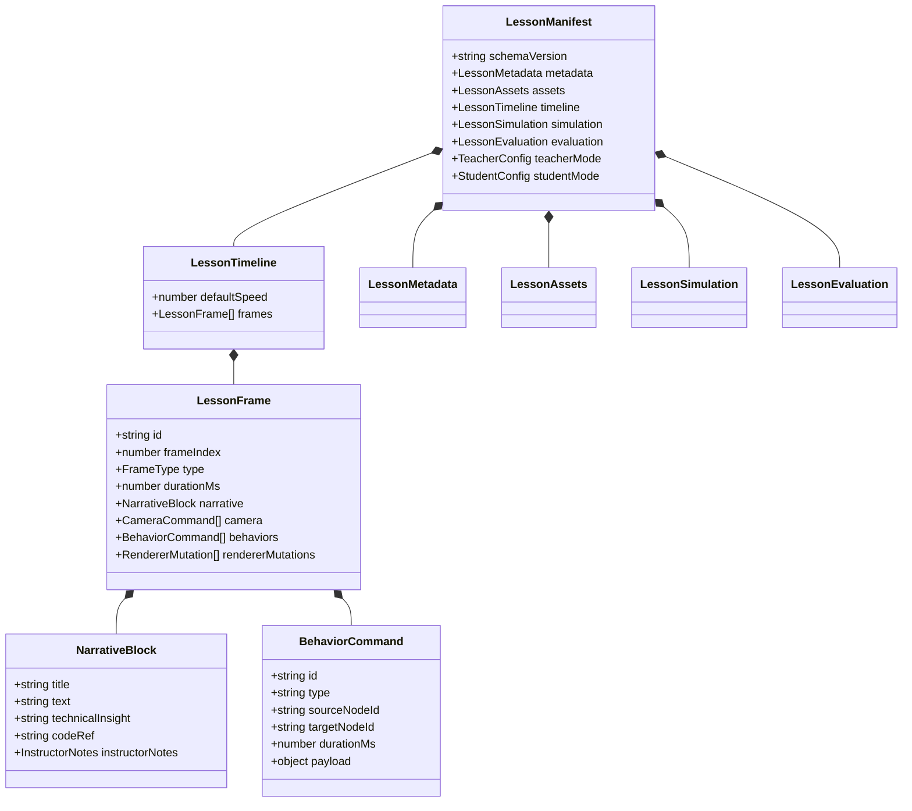
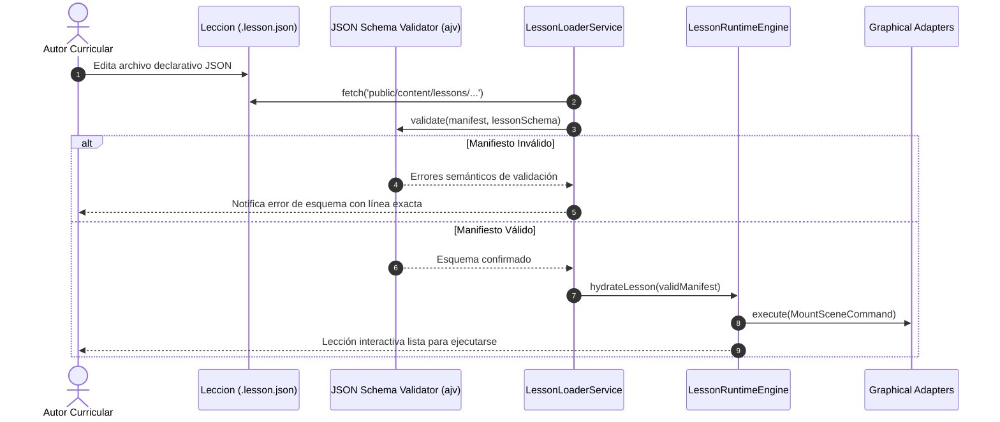
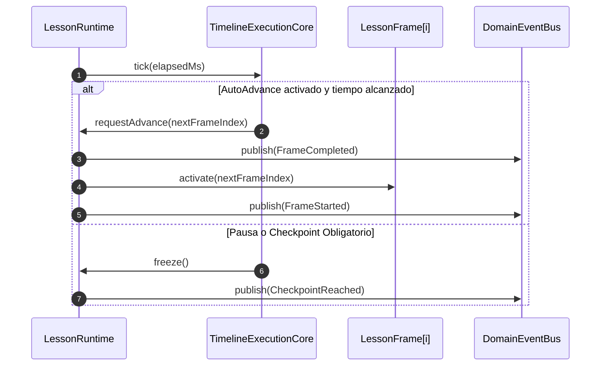
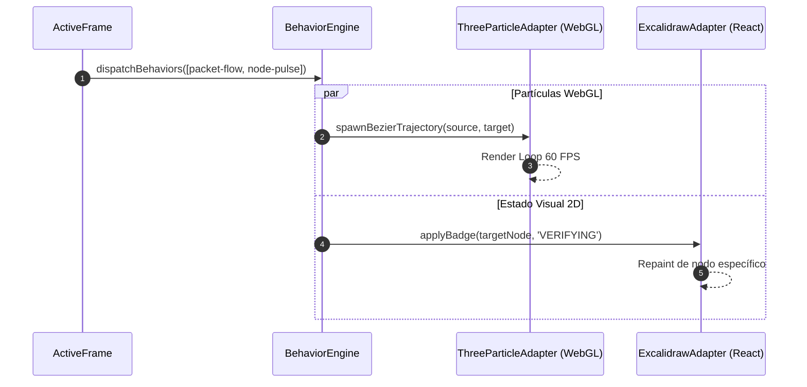
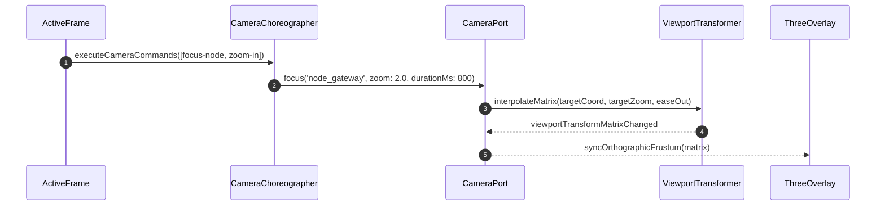
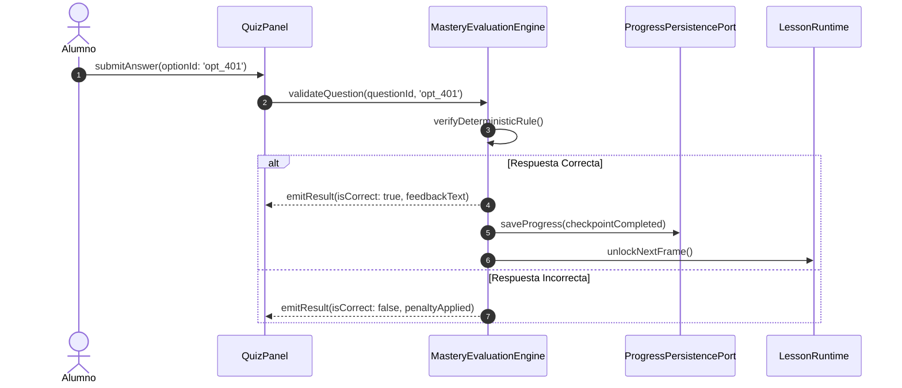
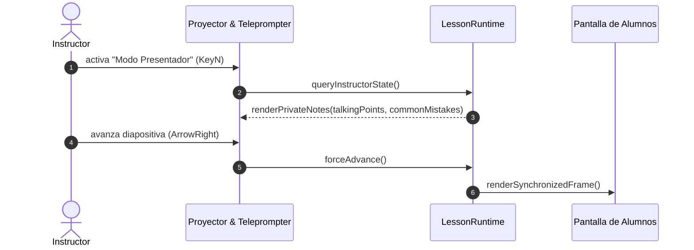
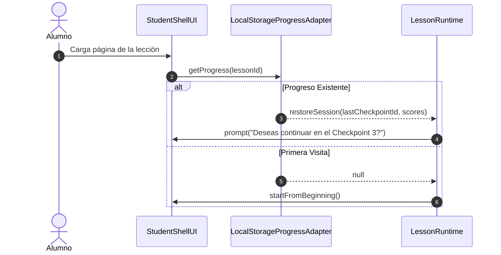

# ADR 004: Lesson Manifest & Pedagogical DSL Architecture

- **Estado:** Propuesto / Aceptado
- **Fecha:** 2026-10-05
- **Sprint:** Sprint 2 — Estandarización de Contenido y DSL
- **Autores / Decisores:** Principal Software Architect, Software Architect, Staff Frontend Engineer, Product Architect, Engineering Manager
- **Contexto:** Definición del lenguaje de especificación declarativo (Domain-Specific Language - DSL) y contrato de datos universal para la autoría de lecciones interactivas, cinemáticas y offline-first en CASE Visual Lab sin escribir código TypeScript.

---

## 1. Contexto y Declaración del Problema

Tras la aprobación de [ADR-001 (Canvas Renderer Adapter)](001-canvas-renderer-adapter.md), [ADR-002 (Cinematic Learning Engine)](002-cinematic-learning-engine.md) y [ADR-003 (Lesson Runtime Architecture)](003-lesson-runtime.md), la infraestructura y el motor de ejecución están desacoplados.

Sin embargo, existía un cuello de botella crítico para la escalabilidad de **CASE Academy**:
> **El problema del acoplamiento a código:** Crear o modificar una clase requería que un ingeniero de software modificara archivos TypeScript, recompilara la aplicación Angular y gestionara ramas en Git.

Un educador técnico, arquitecto de software o autor curricular no debe escribir código de infraestructura para enseñar una lección. Debe disponer de un **Lenguaje de Dominio Específico (DSL)** declarativo, reproducible, legible por humanos y validable por esquemas automáticos.

El objetivo de este ADR es formalizar el **Lesson Manifest**: el contrato exhaustivo y el DSL definitivo que gobernará la creación de contenidos curriculares durante los próximos 5 años en CASE Visual Lab.

---

## 2. Discovery: Clasificación y Segregación de Información

A partir del análisis de ADR-001, ADR-002, ADR-003 y `documentation/product/08-vision.md`, se identificó la necesidad de deslindar claramente qué datos pertenecen a cada dimensión del sistema para evitar que el manifiesto se convierta en un blob caótico de propiedades.

### 2.1 Fronteras de Información

```
┌────────────────────────────────────────────────────────────────────────┐
│                   SEPARACIÓN DE INTERESES EN EL DSL                    │
├──────────────────────────┬─────────────────────────────────────────────┤
│ Dominio de Información   │ Pregunta Arquitectónica que Resuelve        │
├──────────────────────────┼─────────────────────────────────────────────┤
│ 1. Lesson Runtime        │ ¿Cómo orquestar y validar la ejecución?    │
│ 2. Contenido Curricular  │ ¿Qué se está enseñando y con qué narrativa? │
│ 3. Motor de Renderizado  │ ¿Cómo se encuadra y se proyecta visualmente?│
│ 4. Modo Instructor       │ ¿Qué notas pedagógicas guían la sesión?    │
│ 5. Modo Estudiante       │ ¿Qué estado y progreso formativo persiste? │
└──────────────────────────┴─────────────────────────────────────────────┘
```

1. **¿Qué información necesita realmente el Lesson Runtime?**
   - El grafo de dependencias de la lección, la lista ordenada de frames, sus condiciones de transición (autoplay, manual, duración), los disparadores de eventos (`checkpointId`), y las reglas de validación determinísticas para preguntas y ejercicios.
2. **¿Qué información pertenece únicamente al contenido?**
   - El guión pedagógico (`narrative`), el título, los objetivos de aprendizaje (Bloom taxonomy), el código fuente de ejemplo con resaltado de sintaxis, los glosarios de términos y los textos de explicaciones técnicas.
3. **¿Qué información pertenece al renderer?**
   - Las coordenadas lógicas de los nodos en el diagrama vectorial, las mutaciones de estilo temporales (status badges, stroke color), los comandos de cámara (zoom, pan, focus) y las trayectorias de partículas 3D.
4. **¿Qué información pertenece al instructor?**
   - Notas secretas del presentador, duración estimada por sección, advertencias sobre dudas frecuentes de los alumnos, preguntas sugeridas para dinamizar la clase y flags de modo proyector.
5. **¿Qué información pertenece al alumno?**
   - Historial de respuestas en quizzes, intentos fallidos en ejercicios prácticos, checkpoints desbloqueados, marcadores (bookmarks), tiempo dedicado y notas personales.

---

## 3. Selección y Justificación Técnica del DSL

Se evaluaron cuatro alternativas para el formato de autoría y distribución:

| Criterio | YAML | JSON Canónico + JSON Schema | Markdown + Frontmatter | DSL Propietario en Texto |
| :--- | :--- | :--- | :--- | :--- |
| **Parsing en el Navegador** | Requiere librería externa (~50 kB en bundle). | **Nativo (`JSON.parse` instantáneo, 0 kB).** | Requiere parser AST híbrido complejo. | Requiere compilador léxico completo. |
| **Ergonomía de Autoría** | Muy alta (sintaxis limpia, sin llaves). | Media/Alta (asistido con IDE + Schema). | Alta para prosa, pésima para timelines. | Variable. |
| **Validación de Esquema** | Vía JSON Schema convertido. | **Nativa con JSON Schema 2020-12.** | Parcial (solo valida frontmatter). | Requiere gramática ad-hoc. |
| **Determinismo & Diff en Git** | Sensible a indentación por espacios. | **100% determinístico y formateable.** | Bueno para texto, propenso a desajustes. | Variable. |
| **Offline-First en Runtime** | Requiere transpilación. | **Directo desde `public/content/`.** | Requiere parseo pesado en cliente. | Requiere runtime en cliente. |

### Decisión Técnica: Arquitectura de Representación Dual (Bijectiva)

1. **Formato Canónico de Distribución y Runtime:** **`JSON` tipado con `$schema` formal (JSON Schema 2020-12)**.
   - El runtime carga `.lesson.json` nativamente en milisegundos sin sobrecosto de bundle.
   - Validación automática en tiempo de compilación o test mediante `ajv`.
2. **Formato de Autoría Ergonomica (Opcional):** Los autores pueden escribir en **`YAML` (`.lesson.yaml`)**, que se compila 1:1 sin pérdida semántica a `.lesson.json` mediante un script de build estático.
3. **Sintaxis de Textos:** Toda la narrativa, descripciones y notas utilizan **GitHub Flavored Markdown (GFM)** integrado en los campos de texto.

---

## 4. Estructura Exhaustiva del Lesson Manifest

A continuación se define la especificación técnica completa de cada bloque del manifiesto.

### 4.1 Encabezado y Metadatos (`metadata`)

```json
{
  "$schema": "https://case-visual-lab.io/schemas/v1/lesson-manifest.json",
  "schemaVersion": "1.0.0",
  "id": "http-request-architecture",
  "slug": "http-request-architecture",
  "title": "Anatomía de una Petición HTTP: Del Cliente a la Base de Datos",
  "subtitle": "Ciclo de vida completo, reverse proxy, JWT parsing y persistencia transaccional",
  "category": "networking-and-protocols",
  "level": "Fundamentos",
  "language": "es",
  "version": "1.2.0",
  "author": {
    "name": "CASE Architecture Guild",
    "email": "architecture@case-os.org",
    "url": "https://case-academy.org"
  },
  "estimatedMinutes": 12,
  "tags": ["HTTP", "Networking", "Clean Architecture", "API Gateway", "PostgreSQL"],
  "prerequisites": ["conceptos-basicos-redes", "introduccion-rest"],
  "learningObjectives": [
    "Trazar la ruta exacta de una petición HTTP a través de un reverse proxy.",
    "Analizar la inspección y validación de tokens criptográficos en el Gateway.",
    "Comprender la diferencia entre latencia de red y tiempo de cómputo en base de datos."
  ]
}
```

### 4.2 Activos y Escenas Vectoriales (`assets`)

Define los diagramas vectoriales iniciales, snippets de código y recursos estáticos referenciados en los fotogramas:

```json
{
  "assets": {
    "scene": {
      "initialSceneId": "scene_http_flow",
      "scenes": {
        "scene_http_flow": {
          "schemaVersion": 1,
          "elements": [
            {
              "id": "node_client",
              "type": "rectangle",
              "label": "Client Application\n(React SPA)",
              "x": 80,
              "y": 250,
              "width": 180,
              "height": 90,
              "role": "client"
            },
            {
              "id": "node_gateway",
              "type": "rectangle",
              "label": "API Gateway\n(Envoy / Nginx)",
              "x": 360,
              "y": 250,
              "width": 180,
              "height": 90,
              "role": "gateway"
            },
            {
              "id": "node_api",
              "type": "rectangle",
              "label": "Order Service\n(Domain Core)",
              "x": 640,
              "y": 250,
              "width": 180,
              "height": 90,
              "role": "service"
            },
            {
              "id": "node_db",
              "type": "cylinder",
              "label": "Primary Database\n(PostgreSQL)",
              "x": 920,
              "y": 250,
              "width": 180,
              "height": 90,
              "role": "database"
            }
          ]
        }
      }
    },
    "codeSnippets": {
      "snippet_jwt_middleware": {
        "language": "typescript",
        "filename": "auth-gateway.middleware.ts",
        "code": "export async function verifyAuth(req: HttpRequest): Promise<AuthContext> {\n  const token = req.headers['authorization']?.replace('Bearer ', '');\n  if (!token) throw new UnauthorizedException('Missing JWT token');\n  return await jwtVerifier.verify(token);\n}"
      }
    }
  }
}
```

### 4.3 Especificación del Timeline y Tipos de Frames (`timeline`)

El timeline es una colección ordenada y determinística de `LessonFrame`. El manifiesto clasifica los frames en 4 variantes tipadas:

```
┌────────────────────────────────────────────────────────────────────────┐
│                        JERARQUÍA DE FRAMES                             │
├────────────────────┬───────────────────────────────────────────────────┤
│ Frame Type         │ Propósito Pedagógico                              │
├────────────────────┼───────────────────────────────────────────────────┤
│ 1. `narrative`     │ Explicación conceptual, analogía y código.       │
│ 2. `question`      │ Quiz formativo con validación inmediata.          │
│ 3. `exercise`      │ Desafío interactivo para manipular el canvas.    │
│ 4. `simulation`    │ Ejecución determinística de la máquina de estados.│
└────────────────────┴───────────────────────────────────────────────────┘
```

#### Anatomía General de un Frame:

```json
{
  "id": "frame_gateway_auth",
  "frameIndex": 1,
  "type": "narrative",
  "durationMs": 4000,
  "autoAdvance": false,
  "checkpoint": {
    "id": "cp_gateway_validation",
    "label": "Validación en el Gateway",
    "description": "Comprende la terminación de TLS y verificación de cabeceras",
    "isMandatory": true
  },
  "narrative": {
    "speaker": "Profesor Principal",
    "title": "Inspección en el API Gateway",
    "text": "La petición arriba al Gateway. Aquí se realiza la terminación TLS, el rate-limiting y la validación de cabeceras de autorización.",
    "technicalInsight": "El Gateway actúa como escudo protector. Si el token JWT ha expirado, la petición se rechaza con HTTP 401 sin consumir ciclos de CPU en el microservicio.",
    "codeRef": "snippet_jwt_middleware",
    "instructorNotes": {
      "talkingPoints": [
        "Enfatizar que el microservicio interno no debe re-verificar la firma criptográfica si el Gateway ya validó el token.",
        "Mencionar la inyección de la cabecera X-User-Id."
      ],
      "commonMistakes": [
        "Confundir autenticación (quién eres) con autorización (qué puedes hacer)."
      ],
      "estimatedSeconds": 45
    }
  },
  "camera": [
    {
      "type": "focus-node",
      "targetNodeId": "node_gateway",
      "zoomLevel": 2.0,
      "durationMs": 800,
      "easing": "ease-out"
    }
  ],
  "behaviors": [
    {
      "id": "beh_packet_client_gateway",
      "type": "packet-flow",
      "sourceNodeId": "node_client",
      "targetNodeId": "node_gateway",
      "durationMs": 1500,
      "payload": {
        "packetType": "http",
        "label": "POST /api/orders (JWT)",
        "color": "#00F2FE",
        "preview": "{ orderId: 'ord_987', amount: 150.00 }"
      }
    },
    {
      "id": "beh_gateway_pulse",
      "type": "node-pulse",
      "targetNodeId": "node_gateway",
      "durationMs": 1000,
      "payload": {
        "color": "#38EF7D",
        "badgeText": "JWT_VERIFIED"
      }
    }
  ],
  "rendererMutations": [
    {
      "targetNodeId": "node_gateway",
      "status": "processing",
      "badge": "200_INSPECTING",
      "strokeColor": "#38EF7D"
    }
  ]
}
```

### 4.4 Catálogo Universal de Behaviors Declarativos (`behaviors`)

El manifiesto admite el catálogo completo de behaviors de dominio sin acoplamiento a WebGL ni CSS:

1. **`packet-flow`**: Desplazamiento de partículas siguiendo curvas Bezier entre nodos de origen y destino (`sourceNodeId` $\to$ `targetNodeId`).
2. **`jwt-flow`**: Variante visual con halo criptográfico dorado que representa claims de autenticación.
3. **`database-write`**: Pulsación magnética de escritura con indicador visual de inserción en disco.
4. **`database-read`**: Onda de lectura con halo azul cian indicando lectura de índice B-Tree.
5. **`node-pulse`**: Ondas circulares expansivas sobre el nodo (`THREE.RingGeometry`).
6. **`glow`**: Halo de resplandor continuo para señalar nodo en foco de atención pedagógica.
7. **`streaming`**: Chorro continuo de mini-partículas para tokens LLM o WebSockets.
8. **`typing`**: Simulación visual de escritura de comandos en una terminal embebida.
9. **`agent-thinking`**: Órbita de micro-partículas rotatorias representando el bucle de razonamiento de un agente.
10. **`tool-call`**: Trayectoria de invocación bidireccional hacia un servidor de herramientas (MCP).
11. **`custom`**: Behaviors extensibles mediante payload genérico JSON.

### 4.5 Coreografía de Cámara (`camera`)

Comandos cinematográficos universales declarados por frame:
- **`fit-scene`**: Restablece el encuadre global a escala 1:1.
- **`focus-node`**: Centra suavemente en el nodo indicado.
- **`zoom-in` / `zoom-out`**: Modifica el nivel de escala entre 0.5x y 3.0x.
- **`pan-to`**: Desplaza la vista a coordenadas específicas $(X, Y)$.
- **`shake-failure`**: Micro-vibración del lienzo para señalar errores HTTP 500, timeouts o excepciones.
- **`fade`**: Atenúa nodos adyacentes para concentrar el contraste en el camino crítico.

### 4.6 Motor de Simulación Determinística Local (`simulation`)

Estructura de la máquina de estados discreta embebida en la lección:

```json
{
  "simulation": {
    "id": "sim_http_lifecycle",
    "initialState": {
      "clientState": "AWAITING_RESPONSE",
      "gatewayRequestsPerSec": 420,
      "apiActiveThreads": 14,
      "dbConnectionPool": {
        "active": 3,
        "idle": 17,
        "max": 20
      },
      "transactions": []
    },
    "transitions": [
      {
        "onFrameIndex": 1,
        "action": "GATEWAY_VERIFY_TOKEN",
        "mutations": {
          "gatewayRequestsPerSec": 421,
          "activeTokenSubject": "usr_alpha_9"
        }
      },
      {
        "onFrameIndex": 3,
        "action": "DATABASE_BEGIN_TRANSACTION",
        "mutations": {
          "dbConnectionPool.active": 4,
          "dbConnectionPool.idle": 16,
          "transactions": ["tx_0192a_order_create"]
        }
      }
    ]
  }
}
```

### 4.7 Evaluación, Quizzes y Desafíos (`questions` & `evaluation`)

```json
{
  "questions": [
    {
      "id": "quiz_gateway_failure",
      "frameIndex": 2,
      "type": "quiz",
      "prompt": "¿Qué código de estado HTTP debe devolver el Gateway si el JWT está firmado con una clave incorrecta?",
      "options": [
        {
          "id": "opt_200",
          "text": "HTTP 200 con { error: true } en el cuerpo",
          "isCorrect": false,
          "feedback": "Antipatrón. Oculta el fallo de autenticación a nivel de transporte."
        },
        {
          "id": "opt_401",
          "text": "HTTP 401 Unauthorized",
          "isCorrect": true,
          "feedback": "Correcto. El cliente debe reautenticarse para obtener un token válido."
        },
        {
          "id": "opt_500",
          "text": "HTTP 500 Internal Server Error",
          "isCorrect": false,
          "feedback": "Incorrecto. Un token inválido es un error del cliente, no un fallo del servidor."
        }
      ],
      "retryPolicy": {
        "maxAttempts": 2,
        "penaltyPerAttemptPct": 10
      }
    }
  ],
  "evaluation": {
    "passingScorePct": 80,
    "requireAllCheckpoints": true,
    "certificationBadge": {
      "id": "badge_http_architect",
      "title": "HTTP Protocol Architect",
      "level": "Associate",
      "icon": "shield-check"
    }
  }
}
```

### 4.8 Modos Instructor y Alumno (`teacherMode` & `studentMode`)

```json
{
  "teacherMode": {
    "enabled": true,
    "globalTalkingPoints": [
      "No comenzar por el código; comenzar por el problema de la red no confiable.",
      "Hacer énfasis en cómo el timeout protege los recursos de la base de datos."
    ],
    "presentationShortcuts": {
      "toggleNotes": "KeyN",
      "forceNextFrame": "ArrowRight",
      "highlightActiveNode": "KeyH"
    }
  },
  "studentMode": {
    "allowNotes": true,
    "allowBookmarks": true,
    "resumePolicy": "last-checkpoint"
  }
}
```

---

## 5. Diagramas Arquitectónicos (Mermaid)

### 5.1 Diagrama 1: Taxonomía Estructural del Lesson Manifest



### 5.2 Diagrama 2: Ingesta y Deserialización en el Lesson Runtime



### 5.3 Diagrama 3: Flujo de Ejecución del Timeline



### 5.4 Diagrama 4: Flujo de Behaviors



### 5.5 Diagrama 5: Flujo de Coreografía de Cámara



### 5.6 Diagrama 6: Flujo de Evaluación y Maestría



### 5.7 Diagrama 7: Flujo del Modo Instructor (Teacher Mode)



### 5.8 Diagrama 8: Flujo del Modo Estudiante (Student Mode)



---

## 6. Ejemplo Completo de Referencia: Lección "HTTP Request Flow"

El siguiente manifiesto representa la implementación canónica y completa de una clase sin código TypeScript.

```json
{
  "$schema": "https://case-visual-lab.io/schemas/v1/lesson-manifest.json",
  "schemaVersion": "1.0.0",
  "id": "http-request-lifecycle",
  "slug": "http-request-lifecycle",
  "title": "Anatomía de una Petición HTTP: Del Cliente a la Base de Datos",
  "subtitle": "Reverse proxy, inspección de JWT, casos de uso y persistencia ACID",
  "category": "networking-and-protocols",
  "level": "Fundamentos",
  "language": "es",
  "version": "1.0.0",
  "author": {
    "name": "CASE Academy Core Team"
  },
  "estimatedMinutes": 10,
  "tags": ["HTTP", "Gateway", "PostgreSQL", "Clean Architecture"],
  "learningObjectives": [
    "Identificar las fases críticas de una transacción HTTP segura.",
    "Analizar el impacto del enrutamiento perimetral en la arquitectura de microservicios."
  ],
  "assets": {
    "scene": {
      "initialSceneId": "scene_http_default",
      "scenes": {
        "scene_http_default": {
          "schemaVersion": 1,
          "elements": [
            {
              "id": "node_client",
              "type": "rectangle",
              "label": "Cliente Web\n(React / SPA)",
              "x": 100,
              "y": 260,
              "width": 160,
              "height": 90,
              "strokeColor": "#00F2FE"
            },
            {
              "id": "node_gateway",
              "type": "rectangle",
              "label": "API Gateway\n(Envoy Proxy)",
              "x": 380,
              "y": 260,
              "width": 160,
              "height": 90,
              "strokeColor": "#38EF7D"
            },
            {
              "id": "node_api",
              "type": "rectangle",
              "label": "Servicio de Órdenes\n(Dominio Hexagonal)",
              "x": 660,
              "y": 260,
              "width": 180,
              "height": 90,
              "strokeColor": "#F39C12"
            },
            {
              "id": "node_db",
              "type": "cylinder",
              "label": "PostgreSQL\n(Master DB)",
              "x": 960,
              "y": 260,
              "width": 160,
              "height": 90,
              "strokeColor": "#9B59B6"
            }
          ]
        }
      }
    },
    "codeSnippets": {
      "code_client_fetch": {
        "language": "typescript",
        "filename": "order-api.client.ts",
        "code": "const res = await fetch('https://api.case.org/v1/orders', {\n  method: 'POST',\n  headers: {\n    'Authorization': `Bearer ${token}`,\n    'Content-Type': 'application/json'\n  },\n  body: JSON.stringify({ sku: 'CS-800', quantity: 1 })\n});"
      },
      "code_db_insert": {
        "language": "sql",
        "filename": "insert-order.sql",
        "code": "INSERT INTO orders (id, user_id, sku, status, created_at)\nVALUES ('ord_1024', 'usr_88', 'CS-800', 'CONFIRMED', NOW())\nRETURNING id, status;"
      }
    }
  },
  "timeline": {
    "defaultSpeed": 1.0,
    "frames": [
      {
        "id": "frame_0_init",
        "frameIndex": 0,
        "type": "narrative",
        "durationMs": 3500,
        "autoAdvance": false,
        "narrative": {
          "speaker": "Profesor Principal",
          "title": "Paso 1: Emisión de la Petición",
          "text": "El usuario hace clic en 'Confirmar Compra'. La aplicación cliente genera una petición HTTP POST segura firmada con un Bearer Token.",
          "technicalInsight": "El cliente no se comunica directamente con la base de datos ni con los microservicios internos; toda comunicación viaja hacia la zona perimetral.",
          "codeRef": "code_client_fetch"
        },
        "camera": [
          {
            "type": "fit-scene",
            "durationMs": 600
          }
        ],
        "behaviors": [
          {
            "id": "beh_0_pulse_client",
            "type": "node-pulse",
            "targetNodeId": "node_client",
            "durationMs": 800,
            "payload": { "color": "#00F2FE" }
          }
        ]
      },
      {
        "id": "frame_1_gateway",
        "frameIndex": 1,
        "type": "narrative",
        "durationMs": 4000,
        "autoAdvance": false,
        "checkpoint": {
          "id": "cp_gateway_inspected",
          "label": "Gateway Auth",
          "description": "El Gateway valida la firma criptográfica antes de enrutar.",
          "isMandatory": true
        },
        "narrative": {
          "speaker": "Profesor Principal",
          "title": "Paso 2: Inspección y Enrutamiento en el Gateway",
          "text": "El Gateway recibe el paquete TCP, termina la sesión TLS y valida la expiración y firma del token JWT.",
          "technicalInsight": "Al centralizar la autenticación en el Gateway, evitamos replicar la lógica de verificación en 20 microservicios distintos.",
          "instructorNotes": {
            "talkingPoints": [
              "Hacer la analogía del Gateway con la aduana de un aeropuerto.",
              "Preguntar a los alumnos qué ocurre si el reloj del servidor está desincronizado (NTP skew)."
            ]
          }
        },
        "camera": [
          {
            "type": "focus-node",
            "targetNodeId": "node_gateway",
            "zoomLevel": 1.8,
            "durationMs": 700
          }
        ],
        "behaviors": [
          {
            "id": "beh_1_packet_flight",
            "type": "jwt-flow",
            "sourceNodeId": "node_client",
            "targetNodeId": "node_gateway",
            "durationMs": 1400,
            "payload": { "label": "HTTP POST (TLS)", "color": "#00F2FE" }
          },
          {
            "id": "beh_1_verify_pulse",
            "type": "node-pulse",
            "targetNodeId": "node_gateway",
            "durationMs": 900,
            "payload": { "color": "#38EF7D" }
          }
        ],
        "rendererMutations": [
          {
            "targetNodeId": "node_gateway",
            "status": "processing",
            "badge": "JWT_200_OK"
          }
        ]
      },
      {
        "id": "frame_2_service",
        "frameIndex": 2,
        "type": "narrative",
        "durationMs": 3500,
        "autoAdvance": false,
        "narrative": {
          "speaker": "Profesor Principal",
          "title": "Paso 3: Ejecución de Reglas en el Dominio",
          "text": "La petición llega al microservicio interno a través de una red privada. Se ejecuta el caso de uso `CreateOrderUseCase` garantizando la consistencia del negocio.",
          "technicalInsight": "El servicio asume que la petición ya fue autenticada por el Gateway perimetral mediante cabeceras confiables `X-User-Id`."
        },
        "camera": [
          {
            "type": "focus-node",
            "targetNodeId": "node_api",
            "zoomLevel": 1.8,
            "durationMs": 600
          }
        ],
        "behaviors": [
          {
            "id": "beh_2_forward",
            "type": "packet-flow",
            "sourceNodeId": "node_gateway",
            "targetNodeId": "node_api",
            "durationMs": 1200,
            "payload": { "label": "gRPC / HTTP Private", "color": "#F39C12" }
          }
        ]
      },
      {
        "id": "frame_3_database",
        "frameIndex": 3,
        "type": "narrative",
        "durationMs": 4000,
        "autoAdvance": false,
        "narrative": {
          "speaker": "Profesor Principal",
          "title": "Paso 4: Persistencia Transaccional (ACID)",
          "text": "El repositorio envía la sentencia `INSERT INTO orders` al clúster de PostgreSQL. La transacción se confirma en el Write-Ahead Log (WAL).",
          "technicalInsight": "La base de datos retorna el ID autogenerado de la orden en menos de 2 milisegundos si los índices están optimizados.",
          "codeRef": "code_db_insert"
        },
        "camera": [
          {
            "type": "focus-node",
            "targetNodeId": "node_db",
            "zoomLevel": 2.1,
            "durationMs": 600
          }
        ],
        "behaviors": [
          {
            "id": "beh_3_db_write",
            "type": "database-write",
            "sourceNodeId": "node_api",
            "targetNodeId": "node_db",
            "durationMs": 1200,
            "payload": { "label": "SQL INSERT", "color": "#9B59B6" }
          }
        ]
      },
      {
        "id": "frame_4_response",
        "frameIndex": 4,
        "type": "narrative",
        "durationMs": 3500,
        "autoAdvance": false,
        "narrative": {
          "speaker": "Profesor Principal",
          "title": "Paso 5: Viaje de Retorno (HTTP 201 Created)",
          "text": "La confirmación viaja en sentido inverso: Base de datos $\\to$ Servicio $\\to$ Gateway $\\to$ Cliente. El navegador actualiza el estado de la UI.",
          "technicalInsight": "El cliente recibe la respuesta HTTP 201 con los headers de telemetría `X-Trace-Id` intactos."
        },
        "camera": [
          {
            "type": "fit-scene",
            "durationMs": 800
          }
        ],
        "behaviors": [
          {
            "id": "beh_4_response_trip",
            "type": "packet-flow",
            "sourceNodeId": "node_db",
            "targetNodeId": "node_client",
            "durationMs": 2000,
            "payload": { "label": "HTTP 201 Created", "color": "#38EF7D" }
          }
        ]
      },
      {
        "id": "frame_5_quiz",
        "frameIndex": 5,
        "type": "question",
        "durationMs": 0,
        "autoAdvance": false,
        "questionRef": "quiz_gateway_failure"
      }
    ]
  },
  "simulation": {
    "id": "sim_http_flow",
    "initialState": {
      "requestStatus": "IDLE",
      "gatewayRequestsPerSec": 350,
      "dbConnectionInUse": 1
    },
    "transitions": [
      {
        "onFrameIndex": 1,
        "action": "INSPECT_AUTH",
        "mutations": { "gatewayRequestsPerSec": 351 }
      },
      {
        "onFrameIndex": 3,
        "action": "COMMIT_WAL",
        "mutations": { "dbConnectionInUse": 2 }
      },
      {
        "onFrameIndex": 4,
        "action": "RESPONSE_RECEIVED",
        "mutations": { "requestStatus": "COMPLETED", "dbConnectionInUse": 1 }
      }
    ]
  },
  "questions": [
    {
      "id": "quiz_gateway_failure",
      "frameIndex": 5,
      "type": "quiz",
      "prompt": "Si el cliente envía un token expirado, ¿cuál es el componente responsable de rechazar la petición antes de saturar el microservicio?",
      "options": [
        {
          "id": "opt_a",
          "text": "El API Gateway con HTTP 401",
          "isCorrect": true,
          "feedback": "¡Correcto! El Gateway actúa como filtro perimetral y evita el consumo innecesario de CPU interna."
        },
        {
          "id": "opt_b",
          "text": "La Base de Datos PostgreSQL con SQLSTATE 42000",
          "isCorrect": false,
          "feedback": "Incorrecto. La base de datos no tiene conocimiento de tokens web ni protocolos de autenticación de usuario."
        },
        {
          "id": "opt_c",
          "text": "El navegador web bloquea la petición localmente",
          "isCorrect": false,
          "feedback": "Incorrecto. El navegador no valida la firma criptográfica del servidor de autenticación."
        }
      ]
    }
  ],
  "evaluation": {
    "passingScorePct": 100,
    "requireAllCheckpoints": true,
    "certificationBadge": {
      "id": "badge_http_fundamentals",
      "title": "HTTP Lifecycle Specialist",
      "level": "Fundamentos",
      "icon": "network"
    }
  }
}
```

---

## 7. Versionado, Migraciones y Compatibilidad del DSL

Para garantizar la promesa de **inmutabilidad de contenidos a 5 años** ([ADR-001](001-canvas-renderer-adapter.md) y `documentation/product/08-vision.md`), se define la estrategia formal de versionado de esquemas.

### 7.1 Semántica de Versionado
Cada lección declara:
- `schemaVersion`: Versión del esquema del DSL (`"1.0.0"`).
- `version`: Versión curricular del contenido de la lección (`"1.2.0"`).

### 7.2 Reglas de Compatibilidad

```
┌────────────────────────────────────────────────────────────────────────┐
│                      POLÍTICA DE COMPATIBILIDAD                        │
├────────────────────┬───────────────────────────────────────────────────┤
│ Tipo de Cambio     │ Regla Arquitectónica                              │
├────────────────────┼───────────────────────────────────────────────────┤
│ Retrocompatibilidad│ Un Runtime versión N debe ser capaz de ejecutar   │
│ (Backward)         │ cualquier lección escrita para versiones 1.0.0 a N│
├────────────────────┼───────────────────────────────────────────────────┤
│ Compatibilidad     │ Propiedades desconocidas en el JSON se ignoran    │
│ Futura (Forward)   │ limpiamente sin arrojar excepciones fatales.      │
├────────────────────┼───────────────────────────────────────────────────┤
│ Breaking Changes   │ Incrementan `MAJOR` (v2.0.0). Se provee función   │
│                    │ pura de migración declarativa `migrateLesson()`.  │
└────────────────────┴───────────────────────────────────────────────────┘
```

### 7.3 Pipeline de Migración de Lecciones (`migrateLesson`)

Si una propiedad es renombrada o refactorizada en una versión futura:

$$\text{Manifest } v1 \xrightarrow{\text{migrateV1toV2}} \text{Manifest } v2 \xrightarrow{\text{migrateV2toV3}} \text{Manifest } v3$$

Las migraciones son **funciones puras encadenadas**:
```typescript
// Contrato de migración puro (ejecutado en runtime sin mutar el archivo estático)
export interface LessonMigration {
  readonly fromVersion: string;
  readonly toVersion: string;
  readonly migrate: (raw: Record<string, unknown>) => Record<string, unknown>;
}
```

---

## 8. Demostración de Extensibilidad Multidominio

El mismo esquema y DSL formalizado en este ADR soporta dominios de alta complejidad técnica **sin modificar una sola línea del Lesson Runtime**:

### 8.1 Inteligencia Artificial & RAG (Retrieval-Augmented Generation)

```json
{
  "behaviors": [
    {
      "id": "beh_rag_query",
      "type": "packet-flow",
      "sourceNodeId": "node_user",
      "targetNodeId": "node_embedding_model",
      "payload": { "label": "Embedding(Query) -> 1536 dims", "color": "#00F2FE" }
    },
    {
      "id": "beh_vector_search",
      "type": "custom",
      "targetNodeId": "node_vector_db",
      "payload": {
        "customBehavior": "cosine-similarity-scan",
        "topK": 3,
        "similarityScore": 0.892,
        "color": "#38EF7D"
      }
    }
  ]
}
```

### 8.2 Agent Loop & Tool Calling (MCP - Model Context Protocol)

```json
{
  "behaviors": [
    {
      "id": "beh_agent_reasoning",
      "type": "agent-thinking",
      "targetNodeId": "node_planner_agent",
      "durationMs": 2500,
      "payload": {
        "thought": "Need current cluster metrics. Invoking MCP tool: get_pod_health"
      }
    },
    {
      "id": "beh_tool_call",
      "type": "tool-call",
      "sourceNodeId": "node_planner_agent",
      "targetNodeId": "node_mcp_k8s_server",
      "durationMs": 1200,
      "payload": {
        "toolName": "kubernetes_get_pods",
        "arguments": { "namespace": "production" }
      }
    }
  ]
}
```

### 8.3 Domain-Driven Design (DDD) & Event-Driven Architecture

```json
{
  "behaviors": [
    {
      "id": "beh_order_placed_event",
      "type": "custom",
      "sourceNodeId": "aggregate_order",
      "targetNodeId": "message_broker_kafka",
      "payload": {
        "customBehavior": "domain-event-publish",
        "eventName": "OrderPlacedDomainEvent",
        "aggregateId": "ord_8819",
        "color": "#F39C12"
      }
    }
  ]
}
```

### 8.4 Kubernetes & DevOps (Pod Failover)

```json
{
  "camera": [
    { "type": "shake-failure", "targetNodeId": "pod_backend_replica_1", "intensity": 0.8 }
  ],
  "rendererMutations": [
    { "targetNodeId": "pod_backend_replica_1", "status": "error", "badge": "OOMKilled" },
    { "targetNodeId": "k8s_replicaset_controller", "status": "processing", "badge": "RECONCILING" },
    { "targetNodeId": "pod_backend_replica_2", "status": "success", "badge": "RUNNING" }
  ]
}
```

---

## 9. Beneficios, Riesgos y Trade-offs

### 9.1 Beneficios
1. **Desacoplamiento Absoluto:** Autores curriculares generan cursos completos redactando JSON/YAML sin conocer TypeScript, Angular ni Three.js.
2. **Autocompletado y Validación en IDE:** La referencia `$schema` dota a VS Code, Cursor e IntelliJ de intellisense en tiempo real con advertencias de sintaxis inmediatas.
3. **Validación Automatizada en CI/CD:** Un test de integración en Vitest puede validar los 50 JSON de lecciones en menos de 200 ms usando `ajv`.
4. **Cero Costo de Inferencia:** Todo el dinamismo pedagógico y los comportamientos visuales se describen de forma determinística, sin requerir APIs de LLM externas.

### 9.2 Riesgos y Mitigaciones

| Riesgo | Severidad | Mitigación Arquitectónica |
| :--- | :--- | :--- |
| **Fatiga de Verbosidad en Manifiestos Grandes** | Media | Soporte para escribir en YAML (`.lesson.yaml`) y compilación transparente a `.lesson.json` en tiempo de empaquetado. |
| **Referencias Rotas a Nodos (`nodeId` inexistente)** | Alta | El validador semántico en el cargador comprueba que todo `sourceNodeId` y `targetNodeId` exista en la escena del manifiesto antes de inicializar el runtime. |
| **Desincronización de Coordenadas de Canvas** | Media | Las escenas se versionan con el esquema de diagrama AST canónico (`SceneDocument`), garantizando estabilidad visual. |

---

## 10. Decisión Final

Se aprueba formalmente el **ADR-004: Lesson Manifest & Pedagogical DSL Architecture**.

A partir de esta decisión:
1. El archivo JSON Schema correspondiente (`lesson.schema.json`) y las interfaces de lectura gobernadas por este contrato serán el único estándar de comunicación entre el contenido de **CASE Academy** y el motor de **CASE Visual Lab**.
2. No se escribirá código TypeScript dentro de las lecciones.
3. Se mantiene el cumplimiento estricto de las restricciones: **cero modificaciones de código de aplicación, cero commits y cero push** durante esta fase de arquitectura.
