# ADR 005: Visual Execution Engine — De Motor de Lecciones a Motor Universal de Experiencias Visuales

- **Estado:** Propuesto / Aceptado
- **Fecha:** 2026-10-05
- **Sprint:** Sprint 2 — Generalización y Arquitectura del Motor Universal
- **Autores / Decisores:** Principal Software Architect, Software Architect, Staff Frontend Engineer, Product Architect, Engineering Manager
- **Contexto:** Evolución arquitectónica de CASE Visual Lab desde un "Lesson Runtime" hacia un "Visual Execution Engine" agnóstico, capaz de ejecutar múltiples arquetipos de experiencias interactivas (Lessons, Workshops, Interactive Books, Presentations, Playgrounds, Simulations, Certifications y Live Demos) sobre un único núcleo determinístico desacoplado.

---

## 1. Contexto y Declaración del Problema

En los documentos fundacionales ([ADR-001](001-canvas-renderer-adapter.md), [ADR-002](002-cinematic-learning-engine.md), [ADR-003](003-lesson-runtime.md) y [ADR-004](004-lesson-manifest.md)), CASE Visual Lab resolvió el desacoplamiento de renderizadores y formalizó el lenguaje pedagógico de las clases interactivas.

Sin embargo, a la luz del documento [VISION.md](../../VISION.md) (Horizonte 2031) y de las necesidades del ecosistema **CASE OS**, surgió una limitación conceptual crítica:

> **El problema del sesgo pedagógico (The "Lesson" Monolithic Bias):**  
> El sistema fue modelado asumiendo que *todo* lo que se proyecta en el lienzo es una "clase con alumno y profesor". Conceptos como `LessonRuntime`, `LessonManifest`, `QuizQuestion`, `StudentProgress` y `TeacherMode` quedaron incrustados en el corazón del motor.

Esto impedía utilizar CASE Visual Lab para otros casos de uso fundamentales:
- **Presentaciones Técnicas & Pitch Decks de Arquitectura:** Sin cuestionarios ni notas de examen, pero con transiciones cinemáticas manuales de cámara y narrativa para juntas de ingeniería.
- **Playgrounds Libres & Sandbox de Simulación:** Escenas vivas donde un arquitecto prueba topologías de resiliencia o algoritmos distribuidos sin checkpoints obligatorios.
- **Interactive Technical Books (Libros Vivos):** Capítulos navegables con texto enriquecido lateral que conduce simulaciones en el canvas.
- **Workshops Hands-On & Certificaciones Industriales:** Ambientes evaluativos con reglas de temporización estricta, telemetría y escenarios de fallos inyectados.
- **Live Demos / Keynotes:** Demostraciones automatizadas con sincronización de audio, subtítulos y partículas a 60 FPS sostenidos.

**La Decisión:** Desmontar el sesgo pedagógico del núcleo de ejecución. El Runtime no debe pensar en "Lecciones"; debe pensar en **Experiencias Visuales (`Visual Experiences`)** y operar como un **Programador Determinístico de Acciones (`Deterministic Action Scheduler`)**.

---

## 2. Discovery: Auditoría de Acoplamientos en el Diseño Actual

Se auditó minuciosamente el código y los ADRs previos (001 a 004). A continuación se documentan todos los lugares donde el sistema asumía erróneamente que siempre ejecutaría una lección.

### 2.1 Puntos de Acoplamiento Detectados

```
┌────────────────────────────────────────────────────────────────────────┐
│               MATRIZ DE ACOPLAMIENTOS AL CONCEPTO "LESSON"             │
├────────────────────┬───────────────────────────────────────────────────┤
│ Componente / Capa  │ Acoplamiento Concreto Identificado                │
├────────────────────┼───────────────────────────────────────────────────┤
│ 1. Ontología       │ Interfaces bautizadas como `Lesson`,              │
│    del Dominio     │ `LessonManifest`, `LessonStep`, `LessonContext`,  │
│                    │ `LessonProgress`, `LessonCheckpoint`.             │
├────────────────────┼───────────────────────────────────────────────────┤
│ 2. Reglas del      │ Presunción de que siempre existe un "Alumno" que  │
│    Runtime         │ aprueba quizzes y un "Profesor" con notas         │
│                    │ secretas. Puertas de bloqueo (Gates) rígidas.     │
├────────────────────┼───────────────────────────────────────────────────┤
│ 3. Estructura      │ `CinematicFrame` / `LessonFrame` poseía campos    │
│    de Frames       │ fijos y estáticos (`narrative`, `camera`,         │
│                    │ `behaviors`, `rendererMutations`).                │
├────────────────────┼───────────────────────────────────────────────────┤
│ 4. Despacho de     │ Los behaviors se tipaban en un gran enum cerrado  │
│    Behaviors       │ (`VisualBehaviorType`), fomentando `switch`       │
│                    │ gigantescos que violan el principio Abierto/Cerrado│
├────────────────────┼───────────────────────────────────────────────────┤
│ 5. Asimetría de    │ Three.js fue concebido como una "capa especial de │
│    Renderers       │ animación" en vez de un adaptador simétrico.      │
├────────────────────┼───────────────────────────────────────────────────┤
│ 6. Línea Temporal  │ Un frame duraba N milisegundos y todo ocurría     │
│    Secuencial      │ a la vez; sin soporte formal para pistas (Tracks) │
│                    │ paralelas sincronizadas (Audio || Cámara || FX).  │
└────────────────────┴───────────────────────────────────────────────────┘
```

1. **Frames con Lógica Embebida:** En ADR-003/004, un frame no era solo tiempo: era un contenedor heterogéneo que sabía de preguntas (`question`), de checkpoints y de narrativa. Si se quería agregar una pista de subtítulos o audio, había que alterar el contrato del Frame.
2. **Violación del Principio Abierto/Cerrado (OCP):** El catálogo de behaviors (`packet-flow`, `database-write`, etc.) residía en una lista estática. Incorporar un nuevo behavior (p. ej. `KafkaOutboxStreamBehavior`) requería modificar el núcleo del motor.
3. **Control Temporal Primitivo:** La ejecución dependía de encadenamientos de `setTimeout` en la capa de aplicación, susceptible a drift temporal acumulativo y sin soporte nativo de scrubbing milimétrico o reproducción inversa.

---

## 3. Nuevo Modelo Conceptual y Taxonomía Universal

Para soportar cualquier artefacto interactivo sin reescribir el motor, se establece una nueva jerarquía conceptual limpia:

```mermaid
graph TD
    VE[Visual Experience]
    P[Profile: Lesson | Workshop | Book | Presentation | Playground | Simulation | Certification]
    S[Scenes / Spatial AST]
    T[Timeline / Virtual Clock]
    F[Frames / Temporal Windows]
    A[Actions / Atomic Declarative Intention]
    RC[Renderer Commands / Hardware Instructions]
    RA[Renderers: Excalidraw | Three.js | Audio | DOM Subtitles]

    VE --> P
    VE --> S
    VE --> T
    T --> F
    F --> A
    A --> RC
    RC --> RA
```

### 3.1 La Cadena de Abstracción Unidireccional

$$\text{\textbf{Visual Experience}} \longrightarrow \text{\textbf{Scenes}} \longrightarrow \text{\textbf{Timeline}} \longrightarrow \text{\textbf{Frames}} \longrightarrow \text{\textbf{Actions}} \longrightarrow \text{\textbf{Renderer Commands}} \longrightarrow \text{\textbf{Renderers}}$$

- **Visual Experience (`VisualExperience`):** El contenedor raíz agnóstico. Posee metadatos, recursos y declara un perfil (`profile`).
- **Profile (`ExperienceProfile`):** Define las reglas de interacción contextuales (`lesson`, `presentation`, `playground`, `simulation`, `interactive-book`, `certification`, `live-demo`).
- **Scene (`SceneDocument`):** La topología espacial inmutable 2D/3D (diagramas, nodos, límites).
- **Timeline (`ExperienceTimeline`):** El sistema de coordenadas temporal gobernado por un reloj virtual discreto.
- **Frame (`ExperienceFrame`):** Una ventana temporal discreta. **Un Frame NO tiene lógica de negocio ni campos especializados**. Es únicamente un contenedor ordenado de `Actions`.
- **Action (`ExperienceAction`):** La unidad atómica de intención declarativa (ej: `FocusCameraAction`, `PacketFlowAction`, `PlayAudioAction`, `WaitAction`).
- **Renderer Command (`RendererCommand`):** La instrucción traducida, normalizada y optimizada lista para ser ejecutada por el hardware gráfico o de sonido.
- **Renderer Adapter (`RendererPort`):** El driver final que dibuja o emite (Excalidraw, Three.js, Web Audio API, Web Subtitles).

---

## 4. Arquitectura de Acciones: El Frame como Contenedor Puro

Los Frames se despojan de toda especialización. No existe más un `NarrativeFrame` o un `QuestionFrame`. **Todo suceso en la pantalla es una Acción (`Action`)**.

```typescript
/**
 * Contrato base para toda acción declarativa dentro de un Frame.
 */
export interface ExperienceAction<TPayload = Record<string, unknown>> {
  readonly id: string;
  readonly type: string; // Registrado en ActionRegistry
  readonly startTimeOffsetMs: number; // Offset respecto al inicio del Frame
  readonly durationMs?: number; // Duración de la acción (si es continua)
  readonly isBlocking?: boolean; // Si true, el Frame no avanza hasta completarse
  readonly payload: TPayload;
}

/**
 * Un Frame es exclusivamente un contenedor ordenado de acciones.
 * Cero lógica de negocio. Cero switch statements.
 */
export interface ExperienceFrame {
  readonly id: string;
  readonly frameIndex: number;
  readonly durationMs: number;
  readonly autoAdvance: boolean;
  readonly actions: readonly ExperienceAction[];
}
```

### 4.1 Catálogo Universal de Acciones Atómicas

```
┌────────────────────────────────────────────────────────────────────────┐
│                      CATÁLOGO DE ACCIONES ATÓMICAS                     │
├──────────────────────────┬─────────────────────────────────────────────┤
│ Familia de Acción        │ Tipos de Acciones Disponibles               │
├──────────────────────────┼─────────────────────────────────────────────┤
│ Cámara (Cinemática)      │ `camera:focus`, `camera:zoom`, `camera:pan`,│
│                          │ `camera:shake`, `camera:fit-scene`          │
├──────────────────────────┼─────────────────────────────────────────────┤
│ Visual Behaviors         │ `behavior:packet-flow`, `behavior:db-write`,│
│                          │ `behavior:agent-thinking`, `behavior:pulse` │
├──────────────────────────┼─────────────────────────────────────────────┤
│ Mutación de Escena 2D    │ `scene:update-badge`, `scene:highlight`,    │
│                          │ `scene:set-status`, `scene:dim-background`  │
├──────────────────────────┼─────────────────────────────────────────────┤
│ Narrativa y Subtítulos   │ `narrative:display`, `subtitle:show-cue`,   │
│                          │ `code:highlight-lines`                      │
├──────────────────────────┼─────────────────────────────────────────────┤
│ Audio & Locución         │ `audio:play-voiceover`, `audio:play-sfx`    │
├──────────────────────────┼─────────────────────────────────────────────┤
│ Interacción y Evaluación │ `interaction:prompt-question`,              │
│                          │ `interaction:await-canvas-wire`,            │
│                          │ `interaction:checkpoint-gate`               │
├──────────────────────────┼─────────────────────────────────────────────┤
│ Control de Flujo         │ `timeline:wait`, `timeline:branch-if`       │
└──────────────────────────┴─────────────────────────────────────────────┘
```

---

## 5. Arquitectura de Behaviors: Registry + Factory + Handler (Erradicación del Switch)

Para satisfacer el principio Open-Closed (OCP), el Runtime **jamás** utilizará un `switch (behavior.type)`. En su lugar, se implementa el patrón **Behavior Registry & Handlers desacoplados**:

```mermaid
flowchart LR
    Action[ExperienceAction] --> Dispatcher[ActionDispatcher]
    Dispatcher --> Registry[BehaviorRegistry]
    Registry -->|Busca por type| Factory[BehaviorHandlerFactory]
    Factory -->|Instancia / Resuelve| Handler[Specific BehaviorHandler]
    Handler -->|Traduce a| Commands[RendererCommands Batch]
    Commands --> Bus[RendererCommandBus]
```

### 5.1 Contrato del Handler Desacoplado

```typescript
/**
 * Contexto inyectado al handler durante el cómputo de la acción.
 */
export interface ActionExecutionContext {
  readonly currentFrameIndex: number;
  readonly virtualTimeMs: number;
  readonly sceneSpatialLookup: (nodeId: string) => { x: number; y: number; width: number; height: number };
}

/**
 * Interfaz que implementa cada comportamiento visual de forma aislada.
 */
export interface BehaviorHandler<TPayload = Record<string, unknown>> {
  readonly actionType: string;
  handle(action: ExperienceAction<TPayload>, context: ActionExecutionContext): readonly RendererCommand[];
}

/**
 * Registro dinámico de comportamientos (Abierto a extensiones, cerrado a modificaciones).
 */
export interface BehaviorRegistry {
  register(handler: BehaviorHandler): void;
  resolve(actionType: string): BehaviorHandler | undefined;
  listRegisteredTypes(): readonly string[];
}
```

### 5.2 Beneficio Arquitectónico
Si el equipo crea mañana un comportamiento para computación cuántica (`QubitSuperpositionBehavior`) o para eventos de Kafka (`KafkaPartitionOffsetBehavior`), se implementa una clase aislada y se registra en `BehaviorRegistry`. **El Runtime Engine permanece 100% inalterado y sin recompilar**.

---

## 6. Análisis Técnico: ¿Cámara como Action o como Servicio Independiente?

Se analizó en profundidad si la Cámara debe ser tratada como una `Action` en el timeline o como un `Servicio Independiente` transversal.

### 6.1 Tabla Comparativa de Alternativas

| Dimensión | Enfoque A: Cámara como Servicio Autónomo Fuera del Timeline | Enfoque B: Cámara como Acción Pura (`CameraAction`) | Enfoque C: Híbrido Declarativo-Estructural (Recomendado) |
| :--- | :--- | :--- | :--- |
| **Declarabilidad en DSL** | Pobre. Requiere llamadas imperativas manuales desde el host. | **Excelente.** Un frame declara `"type": "camera:focus"` como cualquier otra acción. | **Excelente.** Se declara como `CameraAction` dentro de las pistas del Frame. |
| **Scrubbing & Reversibilidad** | Complejo. El servicio desconoce el tiempo histórico exacto si el usuario arrastra la barra temporal. | Difícil de interpolar si la acción es un evento de disparo único. | **Perfecto.** El `CameraAdapter` computa la matriz de transformación en función del reloj $t$. |
| **Interacción Libre del Usuario** | Alta. El usuario puede hacer pan y zoom manual en cualquier momento. | Rígida. Si la acción impone coordenadas fijas, bloquea el gesto del usuario. | **Óptima.** La acción define la coreografía guiada; si el usuario toca el lienzo, el adaptador desacopla temporalmente el seguimiento. |
| **Acoplamiento del Runtime** | Medio. El runtime debe inyectar `CameraService` directamente. | Nulo. El runtime no sabe qué es la cámara; solo despacha acciones. | **Cero.** El runtime despacha `CameraCommand`; el `CameraAdapter` lo ejecuta. |

### 6.2 Decisión Arquitectónica: Patrón Híbrido
- **En el DSL y Timeline:** La cámara es una **`CameraAction`** más dentro del catálogo de acciones.
- **En la Infraestructura:** La cámara es un **`CameraAdapter`** (implementando `RendererPort`) que controla la matriz de proyección ortográfica y notifica transformaciones de viewport para que las partículas de Three.js y el lienzo de Excalidraw coincidan píxel a píxel.

---

## 7. Timeline con Soporte para Acciones Paralelas (Tracks Sincronizados)

Para lograr una calidad cinemática real, las acciones dentro de un frame **no pueden ser estrictamente secuenciales**. Un fotograma típico exige concurrencia temporal sincronizada:

$$\text{Frame } k: \quad \left[ \text{PacketFlow (0-1500ms)} \ \Big\Vert \ \text{CameraFocus (200-1000ms)} \ \Big\Vert \ \text{AudioNarration (0-3800ms)} \ \Big\Vert \ \text{Subtitles (0-3800ms)} \right]$$

```mermaid
gantt
    title Concurrencia de Acciones Paralelas en un Frame
    dateFormat X
    axisFormat %s ms
    section Track Visual 3D
    Packet Flow (Bezier)      :active, 0, 1500
    Arrival Pulse Ring        :1500, 2200
    section Track Cámara
    Focus Camera Node Gateway :200, 1000
    section Track Audio & Voz
    Voiceover Audio Stream    :crit, 0, 3800
    section Track Subtítulos
    Cue 1: "La petición arriba al Gateway..." :0, 1800
    Cue 2: "Validando el token criptográfico" :1800, 3800
    section Track Estado 2D
    Set Badge "JWT_VERIFYING" :200, 1500
    Set Badge "200_OK"        :1500, 3800
```

### 7.1 Regla de Planificación Concurrente
Cada acción define su ventana temporal relativa al inicio del Frame:
$$[t_{\text{start}}, \ t_{\text{end}}] = [t_{\text{frame}} + \Delta_{\text{offset}}, \ t_{\text{frame}} + \Delta_{\text{offset}} + \text{duration}]$$
El Scheduler activa, interpola y finaliza acciones de forma no bloqueante a menos que una acción posea la bandera `isBlocking: true` (por ejemplo, esperar a que el usuario responda una pregunta interactiva).

---

## 8. El Runtime como Scheduler Determinístico (Virtual Clock)

Para erradicar definitivamente los errores de sincronización y las dependencias de temporizadores no confiables (`setTimeout`/`setInterval`), el nuevo motor se rediseña como un **Scheduler de Simulación de Eventos Discretos basado en un Reloj Virtual**:

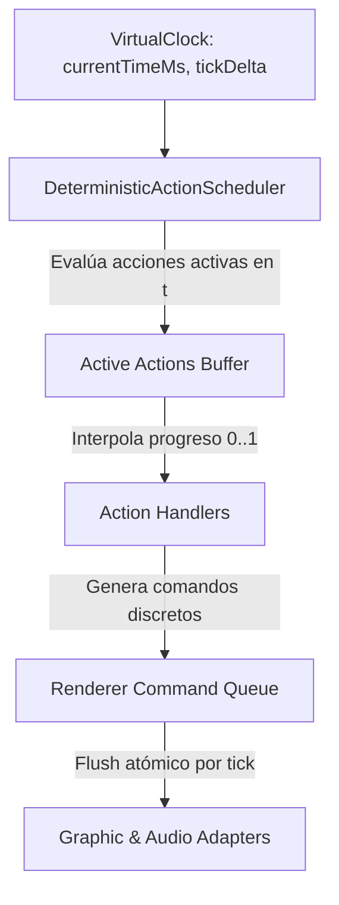

### 8.1 Capacidades Garantizadas por el Scheduler Determinístico:
1. **Scrubbing Milimétrico Bidireccional:** El usuario puede arrastrar la barra de tiempo hacia adelante y hacia atrás. El estado visual en cualquier milisegundo $t$ es una función matemática pura:
   $$\text{State}(t) = \mathcal{F}(S_0, \text{Actions}_{< t}, \alpha(t))$$
2. **Independencia de la Tasa de Refresco:** La lógica de negocio corre sobre tiempo virtual, garantizando que una simulación sea idéntica a 30 FPS, 60 FPS o 144 FPS.
3. **Modo Exportación Offline a Vídeo:** Capacidad de renderizar lecciones a 60 FPS fijos frame a frame hacia WebM/MP4 sin perder un solo fotograma por lag de la CPU.
4. **Velocidad de Reproducción Arbitraria:** Soporta 0.25x, 0.5x, 1x, 2x, 5x o pausa sin desincronizar audio ni partículas.

---

## 9. Integración Simétrica de Renderers (Three.js como Renderer Adapter)

Three.js **nunca debe formar parte del Runtime ni contener lógica de negocio**. Se redefine su rol como un **`RendererAdapter` simétrico** gobernado exclusivamente por comandos:

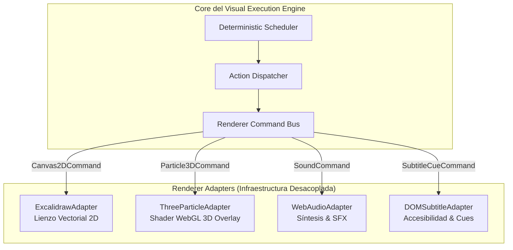

- **Three.js no sabe qué es una lección ni qué es una base de datos.**
- Solo recibe comandos de hardware: `RenderBezierFlowCommand`, `SpawnParticleBurstCommand`, `SetRingPulseCommand`.
- La capa WebGL se monta en un canvas transparente con `pointer-events: none` y se sincroniza mediante la matriz de coordenadas emitida por el `CameraAdapter`.

---

## 10. Los 8 Diagramas de Arquitectura (Mermaid)

### 10.1 Diagrama 1: Arquitectura General del Visual Execution Engine

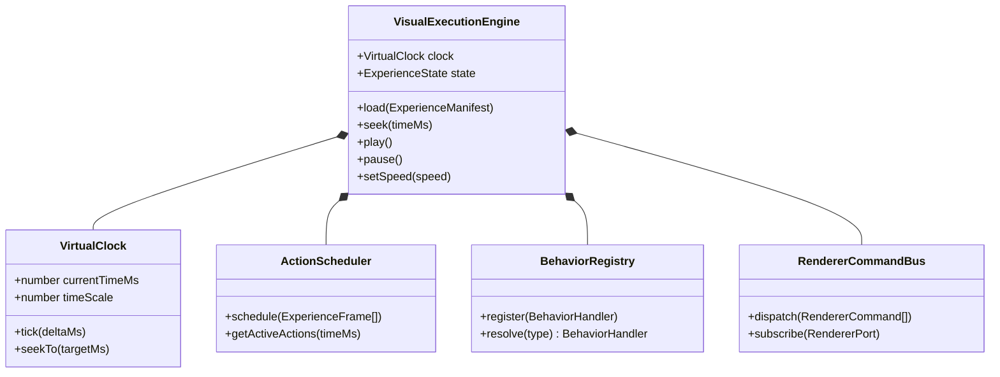

### 10.2 Diagrama 2: Taxonomía de Experiencias y Perfiles

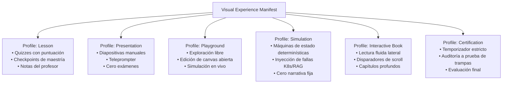

### 10.3 Diagrama 3: Pipeline de Despacho de Acciones (Action $\to$ Command $\to$ Renderer)

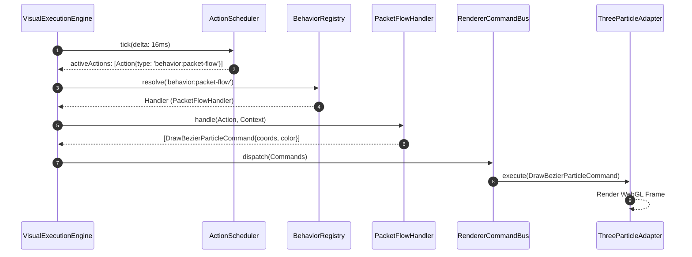

### 10.4 Diagrama 4: Arquitectura del Behavior Registry & Handlers

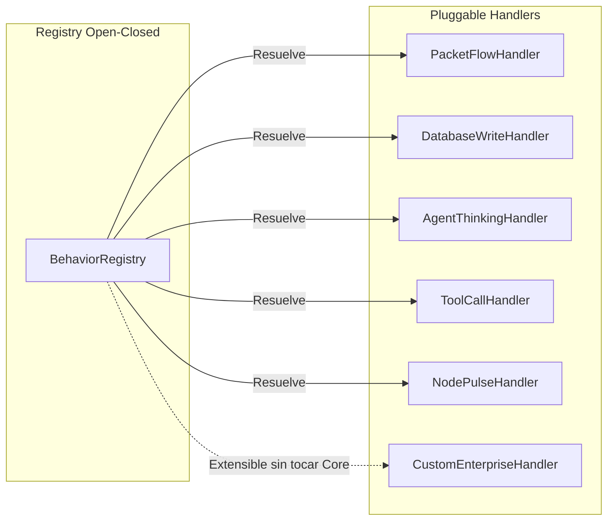

### 10.5 Diagrama 5: Secuencia de Acciones Paralelas en Timeline

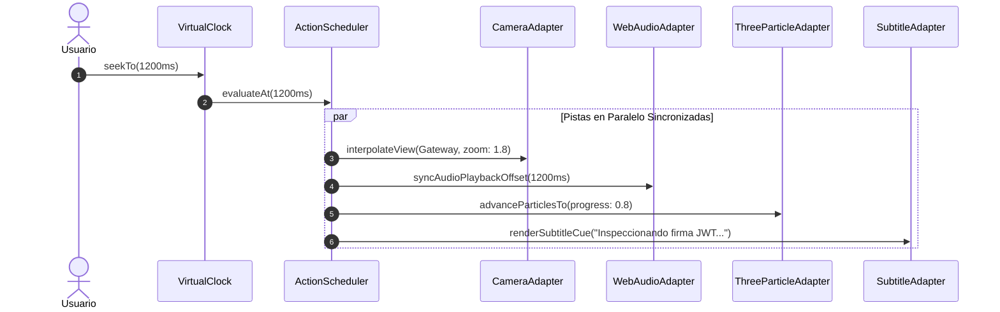

### 10.6 Diagrama 6: Ciclo de Vida del Scheduler Determinístico (Virtual Clock)

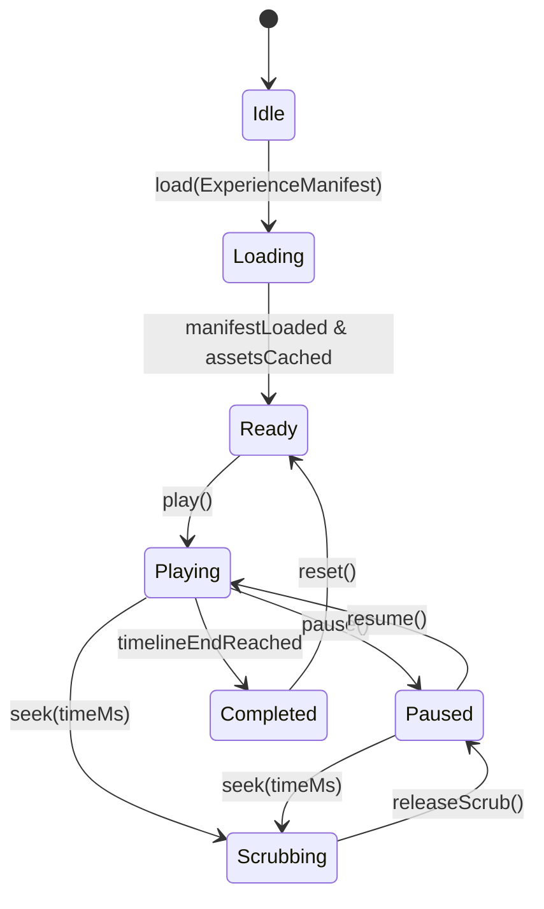

### 10.7 Diagrama 7: Modelo de Adaptadores de Renderizado Simétricos

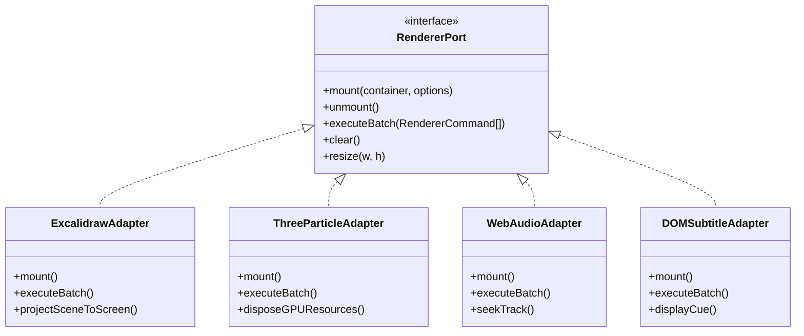

### 10.8 Diagrama 8: Transición de Estados de una Experiencia Visual

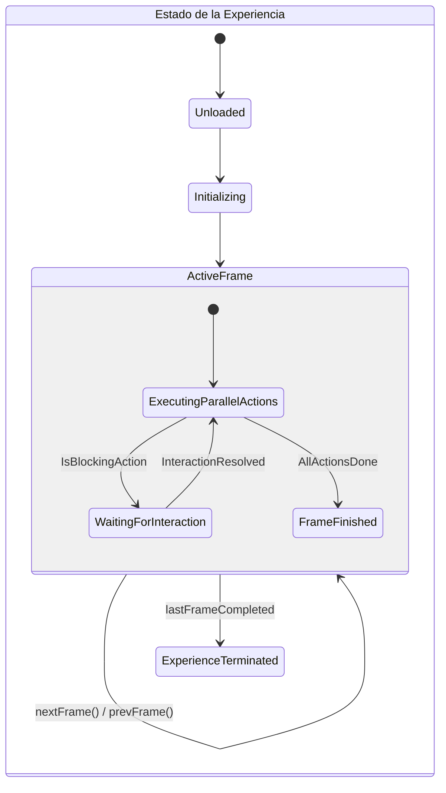

---

## 11. Relación con ADR-004 y Estrategia de Migración

### 11.1 ¿Debe permanecer intacto ADR-004?
**SÍ, pero recontextualizado.**  
El `LessonManifest` diseñado en [ADR-004](004-lesson-manifest.md) **no se descarta ni se destruye**. Se convierte en el **Perfil de Especialización Pedagógica (`profile: "lesson"`)** del motor general.

```
┌────────────────────────────────────────────────────────────────────────┐
│                   RELACIÓN ARQUITECTÓNICA ADR-004 ↔ ADR-005           │
├───────────────────────────────────┬────────────────────────────────────┤
│ Nivel de Abstracción              │ Responsabilidad                    │
├───────────────────────────────────┼────────────────────────────────────┤
│ ADR-005: Visual Execution Engine  │ El sustrato de hardware y tiempo. │
│ (Motor Genérico)                  │ Virtual Clock, Actions, Dispatcher,│
│                                   │ Handlers, Scheduler, Renderers.    │
├───────────────────────────────────┼────────────────────────────────────┤
│ ADR-004: Lesson Manifest & DSL    │ El perfil curricular de autoría.   │
│ (Perfil Especializado)            │ Quizzes, preguntas, checkpoints,   │
│                                   │ pedagogía de Clean Arch, RAG, etc. │
└───────────────────────────────────┴────────────────────────────────────┘
```

Un archivo escrito bajo ADR-004 (`01-clean-architecture.json`) se traduce automáticamente al nuevo motor mediante un adaptador transparente en la capa de carga:
$$\text{ADR-004 LessonManifest} \xrightarrow{\text{LessonProfileAdapter}} \text{ADR-005 VisualExperience}$$

---

## 12. Roadmap de Migración e Impacto en Futuros Sprints

```
┌────────────────────────────────────────────────────────────────────────┐
│               RECALIBRACIÓN DEL ROADMAP DE ARQUITECTURA                │
├──────────┬─────────────────────────────────────────────────────────────┤
│ Sprint   │ Entregables Arquitectónicos y Técnicos                      │
├──────────┼─────────────────────────────────────────────────────────────┤
│ Sprint 2 │ • Formalización de ADR-005 (Motor Universal).               │
│ (Actual) │ • Diseño de interfaces puras: `ExperienceAction`,           │
│          │   `BehaviorRegistry`, `BehaviorHandler`, `VirtualClock`.     │
│          │ • `LessonProfileAdapter` para retrocompatibilidad con ADR-004│
├──────────┼─────────────────────────────────────────────────────────────┤
│ Sprint 3 │ • Implementación del `DeterministicActionScheduler`.         │
│          │ • Refactorización de Three.js hacia un `RendererAdapter`    │
│          │   simétrico sin lógica de negocio.                          │
│          │ • Handlers modulares (PacketFlow, DbWrite, AgentThinking).   │
├──────────┼─────────────────────────────────────────────────────────────┤
│ Sprint 4 │ • Soporte de pistas de acciones paralelas (Audio, Subtítulos│
│          │   y Cámara concurrentes).                                   │
│          │ • Scrubbing bidireccional y reloj desacoplado.              │
├──────────┼─────────────────────────────────────────────────────────────┤
│ Sprint 5 │ • Primer perfil no educativo: `profile: "presentation"`     │
│          │   (Modo Keynote para arquitectura de software).             │
│          │ • `profile: "playground"` (Simulador RAG / MCP abierto).    │
├──────────┼─────────────────────────────────────────────────────────────┤
│ Sprint 6 │ • Multi-Renderer completo (Canvas 2D + WebGL 3D + Mermaid/  │
│          │   C4 + Web Audio) operando sobre el mismo bus de comandos.  │
└──────────┴─────────────────────────────────────────────────────────────┘
```

---

## 13. Riesgos, Beneficios y Trade-offs

### 13.1 Beneficios
1. **Reutilización Masiva de Código (10x):** Un solo motor ejecuta clases, demos comerciales, libros interactivos y playgrounds libres.
2. **Extensibilidad Infinita (OCP Estricto):** Añadir comportamientos gráficos o sonoros es crear un archivo `Handler` independiente sin tocar el scheduler.
3. **Calidad Audiovisual Cinemática:** Concurrencia real de cámara, voz, subtítulos y partículas a 60 FPS sin desincronización por carga de CPU.
4. **Respeto a la Visión a 5 Años:** Alineado directamente con [VISION.md](../../VISION.md), preparando a CASE Visual Lab para ser la plataforma mundial de modelado y entendimiento de sistemas.

### 13.2 Riesgos Identificados y Mitigaciones

| Riesgo | Severidad | Mitigación Arquitectónica |
| :--- | :--- | :--- |
| **Complejidad del Scheduler Determinístico** | Media-Alta | Se construye como una función pura con reloj discreto; se somete a pruebas unitarias exhaustivas con avances de tiempo simulados sin timers reales. |
| **Sobrecarga de Renderers al Despachar Lotes Masivos** | Media | El `RendererCommandBus` implementa coalescencia de comandos (Command Coalescing) por tick de frame para evitar repaints redundantes. |
| **Curva de Aprendizaje en la Autoría de Acciones Paralelas** | Baja | La especificación de alto nivel de ADR-004 abstrae los offsets paralelos para autores comunes; el motor los expande automáticamente. |

---

## 14. Decisión Final

Se aprueba formalmente la adopción de **ADR-005: Visual Execution Engine**.

A partir de esta decisión:
1. El motor central de CASE Visual Lab se consolida como un **Visual Execution Engine** de propósito general, desacoplado de conceptos ontológicos de "clases escolares".
2. Los frames se tratan como contenedores puros de **Acciones Paralelas**.
3. Se adopta el patrón **Behavior Registry & Handlers**, erradicando los `switch-case` monolíticos.
4. Three.js queda formalmente confinado a un **Renderer Adapter** consumidor de comandos de hardware.
5. El contrato [ADR-004](004-lesson-manifest.md) se ratifica y preserva íntegramente como el perfil pedagógico (`profile: "lesson"`) sobre esta nueva base universal.
6. Se mantiene la política innegociable de **cero código modificado, cero commits y cero push** en esta etapa de diseño arquitectónico.
