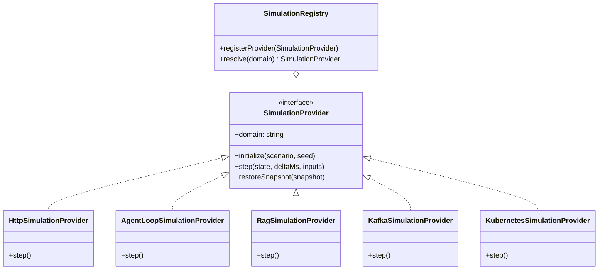
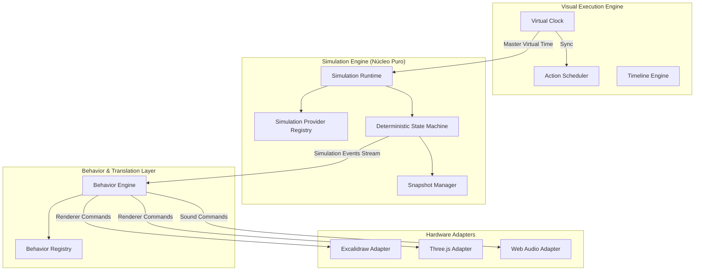
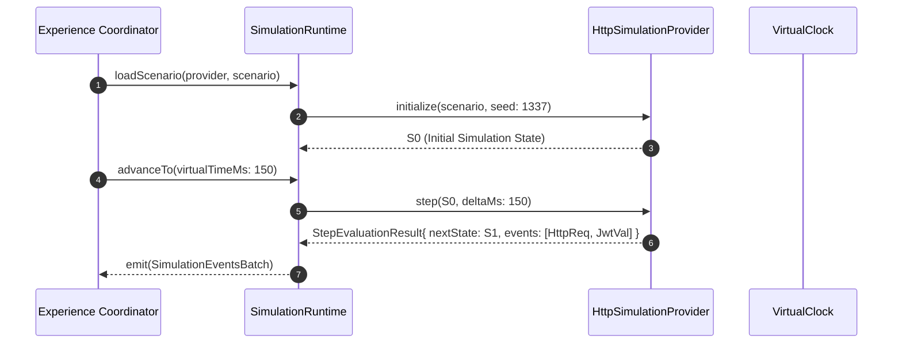
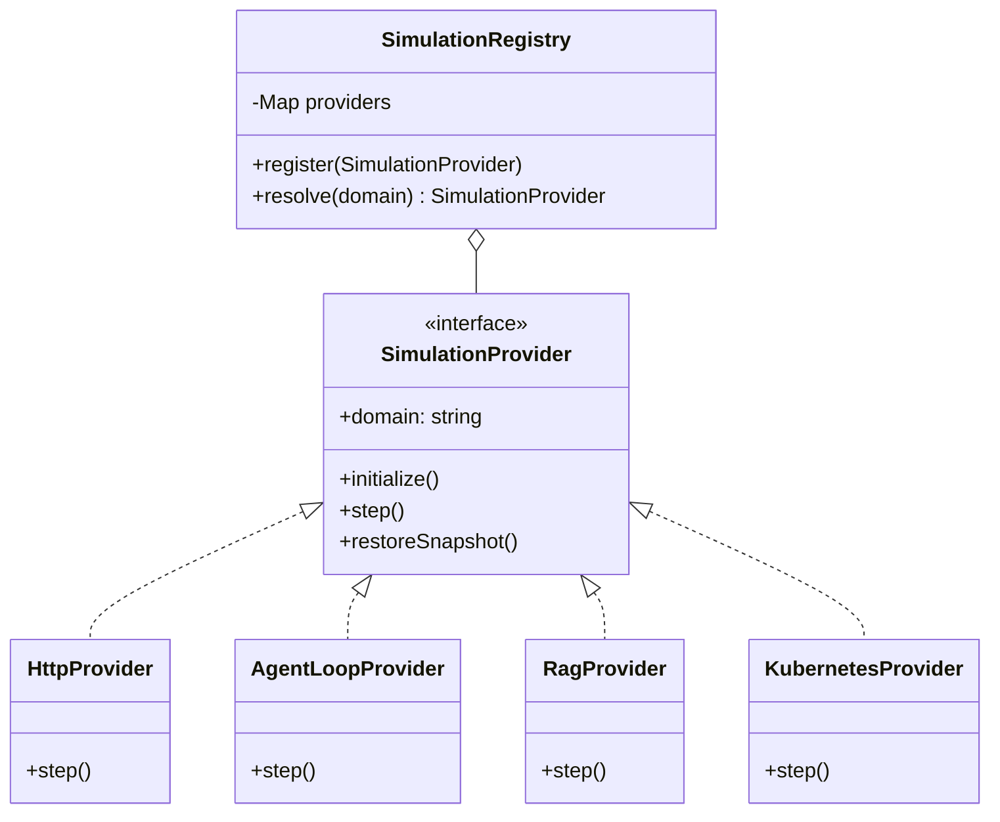
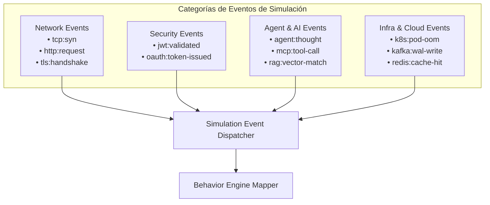
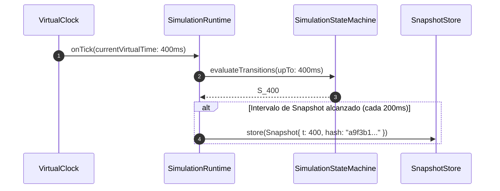
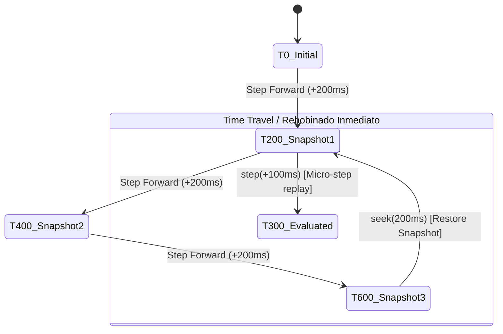
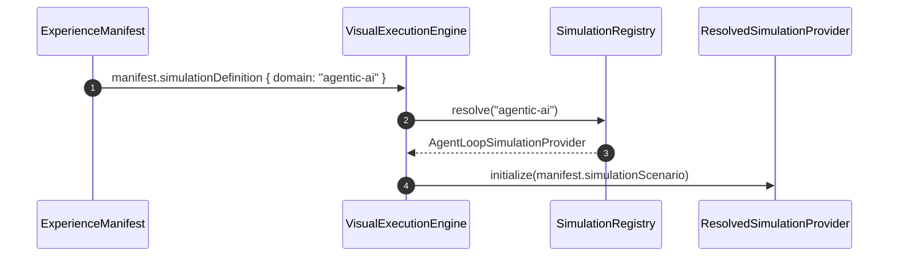
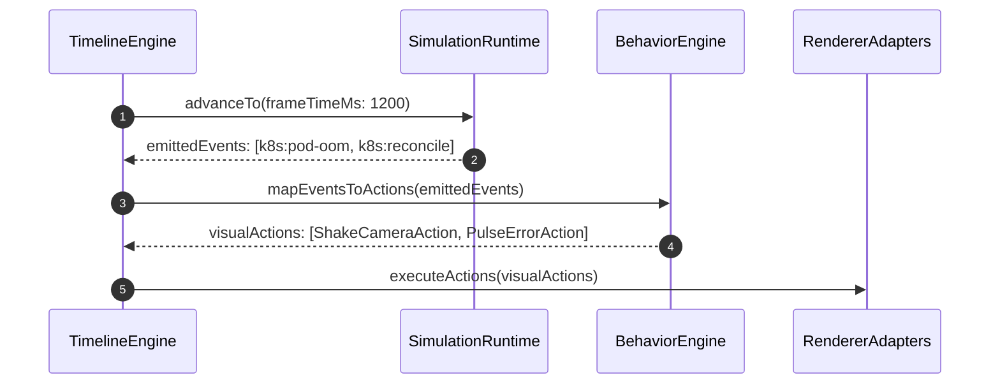

# ADR 006: Simulation Engine — Núcleo Determinístico de Simulación de Sistemas

- **Estado:** Propuesto / Aceptado
- **Fecha:** 2026-10-05
- **Sprint:** Sprint 2 — Arquitectura del Núcleo de Simulación
- **Autores / Decisores:** Principal Software Architect, Software Architect, Staff Frontend Engineer, Product Architect, Engineering Manager
- **Contexto:** Definición del núcleo de simulación formal e independiente de CASE Visual Lab. Este motor desacopla por completo la dinámica del sistema simulado (redes, IA, streaming, sistemas distribuidos, bases de datos) de la experiencia visual, la narrativa pedagógica y los renderizadores gráficos.

---

## 1. Contexto y Declaración del Problema

A través de [ADR-001](001-canvas-renderer-adapter.md) a [ADR-005](005-visual-execution-engine.md), CASE Visual Lab evolucionó desde un editor de diagramas hacia un **Visual Execution Engine** de propósito universal:

```
Visual Execution Engine
│
├── Simulation Engine      <-- [OBJETIVO DE ESTE ADR]
├── Timeline Engine
├── Behavior Engine
├── Animation Engine
├── Camera Engine
├── Narrative Engine
├── Evaluation Engine
├── Renderer Engine
├── Asset Engine
└── Plugin Engine
```

Sin embargo, existía una mezcla conceptual crítica en las capas de ejecución:
> **El problema del acoplamiento entre Simulación y Representación:**  
> En las iteraciones previas, la lógica de *qué hace el sistema simulado* (p. ej., validar un token JWT, calcular la similitud de coseno en una base de datos vectorial o reiniciar un pod de Kubernetes) estaba mezclada con *cómo se ve en pantalla* (`packet-flow`, `node-pulse`, colores de trazo y tiempos de animación).

Si un sistema simula un algoritmo distribuido como Raft o Paxos, esa simulación debe ser **matemáticamente pura, determinística y comprobable mediante pruebas unitarias sin canvas, sin WebGL y sin navegador**.

El **Simulation Engine** debe operar bajo la filosofía de los grandes motores de simulación y videojuegos (Unity, Unreal, Godot, Temporal, SimPy):
1. La simulación modela entidades, estados, variables, eventos y transiciones discretas en el tiempo.
2. La simulación emite **Simulation Events** de dominio puro.
3. El motor visual (Behavior Engine + Timeline) escucha esos eventos y decide *cómo coreografiarlos cinematográficamente*.
4. El Runtime nunca contiene código específico de HTTP, RAG, Kafka o Kubernetes; delega la simulación a **Simulation Providers** intercambiables.

---

## 2. Discovery: Diagnóstico y Segregación de Responsabilidades

### 2.1 Matriz de Responsabilidades: Runtime vs. Simulation Engine

```
┌────────────────────────────────────────────────────────────────────────┐
│             SEGREGACIÓN DE RESPONSABILIDADES EN EL MOTOR               │
├──────────────────────────┬─────────────────────────────┬───────────────┤
│ Responsabilidad          │ ¿A quién pertenecía antes?  │ ¿A quién debe │
│                          │                             │ pertenecer?   │
├──────────────────────────┼─────────────────────────────┼───────────────┤
│ Orquestar Virtual Clock  │ LessonRuntime / Page        │ Runtime       │
├──────────────────────────┼─────────────────────────────┼───────────────┤
│ Calcular estado de Pods, │ Mezclado en JSON / Timeline │ Simulation    │
│ Réplicas o Índices HNSW  │                             │ Engine        │
├──────────────────────────┼─────────────────────────────┼───────────────┤
│ Validar Quizzes o Gates  │ LessonRuntimeService        │ Evaluation    │
│ de aprendizaje           │                             │ Engine        │
├──────────────────────────┼─────────────────────────────┼───────────────┤
│ Decidir duración de      │ CinematicFrame / Step       │ Timeline /    │
│ partículas y cámara      │                             │ Behavior Eng. │
├──────────────────────────┼─────────────────────────────┼───────────────┤
│ Transición de estados:   │ Inexistente o codificada    │ Simulation    │
│ $S_{t+1} = \delta(S_t,e)$│ a mano en mutateState       │ Engine (Puro) │
├──────────────────────────┼─────────────────────────────┼───────────────┤
│ Dibujar en GPU / DOM     │ Excalidraw / Three.js       │ Renderer      │
│                          │                             │ Adapters      │
└──────────────────────────┴─────────────────────────────┴───────────────┘
```

### 2.2 Conceptos Pedagógicos vs. Conceptos de Simulación Pura
- **Conceptos Pedagógicos (Pertenecen a Evaluation / Narrative):** `Checkpoint`, `Quiz`, `BloomLevel`, `Hint`, `ExplanationMarkdown`, `TeacherNote`.
- **Conceptos de Simulación Pura (Pertenecen a Simulation Engine):** `Entity`, `StateVariable`, `TransitionFunction`, `CausalEventChain`, `InvariantConstraint`, `DiscreteEvent`, `SimulationTick`, `Snapshot`.

---

## 3. Arquitectura del Flujo Unidireccional

La arquitectura desacopla el evento lógico del comando visual a través de un canal unidireccional estricto:

```mermaid
flowchart TD
    VE[Visual Experience / Scenario] -->|Carga Definición & Seeds| Sim[Simulation Engine]
    Clock[VirtualClock / Scheduler] -->|Tick discreto t| Sim
    Sim -->|Ejecuta Transiciones delta| SimState[Simulation State Machine]
    SimState -->|Emite| SimEvents[Simulation Events Stream]
    SimEvents -->|Consume Eventos de Dominio| Behavior[Behavior Engine]
    Behavior -->|Mapea Semántica a Intención| Actions[Visual Actions]
    Actions -->|Genera Instrucciones| Cmds[Renderer Commands Batch]
    Cmds -->|Proyecta| Renderers[Renderers: 2D Canvas | 3D WebGL | Web Audio]
```

$$\text{Simulation Event (Qué ocurrió)} \xrightarrow{\text{Behavior Engine}} \text{Visual Behavior (Cómo se ilustra)} \xrightarrow{\text{Renderer Adapter}} \text{Pixels / Sound}$$

---

## 4. Diseño del Simulation Engine: Contratos e Interfaces Formales

A continuación se formalizan los contratos arquitectónicos puros en TypeScript (sin dependencias externas).

### 4.1 Identidad y Metadatos de la Simulación

```typescript
export type SimulationDomainType =
  | 'networking'
  | 'distributed-systems'
  | 'event-streaming'
  | 'agentic-ai'
  | 'vector-database'
  | 'clean-architecture'
  | 'cloud-infrastructure'
  | 'consensus-protocol'
  | 'custom';

export interface SimulationMetadata {
  readonly id: string;
  readonly name: string;
  readonly domain: SimulationDomainType;
  readonly version: string;
  readonly description: string;
  readonly deterministicSeed: number;
}
```

### 4.2 Estado, Variables y Snapshots

```typescript
export type SimulationPrimitive = string | number | boolean | null | undefined;
export type SimulationStateValue = SimulationPrimitive | readonly SimulationPrimitive[] | Record<string, unknown>;

export interface SimulationVariables {
  readonly [variableName: string]: SimulationStateValue;
}

export interface SimulationEntityState {
  readonly entityId: string;
  readonly status: string;
  readonly metrics: Record<string, number>;
  readonly attributes: Record<string, SimulationStateValue>;
}

export interface SimulationState {
  readonly stepIndex: number;
  readonly virtualTimeMs: number;
  readonly variables: SimulationVariables;
  readonly entities: Record<string, SimulationEntityState>;
  readonly eventLog: readonly SimulationEvent[];
}

export interface SimulationSnapshot {
  readonly snapshotId: string;
  readonly virtualTimeMs: number;
  readonly stepIndex: number;
  readonly stateHash: string; // Hash SHA-256 para validación de determinismo
  readonly state: SimulationState;
}
```

### 4.3 Taxonomía Universal de Simulation Events

Un `SimulationEvent` describe **exclusivamente un suceso lógico del sistema**, sin coordenadas, colores ni propiedades gráficas.

```typescript
export interface SimulationEvent<TPayload = Record<string, unknown>> {
  readonly eventId: string;
  readonly correlationId: string;
  readonly causalParentEventId?: string;
  readonly type: string; // E.g., 'http:request-sent', 'k8s:pod-oom-killed'
  readonly sourceEntityId: string;
  readonly targetEntityId?: string;
  readonly virtualTimeMs: number;
  readonly stepIndex: number;
  readonly payload: TPayload;
}
```

### 4.4 Contrato del Proveedor de Simulación (`SimulationProvider`)

El patrón Provider desacopla el motor de los dominios técnicos específicos.

```typescript
export interface SimulationScenario<TInputs = Record<string, unknown>> {
  readonly scenarioId: string;
  readonly initialVariables: SimulationVariables;
  readonly initialEntities: Record<string, SimulationEntityState>;
  readonly inputs: readonly SimulationInputEvent<TInputs>[];
}

export interface SimulationInputEvent<TData = Record<string, unknown>> {
  readonly timeOffsetMs: number;
  readonly actionName: string;
  readonly data: TData;
}

export interface StepEvaluationResult {
  readonly nextState: SimulationState;
  readonly emittedEvents: readonly SimulationEvent[];
  readonly isCompleted: boolean;
}

export interface SimulationProvider {
  readonly domain: SimulationDomainType;
  readonly providerId: string;
  
  initialize(scenario: SimulationScenario, seed: number): SimulationState;
  
  step(
    currentState: SimulationState,
    deltaVirtualTimeMs: number,
    injectedInputs?: readonly SimulationInputEvent[]
  ): StepEvaluationResult;
  
  restoreSnapshot(snapshot: SimulationSnapshot): SimulationState;
  
  validateInvariants(state: SimulationState): readonly string[]; // Errores de invariantes
}
```

### 4.5 Interfaz Central del Runtime de Simulación (`SimulationRuntime`)

```typescript
export interface SimulationRuntime {
  loadScenario(provider: SimulationProvider, scenario: SimulationScenario): void;
  advanceTo(targetVirtualTimeMs: number): readonly SimulationEvent[];
  step(): StepEvaluationResult;
  seek(targetVirtualTimeMs: number): SimulationState;
  captureSnapshot(): SimulationSnapshot;
  restoreSnapshot(snapshot: SimulationSnapshot): void;
  getState(): SimulationState;
  getHistory(): readonly SimulationSnapshot[];
  reset(): void;
}
```

---

## 5. Arquitectura de Simulation Providers (Pluggable SPI)

El Simulation Engine actúa como un **Microkernel** que no implementa protocolos directamente. En su lugar, expone una **Service Provider Interface (SPI)**:



### Principio de Aislamiento de Dependencias:
- `HttpSimulationProvider` conoce el estado de una conexión TCP, cabeceras HTTP y latencias de transporte.
- `RagSimulationProvider` almacena tensores flotantes estáticos y calcula similitud coseno entre vectores 1536d.
- `AgentLoopSimulationProvider` simula la memoria de trabajo y la selección de herramientas de un LLM.
- **El núcleo de CASE Visual Lab no tiene `import` de ninguno de ellos; se cargan dinámicamente mediante el registro.**

---

## 6. Modelo de Estado en Seis Dimensiones

Para garantizar estabilidad a 10 años, el estado de CASE Visual Lab se organiza en seis planos ortogonales e incomunicados directamente:

```
┌────────────────────────────────────────────────────────────────────────┐
│                   PLANOS ORTOGONALES DE ESTADO                         │
├────────────────────┬───────────────────────────────────────────────────┤
│ Plano de Estado    │ Responsabilidad y Ciclo de Vida                   │
├────────────────────┼───────────────────────────────────────────────────┤
│ 1. Estado de       │ Variables matemáticas del modelo simulado         │
│    Simulación      │ (conexiones, réplicas, vectores, locks). Inmutable│
│                    │ por tick. 100% determinístico.                    │
├────────────────────┼───────────────────────────────────────────────────┤
│ 2. Estado Temporal │ Tiempo virtual acumulado ($t$), velocidad (1x, 2x)│
│    (Kinematic)     │ e índice de frame en el Scheduler.                │
├────────────────────┼───────────────────────────────────────────────────┤
│ 3. Estado Visual   │ Coordenadas proyectadas en pantalla, opacidad de  │
│                    │ nodos, partículas vivas en GPU, posición de cámara│
├────────────────────┼───────────────────────────────────────────────────┤
│ 4. Estado          │ Puntuación del alumno, intentos en preguntas,     │
│    Pedagógico      │ checkpoints superados, insignias obtenidas.       │
├────────────────────┼───────────────────────────────────────────────────┤
│ 5. Estado de       │ Conexiones a adaptadores, referencias DOM, buffers│
│    Runtime         │ WebGL, suscripciones a eventos de infraestructura │
├────────────────────┼───────────────────────────────────────────────────┤
│ 6. Estado          │ Datos guardados en IndexedDB/LocalStorage:        │
│    Persistente     │ perfil del usuario, lecciones completadas.        │
└────────────────────┴───────────────────────────────────────────────────┘
```

---

## 7. Scheduler y Sincronización con el Virtual Clock (Discrete Event Simulation - DES)

### 7.1 Evaluación del VirtualClock (ADR-005) vs. SimulationClock
Se evaluó si el Simulation Engine debe tener su propio reloj independiente o utilizar el `VirtualClock` unificado de ADR-005:

| Enfoque | Ventajas | Desventajas | Decisión |
| :--- | :--- | :--- | :--- |
| **Relojes Separados Asíncronos** | El motor de simulación puede computar a velocidades distintas que el render. | Susceptible a carreras de sincronización y jitter visual. | Descartado. |
| **VirtualClock Unificado (ADR-005) como Master Clock** | Sincronización bit a bit garantizada. Permite scrubbing perfecto. Si el usuario congela el reloj, la simulación se congela instantáneamente. | Requiere que el Simulation Provider soporte discretización de tiempo en pasos fijos ($\Delta t$). | **Aprobado.** |

### 7.2 Algoritmo de Simulación de Eventos Discretos (DES)
La simulación avanza mediante pasos determinísticos. Si el usuario arrastra la barra de tiempo desde $t = 1000\text{ ms}$ hasta $t = 2500\text{ ms}$:
1. El `SimulationRuntime` busca el snapshot más cercano con $t_{\text{snap}} \le 2500$.
2. Si existe un snapshot en $t = 2000$, restaura el estado instantáneamente.
3. Ejecuta los pasos de simulación restantes:
   $$S_{2500} = \delta(\delta(S_{2000}, \Delta t_1), \Delta t_2)$$
4. Emite el stream consolidado de `SimulationEvents` correspondientes a esa ventana.
5. El Behavior Engine recibe los eventos y actualiza la escena gráfica.

---

## 8. Determinismo Matemático y Reproducibilidad Cero-Entropía

El Simulation Engine prohíbe el uso de:
- `Math.random()`: En su lugar se utiliza un Generador de Números Pseudoaleatorios basado en Semilla (PRNG Xoshiro128** o PCG).
- `Date.now()` o `performance.now()`: En su lugar se utiliza estrictamente `SimulationClock.currentTimeMs`.
- `setTimeout`, `setInterval`, `requestAnimationFrame` en la lógica de simulación.

### Función Pura de Transición de Estados:
$$S_{t+1} = \delta(S_t, E_t, \theta)$$
Donde:
- $S_t$: Vector de estado en el paso $t$.
- $E_t$: Conjunto de eventos de entrada inyectados en el paso $t$.
- $\theta$: Semilla y configuración inmutable del escenario.

**Garantía:** Una simulación ejecutada 10,000 veces en diferentes navegadores, sistemas operativos (Windows, Linux, macOS) o en un proceso Node.js sin entorno gráfico produce **exactamente el mismo hash de estado (`stateHash`)**.

---

## 9. Casos de Estudio Completos (Modelado Formal de Simulation Events)

A continuación se modelan 5 dominios técnicos complejos mediante **Simulation Events puros**, demostrando que no existen propiedades visuales en este estrato.

### 9.1 Caso 1: Ciclo de Vida de una Petición HTTP Segura

```json
[
  {
    "eventId": "evt_tcp_syn_01",
    "type": "tcp:syn-sent",
    "sourceEntityId": "client_app",
    "targetEntityId": "edge_gateway",
    "virtualTimeMs": 0,
    "payload": { "seq": 1001, "windowSize": 65535 }
  },
  {
    "eventId": "evt_tls_handshake_02",
    "type": "tls:handshake-completed",
    "sourceEntityId": "edge_gateway",
    "targetEntityId": "client_app",
    "virtualTimeMs": 40,
    "payload": { "cipher": "TLS_AES_256_GCM_SHA384", "alpn": "h2" }
  },
  {
    "eventId": "evt_http_req_03",
    "type": "http:request-received",
    "sourceEntityId": "client_app",
    "targetEntityId": "edge_gateway",
    "virtualTimeMs": 60,
    "payload": {
      "method": "POST",
      "path": "/api/v1/orders",
      "headers": { "authorization": "Bearer eyJhbG...", "x-trace-id": "tr_99182" }
    }
  },
  {
    "eventId": "evt_jwt_val_04",
    "type": "security:jwt-validated",
    "sourceEntityId": "edge_gateway",
    "virtualTimeMs": 75,
    "payload": { "subject": "usr_alpha_4", "roles": ["ORDER_CREATOR"], "isValid": true }
  },
  {
    "eventId": "evt_ratelimit_05",
    "type": "ratelimit:check-passed",
    "sourceEntityId": "edge_gateway",
    "virtualTimeMs": 80,
    "payload": { "tokensRemaining": 98, "bucketCapacity": 100 }
  },
  {
    "eventId": "evt_grpc_invoke_06",
    "type": "grpc:method-invoked",
    "sourceEntityId": "edge_gateway",
    "targetEntityId": "order_service",
    "virtualTimeMs": 95,
    "payload": { "method": "orders.v1.OrderService/CreateOrder" }
  },
  {
    "eventId": "evt_db_tx_start_07",
    "type": "database:transaction-started",
    "sourceEntityId": "order_service",
    "targetEntityId": "postgres_primary",
    "virtualTimeMs": 130,
    "payload": { "txId": "tx_8819", "isolationLevel": "READ_COMMITTED" }
  },
  {
    "eventId": "evt_db_commit_08",
    "type": "database:transaction-committed",
    "sourceEntityId": "postgres_primary",
    "targetEntityId": "order_service",
    "virtualTimeMs": 170,
    "payload": { "txId": "tx_8819", "rowsAffected": 1, "walPosition": "0/16B2D40" }
  },
  {
    "eventId": "evt_http_res_09",
    "type": "http:response-sent",
    "sourceEntityId": "order_service",
    "targetEntityId": "client_app",
    "virtualTimeMs": 210,
    "payload": { "statusCode": 201, "body": { "orderId": "ord_1024", "status": "CONFIRMED" } }
  }
]
```

### 9.2 Caso 2: Agent Loop & MCP Tool Calling

```json
[
  {
    "eventId": "evt_agent_input_01",
    "type": "agent:user-prompt-received",
    "sourceEntityId": "user_interface",
    "targetEntityId": "planner_agent",
    "virtualTimeMs": 0,
    "payload": { "prompt": "Reinicia los pods que están consumiendo más del 90% de RAM en production." }
  },
  {
    "eventId": "evt_agent_thought_02",
    "type": "agent:reasoning-step",
    "sourceEntityId": "planner_agent",
    "virtualTimeMs": 800,
    "payload": {
      "thought": "Debo consultar primero las métricas de memoria del cluster mediante la herramienta kubernetes_get_pod_metrics.",
      "planStep": 1,
      "totalStepsPlanned": 3
    }
  },
  {
    "eventId": "evt_mcp_call_03",
    "type": "mcp:tool-call-invoked",
    "sourceEntityId": "planner_agent",
    "targetEntityId": "mcp_k8s_server",
    "virtualTimeMs": 1200,
    "payload": {
      "toolName": "kubernetes_get_pod_metrics",
      "arguments": { "namespace": "production", "metric": "memory" }
    }
  },
  {
    "eventId": "evt_mcp_res_04",
    "type": "mcp:tool-call-completed",
    "sourceEntityId": "mcp_k8s_server",
    "targetEntityId": "planner_agent",
    "virtualTimeMs": 1850,
    "payload": {
      "output": [
        { "pod": "backend-replica-1", "memoryUsagePct": 94.2 },
        { "pod": "backend-replica-2", "memoryUsagePct": 42.1 }
      ]
    }
  },
  {
    "eventId": "evt_agent_decision_05",
    "type": "agent:decision-taken",
    "sourceEntityId": "planner_agent",
    "virtualTimeMs": 2300,
    "payload": {
      "selectedAction": "mcp:invoke_tool",
      "targetTool": "kubernetes_restart_pod",
      "rationale": "El pod backend-replica-1 excede el umbral del 90%."
    }
  }
]
```

### 9.3 Caso 3: Pipeline RAG & Búsqueda Vectorial

```json
[
  {
    "eventId": "evt_rag_query_01",
    "type": "rag:query-received",
    "sourceEntityId": "user",
    "targetEntityId": "rag_orchestrator",
    "virtualTimeMs": 0,
    "payload": { "queryText": "¿Cómo se configura el circuit breaker en Envoy?" }
  },
  {
    "eventId": "evt_embed_gen_02",
    "type": "embedding:vector-generated",
    "sourceEntityId": "rag_orchestrator",
    "targetEntityId": "embedding_model",
    "virtualTimeMs": 150,
    "payload": { "dimensions": 1536, "norm": 1.0, "latencyMs": 142 }
  },
  {
    "eventId": "evt_vec_search_03",
    "type": "vectordb:hnsw-search-started",
    "sourceEntityId": "rag_orchestrator",
    "targetEntityId": "pgvector_db",
    "virtualTimeMs": 160,
    "payload": { "metric": "cosine", "efSearch": 64, "topK": 2 }
  },
  {
    "eventId": "evt_vec_match_04",
    "type": "vectordb:matches-found",
    "sourceEntityId": "pgvector_db",
    "targetEntityId": "rag_orchestrator",
    "virtualTimeMs": 210,
    "payload": {
      "matches": [
        { "chunkId": "doc_envoy_cb_09", "score": 0.912, "source": "docs/circuit-breakers.md" },
        { "chunkId": "doc_envoy_retries_02", "score": 0.834, "source": "docs/resilience.md" }
      ]
    }
  },
  {
    "eventId": "evt_context_inject_05",
    "type": "llm:augmented-prompt-prepared",
    "sourceEntityId": "rag_orchestrator",
    "targetEntityId": "llm_client",
    "virtualTimeMs": 225,
    "payload": { "promptTokens": 1420, "injectedContextTokens": 810 }
  }
]
```

### 9.4 Caso 4: Publicación y Consumo en Kafka (EDA)

```json
[
  {
    "eventId": "evt_kafka_produce_01",
    "type": "kafka:record-produced",
    "sourceEntityId": "order_aggregate",
    "targetEntityId": "kafka_broker_1",
    "virtualTimeMs": 0,
    "payload": {
      "topic": "orders.v1.events",
      "key": "ord_1024",
      "partitionKeyHash": 3,
      "assignedPartition": 3
    }
  },
  {
    "eventId": "evt_kafka_wal_02",
    "type": "kafka:segment-written",
    "sourceEntityId": "kafka_broker_1",
    "virtualTimeMs": 15,
    "payload": { "partition": 3, "offset": 104421, "replicationFactor": 3, "inSyncReplicas": 3 }
  },
  {
    "eventId": "evt_kafka_ack_03",
    "type": "kafka:producer-ack",
    "sourceEntityId": "kafka_broker_1",
    "targetEntityId": "order_aggregate",
    "virtualTimeMs": 25,
    "payload": { "acks": "all", "offset": 104421 }
  },
  {
    "eventId": "evt_kafka_poll_04",
    "type": "kafka:batch-consumed",
    "sourceEntityId": "kafka_broker_1",
    "targetEntityId": "billing_consumer_group",
    "virtualTimeMs": 40,
    "payload": { "consumerId": "billing-worker-01", "partition": 3, "offset": 104421 }
  },
  {
    "eventId": "evt_kafka_commit_05",
    "type": "kafka:offset-committed",
    "sourceEntityId": "billing_consumer_group",
    "targetEntityId": "kafka_broker_1",
    "virtualTimeMs": 95,
    "payload": { "consumerGroup": "billing-service", "committedOffset": 104422 }
  }
]
```

### 9.5 Caso 5: Despliegue y Recuperación en Kubernetes (Control Loop)

```json
[
  {
    "eventId": "evt_k8s_pod_oom_01",
    "type": "k8s:container-terminated",
    "sourceEntityId": "kubelet_node_2",
    "targetEntityId": "pod_backend_replica_1",
    "virtualTimeMs": 0,
    "payload": { "exitCode": 137, "reason": "OOMKilled", "memoryLimitBytes": 536870912 }
  },
  {
    "eventId": "evt_k8s_reconcile_02",
    "type": "k8s:reconciliation-triggered",
    "sourceEntityId": "replicaset_controller",
    "virtualTimeMs": 50,
    "payload": {
      "resource": "apps/v1/ReplicaSet",
      "desiredReplicas": 3,
      "currentHealthyReplicas": 2,
      "deficit": 1
    }
  },
  {
    "eventId": "evt_k8s_schedule_03",
    "type": "k8s:pod-scheduled",
    "sourceEntityId": "kube_scheduler",
    "targetEntityId": "node_4",
    "virtualTimeMs": 180,
    "payload": { "podName": "backend-replica-3-x99b", "assignedNode": "worker-node-04" }
  },
  {
    "eventId": "evt_k8s_pull_04",
    "type": "k8s:image-pull-completed",
    "sourceEntityId": "containerd_node_4",
    "virtualTimeMs": 950,
    "payload": { "image": "registry.case.org/backend:v1.4", "sizeBytes": 142000000 }
  },
  {
    "eventId": "evt_k8s_ready_05",
    "type": "k8s:readiness-probe-passed",
    "sourceEntityId": "kubelet_node_4",
    "targetEntityId": "endpoint_slice_controller",
    "virtualTimeMs": 1400,
    "payload": { "podIP": "10.244.3.44", "status": "Ready", "healthyReplicasNow": 3 }
  }
]
```

---

## 10. Demostración de Extensibilidad a 10 Años

El diseño garantiza que la incorporación de dominios tecnológicos futuros **no alterará una sola línea de código del Runtime**:

### 10.1 Blockchain & Contratos Inteligentes
Un `BlockchainSimulationProvider` emite:
- `mempool:tx-received`
- `pos:validator-attestation`
- `evm:gas-consumed`
- `block:merkle-tree-calculated`

### 10.2 Computación Cuántica
Un `QuantumSimulationProvider` emite:
- `qubit:state-initialized { state: "|0>" }`
- `gate:hadamard-applied { qubitIndex: 0, superpositionAlpha: 0.707, beta: 0.707 }`
- `qubit:measurement-collapsed { outcome: 1, probability: 0.50 }`

### 10.3 Robótica & ROS (Robot Operating System)
Un `RosSimulationProvider` emite:
- `topic:publish { topic: "/odom", linearVelocity: 1.2 }`
- `tf:transform-broadcast { parentFrame: "base_link", childFrame: "laser" }`
- `action:navigation-goal-reached { toleranceMm: 2 }`

### 10.4 IoT & Edge Computing
Un `IotSimulationProvider` emite:
- `mqtt:packet-published { qos: 1, topic: "telemetry/temp" }`
- `edge:offline-buffer-enqueued { queueDepth: 412 }`

---

## 11. Los 10 Diagramas de Arquitectura (Mermaid)

### 11.1 Diagrama 1: Arquitectura General (Visual Execution Engine + Simulation Engine)



### 11.2 Diagrama 2: Simulation Runtime & Ciclo de Vida



### 11.3 Diagrama 3: Simulation Provider Architecture (SPI Pattern)



### 11.4 Diagrama 4: Simulation Events Flow & Taxonomy



### 11.5 Diagrama 5: Simulation Scheduler & Virtual Clock Synchronization



### 11.6 Diagrama 6: Simulation State & Snapshotting (Scrubbing / Time Travel)



### 11.7 Diagrama 7: Simulation Registry & Provider Resolution



### 11.8 Diagrama 8: Integración Simulation Engine + Behavior Engine

```mermaid
flowchart LR
    subgraph "Simulation Engine"
        SE[Simulation Event<br/>'vectordb:matches-found'<br/>{ score: 0.912, chunkId: 'cb_09' }]
    end

    subgraph "Behavior Engine"
        BM[Behavior Mapping Registry]
        BH[VectorSearchHighlightBehavior]
    end

    subgraph "Renderer Layer"
        CMD1[RendererCommand: 'set-node-badge'<br/>{ text: 'SIMILARITY: 91.2%' }]
        CMD2[RendererCommand: 'spawn-glow'<br/>{ color: '#38EF7D' }]
    end

    SE --> BM
    BM --> BH
    BH --> CMD1
    BH --> CMD2
```

### 11.9 Diagrama 9: Integración Simulation + Timeline



### 11.10 Diagrama 10: Multi-Domain Event Stream (Parallel Tracks)

```mermaid
gantt
    title Pistas de Eventos de Simulación Concurrentes en Virtual Clock
    dateFormat X
    axisFormat %s ms
    section Red & Gateway
    tcp:syn-sent            :0, 40
    http:request-received   :60, 80
    security:jwt-validated  :75, 95
    section Microservicio
    grpc:method-invoked     :95, 130
    domain:rule-evaluated   :130, 160
    section Base de Datos
    db:tx-started           :130, 150
    db:wal-write            :150, 170
    db:tx-committed         :170, 190
    section Telemetría
    metrics:latency-recorded :190, 210
```



---

## 12. Roadmap de Implementación e Impacto en Sprints

```
┌────────────────────────────────────────────────────────────────────────┐
│               ROADMAP DE IMPLEMENTACIÓN DEL SIMULATION CORE            │
├──────────┬─────────────────────────────────────────────────────────────┤
│ Sprint   │ Entregables Técnicos                                        │
├──────────┼─────────────────────────────────────────────────────────────┤
│ Sprint 2 │ • Formalización de ADR-006.                                 │
│ (Actual) │ • Contratos puros: `SimulationRuntime`, `SimulationProvider`,│
│          │   `SimulationEvent`, `SimulationSnapshot`.                  │
│          │ • `SimulationRegistry` en memoria con SPI abierta.          │
├──────────┼─────────────────────────────────────────────────────────────┤
│ Sprint 3 │ • Primer Provider oficial: `HttpSimulationProvider`         │
│          │   (TCP, TLS, Gateway, JWT, Headers).                        │
│          │ • Segundo Provider: `AgentLoopSimulationProvider` (MCP).    │
│          │ • Pruebas unitarias de determinismo (10,000 runs idénticos). │
├──────────┼─────────────────────────────────────────────────────────────┤
│ Sprint 4 │ • Integración de `RagSimulationProvider` (HNSW & Vectores). │
│          │ • Snapshotting y scrubbing bidireccional en el canvas.      │
│          │ • Desacoplamiento total de timers (`VirtualClock` master).  │
├──────────┼─────────────────────────────────────────────────────────────┤
│ Sprint 5 │ • `KubernetesSimulationProvider` y `KafkaSimulationProvider`│
│          │ • Simulaciones multi-entidad con inyección de fallas en vivo│
└──────────┴─────────────────────────────────────────────────────────────┘
```

---

## 13. Riesgos, Beneficios, Alternativas Descartadas y Trade-offs

### 13.1 Beneficios
1. **Reutilización Masiva:** El Simulation Engine puede ejecutarse en el navegador, en un WebWorker aislado, en Node.js para testing automático de arquitecturas o en un CLI de CI/CD.
2. **Determinismo Cero-Entropía:** Pruebas unitarias 100% confiables sin esperas de red ni `sleep()`.
3. **Escalabilidad Infinita:** Escribir un nuevo simulador para Kafka, Docker o Redes Neuronales no requiere tocar el motor gráfico ni Angular.
4. **Independencia Tecnológica Total:** El motor gráfico (Excalidraw, Three.js) puede sustituirse sin alterar ninguna regla de simulación.

### 13.2 Alternativas Descartadas

1. **Descartado: Embeber la simulación en los scripts de narrativa.**  
   *Razón:* Acopla la física del sistema a los textos en Markdown y destruye el time-travel.
2. **Descartado: Depender de emuladores reales en WASM (Docker / QEMU).**  
   *Razón:* Pesados (cientos de megabytes), lentos en arrancar y no determinísticos en tiempo de red. Se optó por **máquinas de simulación de estados discretos precalculadas o modeladas matemáticamente**.
3. **Descartado: Usar un único Provider genérico basado en grafos de Petri universales.**  
   *Razón:* Demasiada sobrecarga de modelado para autores de cursos. Los providers tipados por dominio (`HttpProvider`, `RagProvider`) ofrecen la mejor ergonomía y precisión.

---

## 14. Decisión Final

Se aprueba formalmente la adopción de **ADR-006: Simulation Engine**.

A partir de esta decisión:
1. El **Simulation Engine** se establece como el núcleo formal de dinámica de sistemas de CASE Visual Lab.
2. Se respeta la separación unidireccional estricta:  
   $$\text{Simulation} \longrightarrow \text{Simulation Events} \longrightarrow \text{Behavior Engine} \longrightarrow \text{Renderer Commands} \longrightarrow \text{Renderers}$$
3. Se ratifica la directriz de **no modificar código en esta fase de diseño**, constituyendo este documento el contrato inmutable para la implementación del Sprint 2 y posteriores.
