# ADR 007: Experience Orchestrator — Cerebro y Supervisor del Runtime Universal

- **Estado:** Propuesto / Aceptado
- **Fecha:** 2026-10-05
- **Sprint:** Sprint 2 — Arquitectura del Orquestador de Runtime
- **Autores / Decisores:** Principal Software Architect, Distinguished Engineer, Runtime Systems Architect, Game Engine Architect, Software Design Reviewer
- **Contexto:** Definición del orquestador central y supervisor de ciclo de vida de CASE Visual Lab. Este componente actúa como el "director de orquesta" del runtime: coordina los diez motores especializados, administra el bus de eventos, gobierna la máquina de estados global, asegura la liberación determinística de recursos (GPU/Audio/Workers) y aísla los fallos sin ejecutar lógica de dominio.

---

## 1. Contexto y Declaración del Problema

A través de [ADR-001](001-canvas-renderer-adapter.md) a [ADR-006](006-simulation-engine.md), CASE Visual Lab fragmentó sus responsabilidades en diez motores especializados e independientes:

```text
Visual Execution Engine
│
├── Simulation Engine      (ADR-006: Dinámica de sistemas discretos determinísticos)
├── Timeline Engine        (ADR-005: Reloj virtual, pistas temporales concurrentes)
├── Behavior Engine        (ADR-002, ADR-005: Registry & Handlers de comportamientos)
├── Animation Engine       (ADR-001, ADR-002: Shaders, cinemática y trayectorias en GPU)
├── Camera Engine          (ADR-002, ADR-005: Enfoque, transformaciones y proyección)
├── Narrative Engine       (ADR-002, ADR-004: Teleprompter, guión y resaltado de código)
├── Evaluation Engine      (ADR-003, ADR-004: Verificación de invariantes y checkpoints)
├── Renderer Engine        (ADR-001, ADR-005: Adapters simétricos: Excalidraw, Three.js, Audio)
├── Asset Engine           (ADR-004: Caché, ASTs de diagramas y resolución de recursos)
└── Plugin Engine          (ADR-005, ADR-006: Registro dinámico de providers y extensiones)
```

Sin embargo, surgió un vacío estructural de primer orden:
> **El problema del vacío de coordinación (The Headless Engine Dilemma):**  
> Ninguno de los diez motores debe conocer a los otros nueve. Si el `TimelineEngine` llama directamente al `SimulationEngine`, o si el `BehaviorEngine` acopla referencias directas al `RendererEngine`, el sistema degenera en un grafo de dependencias $O(N^2)$ con dependencias circulares, fugas de memoria en WebGL/Audio, ciclos de vida no rastreados y una imposibilidad absoluta de probar los motores en aislamiento.

Hacía falta el **Cerebro del Sistema**: un componente de supervisión que no simule, no renderice, no anime y no evalúe, pero que **gobierne la creación, cableado, ejecución y destrucción de todos los subsistemas**.

Este componente es el **Experience Orchestrator**.

---

## 2. Discovery: Detección de Responsabilidades Huérfanas

Al auditar los ADRs 001 a 006, se detectaron responsabilidades críticas de runtime que carecían de propietario explícito. A continuación se asigna formalmente la titularidad al Orchestrator:

```
┌────────────────────────────────────────────────────────────────────────┐
│             MATRIZ DE PROPIEDAD DE RESPONSABILIDADES HUÉRFANAS         │
├──────────────────────────────┬───────────────────────────┬─────────────┤
│ Responsabilidad Crítica      │ ¿Dónde residía antes?     │ Propietario │
│                              │                           │ Definitivo  │
├──────────────────────────────┼───────────────────────────┼─────────────┤
│ 1. Cargar una Experience     │ CanvasPage / Fetch suelto │ Orchestrator│
├──────────────────────────────┼───────────────────────────┼─────────────┤
│ 2. Validar el Manifest       │ Sin dueño / Implícito ajv │ Orchestrator│
├──────────────────────────────┼───────────────────────────┼─────────────┤
│ 3. Instanciar los 10 Motores │ Angular DI (@Injectable)  │ Orchestrator│
├──────────────────────────────┼───────────────────────────┼─────────────┤
│ 4. Conectar Simulation ↔     │ Inexistente / Spaghetti   │ Orchestrator│
│    Timeline ↔ Behaviors      │                           │ (Event Bus) │
├──────────────────────────────┼───────────────────────────┼─────────────┤
│ 5. Inicializar Adapters      │ CanvasPage (ngAfterView)  │ Orchestrator│
├──────────────────────────────┼───────────────────────────┼─────────────┤
│ 6. Administrar VirtualClock  │ Flotante en ADR-005       │ Orchestrator│
├──────────────────────────────┼───────────────────────────┼─────────────┤
│ 7. Sincronizar Play/Seek     │ Disperso con setTimeouts  │ Orchestrator│
├──────────────────────────────┼───────────────────────────┼─────────────┤
│ 8. Destruir Recursos GPU/Aud │ DestroyRef parcial        │ Orchestrator│
├──────────────────────────────┼───────────────────────────┼─────────────┤
│ 9. Supervisar Errores        │ try/catch en componentes  │ Orchestrator│
├──────────────────────────────┼───────────────────────────┼─────────────┤
│ 10. Administrar Plugins      │ SPI sin ciclo de vida     │ Orchestrator│
├──────────────────────────────┼───────────────────────────┼─────────────┤
│ 11. Estado Global de Runtime │ Múltiples Signals rotas   │ Orchestrator│
└──────────────────────────────┴───────────────────────────┴─────────────┘
```

---

## 3. Filosofía Arquitectónica del Experience Orchestrator

El Orchestrator adopta el patrón de **Composición de Raíz (Composition Root)** y el rol de **Supervisor de Procesos (Erlang OTP Supervisor)** típico de motores como Unreal Engine (`FEngineLoop`), Unity (`PlayerLoop`) o Godot (`MainLoop`).

```
┌────────────────────────────────────────────────────────────────────────┐
│                   LÍMITES Y FRONTERAS DEL ORCHESTRATOR                 │
├───────────────────────────────────┬────────────────────────────────────┤
│ Lo que el Orchestrator HACE       │ Lo que tiene ESTRICTAMENTE PROHIBIDO│
├───────────────────────────────────┼────────────────────────────────────┤
│ • Gobierna el ciclo de vida       │ • NO ejecuta simulaciones de red   │
│   (Load -> Ready -> Play -> Disp) │   ni evalúa reglas de protocolos.  │
│ • Instancia y ensambla motores.   │ • NO calcula matrices Three.js ni  │
│ • Administra el Virtual Clock.    │   dibuja trazos de Excalidraw.     │
│ • Enruta eventos por el EventBus. │ • NO evalúa respuestas de quizzes. │
│ • Sincroniza barreras atómicas en │ • NO parsea narrativa Markdown.    │
│   operaciones de Seek / Scrub.    │ • NO contiene código Angular,      │
│ • Ejecuta recolección de basura   │   React ni componentes visuales.   │
│   determinística de GPU y Audio.  │ • NO accede al DOM directamente.   │
└───────────────────────────────────┴────────────────────────────────────┘
```

### Regla de Dependencia Estricta:
- **El Orchestrator conoce los contratos abstractos de los 10 motores.**
- **Ningún motor conoce al Orchestrator ni a los demás motores.**
- Los motores solo conocen el `RuntimeEventBus` y sus propios contratos de dominio.

---

## 4. Interacción con los Diez Motores Especializados

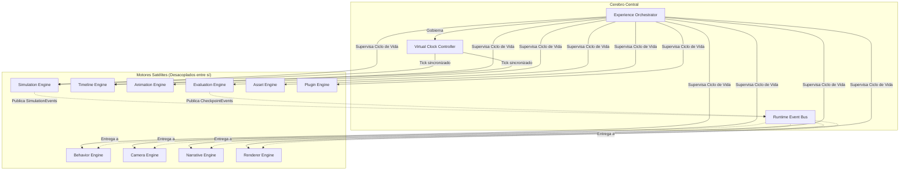

---

## 5. Ciclo de Vida Formal de una Experiencia (11 Fases)

El ciclo de vida de una experiencia no es un booleano `isPlaying`. Es una máquina de estados finita con 11 fases rigurosas:

$$\text{LOAD} \to \text{VALIDATE} \to \text{BUILD} \to \text{INITIALIZE} \to \text{READY} \to \text{PLAY} \rightleftarrows \text{PAUSE} \to \text{SEEK} \to \text{RESUME} \to \text{STOP} \to \text{DESTROY}$$

```
┌────────────────────────────────────────────────────────────────────────────────────────┐
│                      MATRIZ DETALLADA DEL EXPERIENCE LIFECYCLE                         │
├────────────┬─────────────────────────────┬──────────────────────────────┬──────────────┤
│ Estado     │ ¿Qué ocurre internamente?   │ Motores que participan       │ Evento       │
│            │                             │                              │ Emitido      │
├────────────┼─────────────────────────────┼──────────────────────────────┼──────────────┤
│ LOAD       │ Descarga manifest y assets  │ Asset Engine                 │ `ExpLoading` │
│            │ brutos (JSON, SVG, Audio).  │                              │              │
├────────────┼─────────────────────────────┼──────────────────────────────┼──────────────┤
│ VALIDATE   │ Valida contra JSON Schema   │ Asset Engine,                │ `ExpValidated`
│            │ y chequea referencias AST.  │ Plugin Engine                │              │
├────────────┼─────────────────────────────┼──────────────────────────────┼──────────────┤
│ BUILD      │ Instancia motores requeridos│ Plugin Engine,               │ `ExpBuilt`   │
│            │ y resuelve providers/plugins│ Simulation Engine            │              │
├────────────┼─────────────────────────────┼──────────────────────────────┼──────────────┤
│ INITIALIZE │ Monta Adapters en el DOM,   │ Renderer, Camera, WebGL,     │ `ExpInited`  │
│            │ crea WebGL context y audio. │ Web Audio API                │              │
├────────────┼─────────────────────────────┼──────────────────────────────┼──────────────┤
│ READY      │ Estado $S_0$ calculado,     │ Todos los motores en reposo. │ `ExpReady`   │
│            │ cámara encuadrada, listo.   │                              │              │
├────────────┼─────────────────────────────┼──────────────────────────────┼──────────────┤
│ PLAY       │ Arranca el VirtualClock;    │ VirtualClock, Timeline,      │ `ExpStarted` │
│            │ despacho continuo de frames.│ Simulation, Renderers        │              │
├────────────┼─────────────────────────────┼──────────────────────────────┼──────────────┤
│ PAUSE      │ Congela el VirtualClock;    │ VirtualClock, Renderers,     │ `ExpPaused`  │
│            │ preserva buffers de GPU.    │ Audio (suspends context)     │              │
├────────────┼─────────────────────────────┼──────────────────────────────┼──────────────┤
│ SEEK       │ Barrera atómica: rebobina   │ Simulation (restaura snap),  │ `ExpSeeked`  │
│            │ simulación, limpia partículas Timeline, Renderers, Camera │              │
├────────────┼─────────────────────────────┼──────────────────────────────┼──────────────┤
│ RESUME     │ Descongela clock tras pausa │ VirtualClock, AudioContext   │ `ExpResumed` │
│            │ o tras resolución de gate.  │                              │              │
├────────────┼─────────────────────────────┼──────────────────────────────┼──────────────┤
│ STOP       │ Cancela bucle temporal;     │ VirtualClock, Simulation     │ `ExpStopped` │
│            │ retorna el sistema a $t=0$. │ (reset to S0)                │              │
├────────────┼─────────────────────────────┼──────────────────────────────┼──────────────┤
│ DESTROY    │ Libera texturas GPU, cierra │ Renderers, GPU, Audio,       │ `ExpDisposed`│
│            │ AudioContext y Workers.     │ Subscriptions, Workers       │              │
└────────────┴─────────────────────────────┴──────────────────────────────┴──────────────┘
```

---

## 6. Runtime Event Bus: Topología, Prioridades y Backpressure

Para erradicar el acoplamiento cruzado, los motores se comunican exclusivamente a través del **`RuntimeEventBus`**.

### 6.1 Clasificación de Eventos por Alcance

```typescript
export type EventScope = 'internal' | 'public' | 'private';

export interface RuntimeEventEnvelope<T = unknown> {
  readonly id: string;
  readonly scope: EventScope;
  readonly priority: EventPriority;
  readonly channel: string;
  readonly type: string;
  readonly timestamp: number;
  readonly virtualTimeMs: number;
  readonly senderEngine: string;
  readonly payload: T;
  readonly isCancellable: boolean;
}
```

1. **Eventos Privados (`private`):** Confinados estrictamente dentro del Orchestrator y un motor específico (p. ej., mensajes de heartbeat, comandos de teardown de GPU).
2. **Eventos Internos (`internal`):** Visibles para todos los diez motores del runtime, pero invisibles para la UI del host Angular (p. ej., `sim:event-emitted`, `timeline:track-boundary-reached`).
3. **Eventos Públicos (`public`):** Expuestos hacia la capa de presentación (Angular Signals / UI) para reflejar progreso, badges, errores o cambios de estado (`exp:ready`, `eval:checkpoint-satisfied`).

### 6.2 Jerarquía de Prioridades

$$\text{CRITICAL (0)} \quad > \quad \text{HIGH (1)} \quad > \quad \text{NORMAL (2)} \quad > \quad \text{LOW (3)}$$

- **`CRITICAL` (Prioridad 0):** Errores fatales de hardware (pérdida de contexto WebGL), abortos de seguridad y comandos de detención de emergencia (`DESTROY`). Procesados de inmediato de forma síncrona.
- **`HIGH` (Prioridad 1):** Barreras de sincronización de `SEEK`, saltos de cámara y cambios de estado del scheduler.
- **`NORMAL` (Prioridad 2):** Eventos regulares de simulación, transiciones de timeline y batches de renderizado.
- **`LOW` (Prioridad 3):** Telemetría analítica, logging de diagnóstico y métricas de rendimiento (FPS, memoria).

### 6.3 Mecanismo de Backpressure (Control de Saturación)
Si el bus acumula más de **1,000 eventos no procesados** en un tick (por ejemplo, durante una simulación masiva de paquetes en red):
1. El Orchestrator **congela temporalmente el VirtualClock**.
2. Realiza un vaciado atómico (*drain*) de la cola en orden de prioridad.
3. Aplica **Coalescencia de Eventos (Event Coalescing)**: eventos repetidos de mutación visual sobre el mismo nodo se colapsan en el último estado emitido.
4. Reanuda el reloj virtual sin pérdida de datos ni desincronización de audio.

---

## 7. Máquina de Estados del Runtime

La máquina de estados del Orchestrator garantiza que sea imposible invocar operaciones ilegales (como hacer `SEEK` antes de `INITIALIZE` o `PLAY` sobre un recurso en `ERROR`).

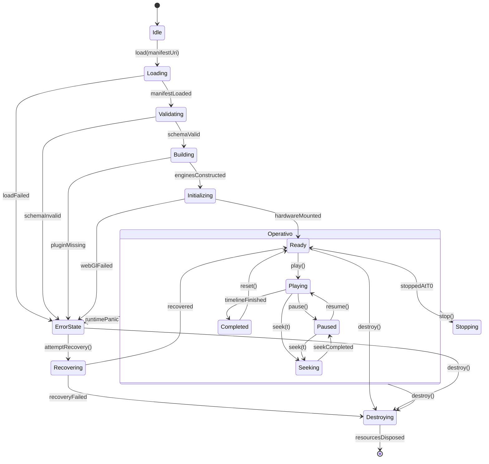

### Tabla de Transiciones Prohibidas:
- `Loading` $\to$ `Playing`: **ILEGAL**. Lanza excepción `RuntimeNotReadyException`.
- `Seeking` $\to$ `Seeking`: **COALESCIDO**. Si llega un segundo seek antes de terminar el primero, se descarta el anterior y se actualiza el target.
- `Destroying` $\to$ `*`: **TERMINAL**. Un runtime destruido no puede revivir; debe instanciarse un nuevo Orchestrator.

---

## 8. Gestión Estricta de Recursos y Jerarquía de Ownership

Para garantizar que CASE Visual Lab pueda ejecutar 100 lecciones continuas en un aula sin reiniciar el navegador, el Orchestrator implementa un **Árbol de Propiedad Jerárquico (Ownership Tree)** estricto:

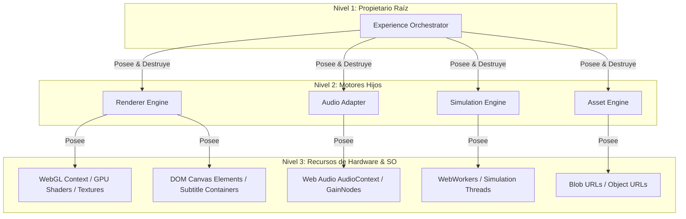

### Protocolo Determinístico de Dispose:
Al transicionar a `DESTROY`, el Orchestrator ejecuta una limpieza ordenada en orden inverso de dependencia:
1. **Pausa y desconexión:** Detiene el `VirtualClock` y cancela los `requestAnimationFrame`.
2. **GPU Cleanup:** Invoca `renderer.dispose()`, liberando `THREE.BufferGeometry`, texturas, shaders (`gl.deleteProgram`) y destruye el canvas WebGL.
3. **Audio Cleanup:** Cierra el `AudioContext` (`audioCtx.close()`), silenciando buffers de sonido.
4. **Worker Termination:** Termina los `WebWorkers` de cálculo con `.terminate()`.
5. **Memory & URLs:** Revoca `URL.revokeObjectURL()` de todos los blobs en caché del `AssetEngine`.
6. **Subscripciones:** Desuscribe todos los listeners del `EventBus` y purga las colas de memoria.

---

## 9. Estrategia de Supervisión y Resiliencia ante Errores

El Orchestrator opera bajo el principio de **Aislamiento de Fallos (Fault Containment)**: el fallo de un componente no debe colapsar la experiencia.

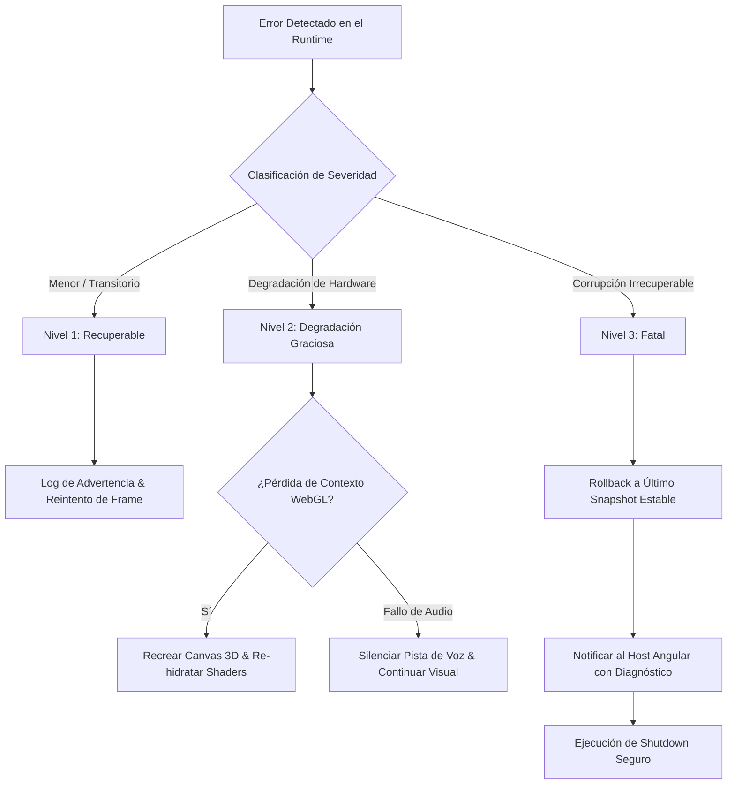

1. **Nivel 1 (Recuperable):** Error en un action handler (p. ej., timeout en una animación de partículas). Se descarta la acción, se notifica en consola y el timeline avanza al siguiente fotograma.
2. **Nivel 2 (Degradación Graciosa / Fallback):** 
   - Si WebGL pierde el contexto (`webglcontextlost`), el Orchestrator suspende el render 3D e intenta restaurarlo; si no es posible, desactiva Three.js y mantiene el canvas 2D de Excalidraw intacto.
   - Si el navegador bloquea el `AudioContext` por falta de interacción del usuario, silencia el audio y activa automáticamente los subtítulos DOM (`DOMSubtitleAdapter`).
3. **Nivel 3 (Fatal / Panic):** Error de corrupción de memoria o schema roto. Realiza un rollback al estado $S_0$, emite `exp:panic` con trazabilidad completa y ejecuta un shutdown seguro sin dejar fugas en memoria.

---

## 10. Arquitectura de Plugins: Descubrimiento, Aislamiento y Ciclo de Vida

El `PluginEngine` es supervisado por el Orchestrator mediante un ciclo de vida en cuatro fases:

$$\text{DISCOVERY} \longrightarrow \text{VERIFICATION} \longrightarrow \text{REGISTRATION} \longrightarrow \text{TEARDOWN}$$

```typescript
export interface VisualLabPlugin {
  readonly id: string;
  readonly version: string;
  readonly requiredEngines: readonly string[]; // P. ej. ['simulation', 'renderer']
  
  install(context: PluginInstallationContext): Promise<void>;
  uninstall(): Promise<void>;
}
```

1. **Descubrimiento:** El Orchestrator escanea los plugins declarados en el manifiesto (`plugins: ["@case/kafka-provider", "@case/mermaid-renderer"]`).
2. **Verificación:** Comprueba compatibilidad semántica de versiones (`semver`) y verifica que los motores requeridos estén activos.
3. **Aislamiento (Sandboxing):** Los plugins solo reciben interfaces restringidas (`PluginContext`). Tienen prohibido acceder a las instancias privadas de otros plugins o al DOM directo.
4. **Teardown:** Cuando se destruye la experiencia, cada plugin ejecuta su método `uninstall()`.

---

## 11. Los Diez Diagramas de Arquitectura (Mermaid)

### 11.1 Diagrama 1: Arquitectura General

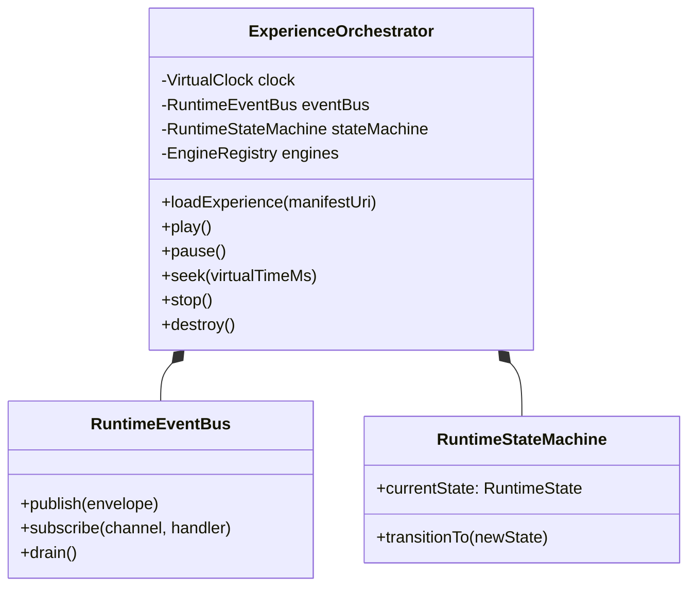

### 11.2 Diagrama 2: Experience Lifecycle (11 Fases)

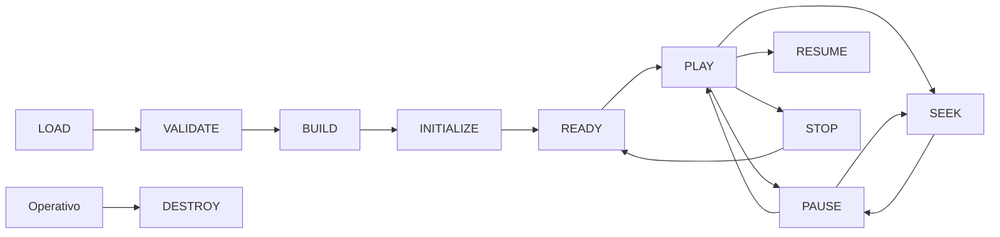

### 11.3 Diagrama 3: Runtime State Machine

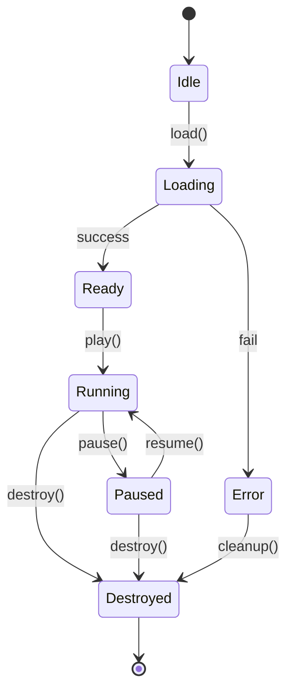

### 11.4 Diagrama 4: Event Bus & Prioridades

```mermaid
queue EventBusQueue
    subgraph "Runtime Event Bus"
        Q0[Cola CRITICAL: Abortos, GPU Loss]
        Q1[Cola HIGH: Seek Barrier, Camera Pan]
        Q2[Cola NORMAL: Sim Events, Frame Actions]
        Q3[Cola LOW: Telemetría, FPS Metrics]
    end

    Dispatcher[Priority Dispatcher & Coalescer]
    Q0 --> Dispatcher
    Q1 --> Dispatcher
    Q2 --> Dispatcher
    Q3 --> Dispatcher
```

### 11.5 Diagrama 5: Resource Ownership Tree

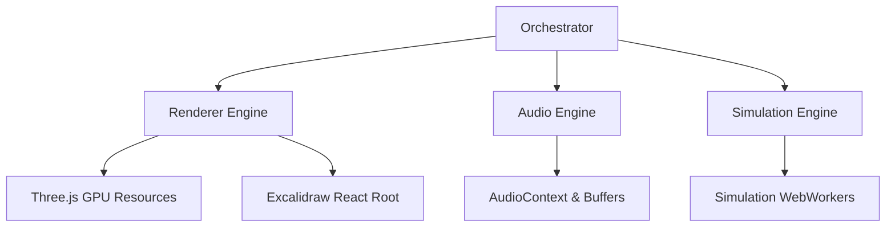

### 11.6 Diagrama 6: Error Flow & Supervisión

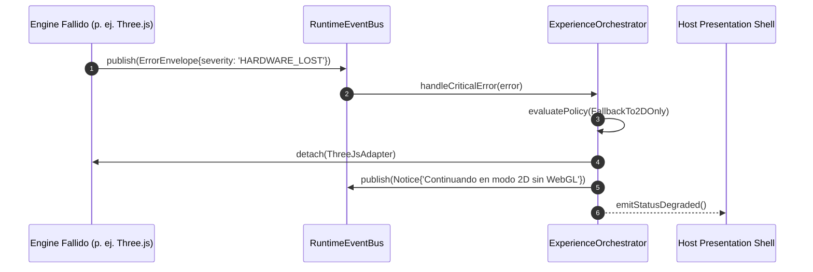

### 11.7 Diagrama 7: Plugin Loading Lifecycle

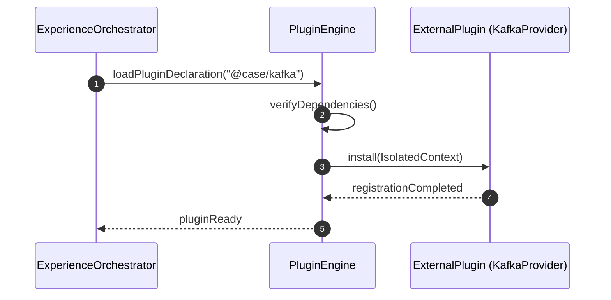

### 11.8 Diagrama 8: Startup Sequence

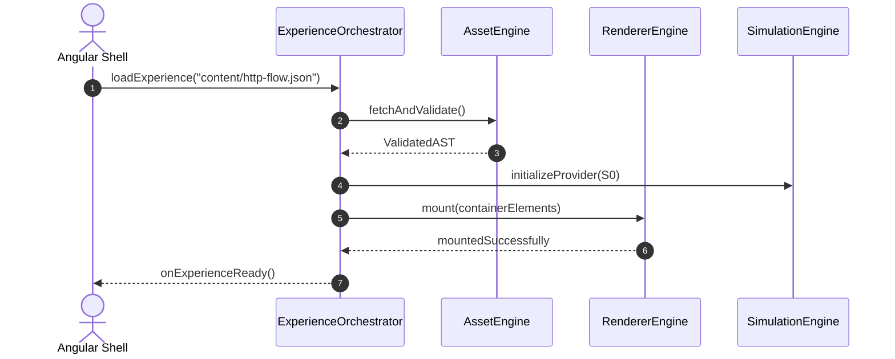

### 11.9 Diagrama 9: Shutdown Sequence

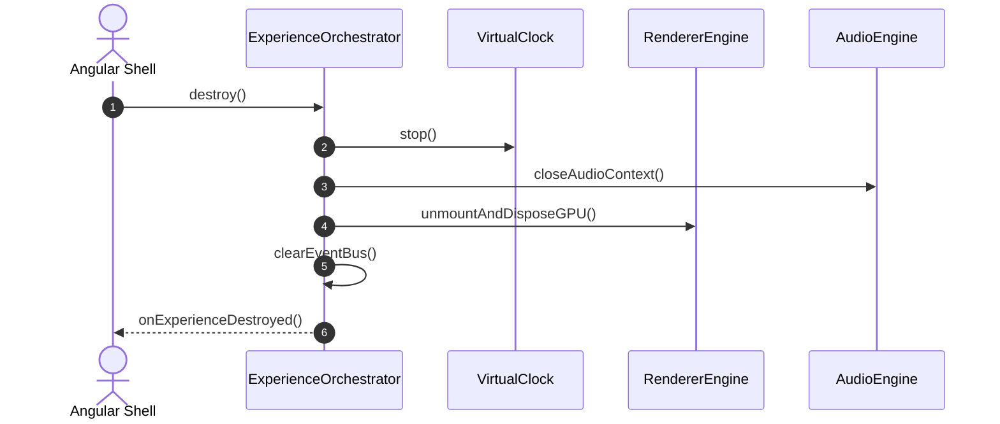

### 11.10 Diagrama 10: Experience Coordinator (Atomic Seek Barrier)

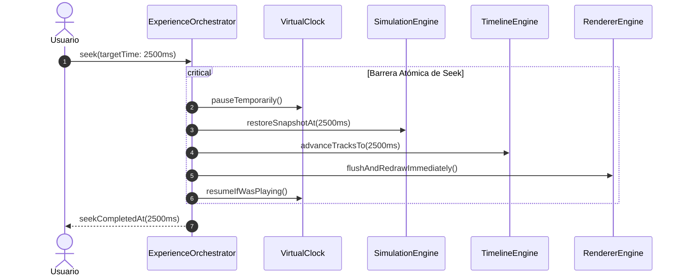

---

## 12. Decisiones Tomadas, Alternativas Descartadas y Trade-offs

### 12.1 Decisiones Tomadas
1. **El Orchestrator es el único punto de control del ciclo de vida:** Ningún motor se instancia a sí mismo ni se destruye por su cuenta.
2. **Cero dependencias cruzadas entre motores:** Toda comunicación inter-motor se ejecuta a través del `RuntimeEventBus`.
3. **Control Centralizado del Tiempo:** El `VirtualClock` vive en el Orchestrator y emite ticks hacia la Simulación y el Timeline simultáneamente.

### 12.2 Alternativas Descartadas
1. **Descartado: Arquitectura Peer-to-Peer sin orquestador.**  
   *Razón:* Provoca dependencia circular entre Timeline y Simulation, y hace imposible asegurar la recolección de basura de GPU.
2. **Descartado: Ubicar la orquestación dentro de componentes Angular (`CanvasPage`).**  
   *Razón:* Destruye la portabilidad a Node.js, CLI, WebWorkers y escritorios nativos (Tauri/Electron).
3. **Descartado: Usar RxJS Subjects globales no tipados.**  
   *Razón:* Propenso a fugas de memoria por subscripciones olvidadas. Se diseñó el `RuntimeEventBus` con canales formales y recolección automática en `DESTROY`.

---

## 13. Impacto sobre ADR-001 a ADR-006 y Orden para Sprint 3

### Impacto en la Arquitectura Previa:
- **ADR-001 (Canvas Renderer):** `CanvasRendererPort` ahora es supervisado por el Orchestrator durante `INITIALIZE` y `DESTROY`.
- **ADR-002 / ADR-003 (Cinematic / Runtime):** Quedan formalmente sustituidos en el rol de coordinación por el `ExperienceOrchestrator`. Los conceptos pedagógicos se aíslan en el `EvaluationEngine`.
- **ADR-004 (Lesson Manifest):** El manifiesto es validado e instanciado por el Orchestrator a través del `AssetEngine`.
- **ADR-005 (Visual Execution Engine):** El Orchestrator asume el control del `VirtualClock` y la coordinación de acciones paralelas.
- **ADR-006 (Simulation Engine):** El Orchestrator inicializa los `SimulationProviders` y puentea los `SimulationEvents` hacia el `BehaviorEngine`.

### Orden Recomendado de Implementación para Sprint 3:

```
┌────────────────────────────────────────────────────────────────────────┐
│             ORDEN DE IMPLEMENTACIÓN RECOMENDADO (SPRINT 3)             │
├───────┬──────────────────────────────────┬─────────────────────────────┤
│ Paso  │ Entregable Técnico               │ Justificación Arquitectónica│
├───────┼──────────────────────────────────┼─────────────────────────────┤
│ 1     │ `RuntimeEventBus` puro en TS     │ Base de comunicación para   │
│       │                                  │ todos los motores.          │
├───────┼──────────────────────────────────┼─────────────────────────────┤
│ 2     │ `ExperienceOrchestrator` &       │ Define la máquina de estados│
│       │ `VirtualClockController`         │ y la jerarquía de ownership.│
├───────┼──────────────────────────────────┼─────────────────────────────┤
│ 3     │ Integración del `SimulationEng.` │ Conecta el primer provider  │
│       │ con el EventBus (ADR-006)        │ (HTTP) con el orquestador.  │
├───────┼──────────────────────────────────┼─────────────────────────────┤
│ 4     │ Conexión de `RendererAdapters`    │ Three.js y Excalidraw       │
│       │ al ciclo de vida formal          │ limpian texturas en DESTROY.│
├───────┼──────────────────────────────────┼─────────────────────────────┤
│ 5     │ Fachada Angular liviana          │ La UI solo consume signals  │
│       │ (`ExperienceFacadeService`)      │ emitidas por el Orchestrator│
└───────┴──────────────────────────────────┴─────────────────────────────┘
```

---

## 14. Decisión Final

Se aprueba y adopta formalmente **ADR-007: Experience Orchestrator**.

A partir de esta decisión:
1. El **Experience Orchestrator** se consagra como el cerebro único y coordinador maestro de CASE Visual Lab.
2. Queda prohibida cualquier comunicación directa no mediada entre motores satélites.
3. Se mantiene la directriz de **no modificar código en esta fase de diseño**, constituyendo este documento el contrato inmutable para la ejecución del Sprint 3 y la evolución de la plataforma en los próximos diez años.
