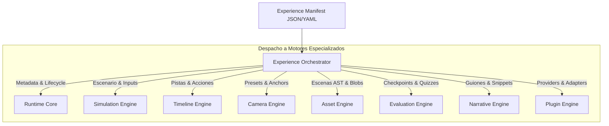
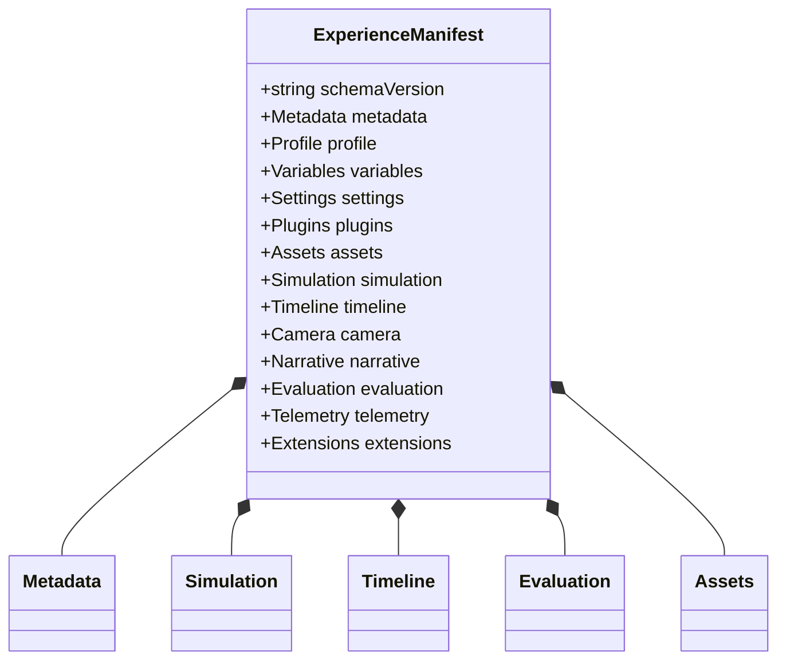
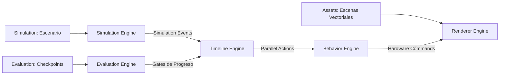
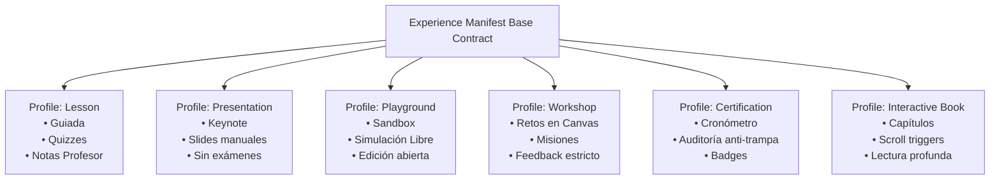
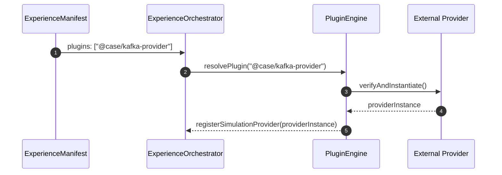
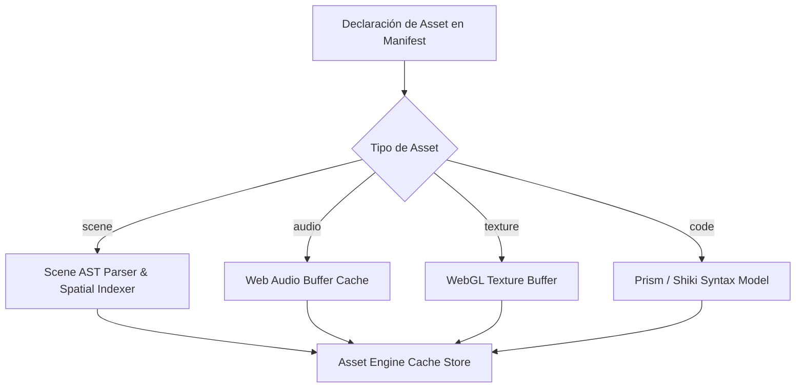
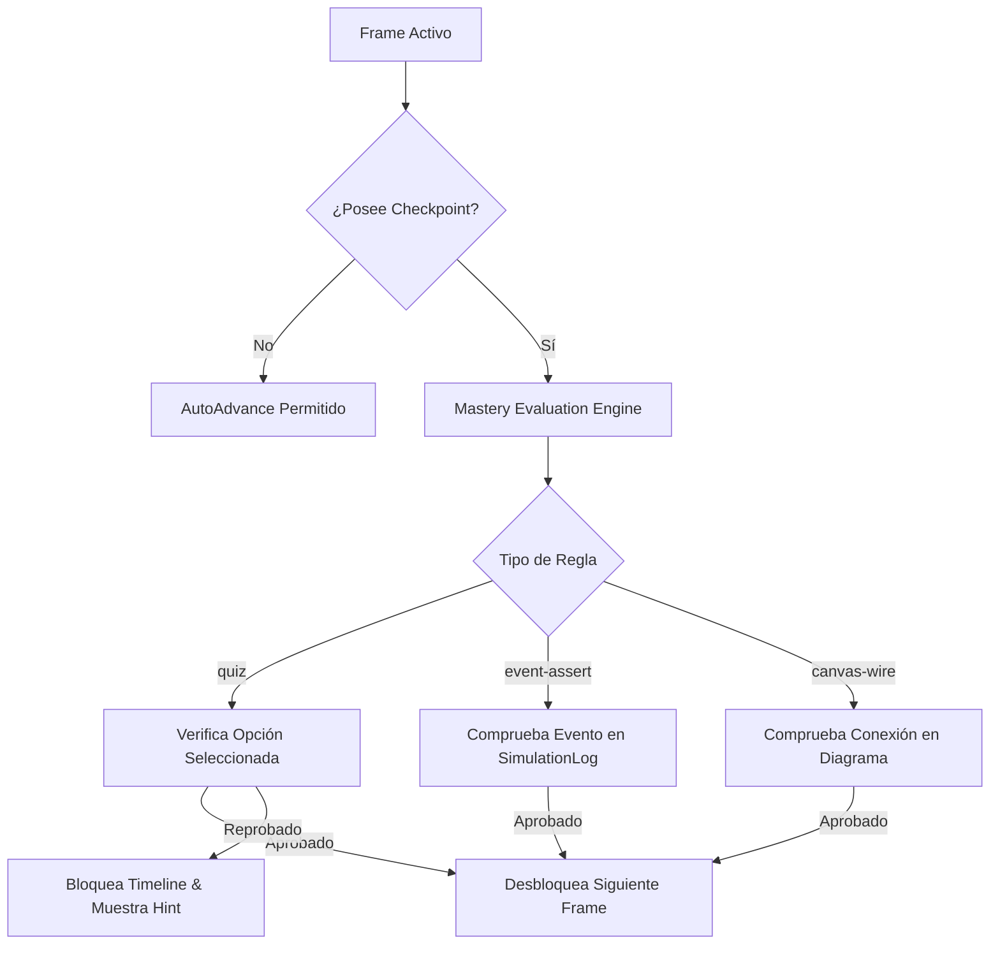
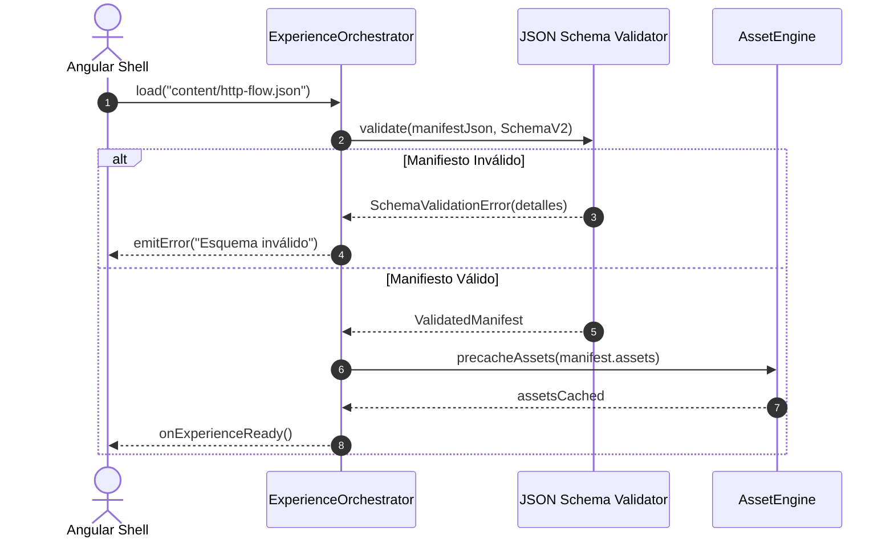
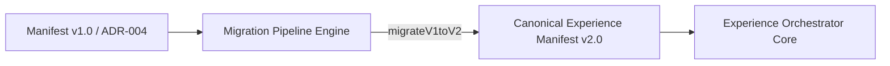

# ADR 008: Experience Manifest — Contrato Universal de Experiencias Interactivas

- **Estado:** Propuesto / Aceptado
- **Fecha:** 2026-10-05
- **Sprint:** Sprint 2 — Estandarización y Cierre Arquitectónico
- **Autores / Decisores:** Principal Software Architect, Runtime Systems Architect, Software Language Designer, DSL Designer, Engine Architect, Product Architect
- **Contexto:** Definición del contrato canónico y universal de datos consumido por el `ExperienceOrchestrator` (ADR-007). Este documento cierra y sella toda la arquitectura del sistema (ADR-001 a ADR-008), erradicando definitivamente el concepto de "Lesson" del núcleo del motor para dar paso a **Experiencias Visuales** polimórficas (Lessons, Workshops, Presentations, Playgrounds, Simulations, Certifications, Interactive Books, Live Demos).

---

## 1. Contexto y Declaración del Problema

Con la aprobación de [ADR-001](001-canvas-renderer-adapter.md) a [ADR-007](007-experience-orchestrator.md), CASE Visual Lab completó la especificación de sus diez motores especializados y de su orquestador supervisor:

```text
Visual Execution Engine
│
├── Experience Orchestrator (ADR-007: Supervisor, Lifecycle, VirtualClock, EventBus)
├── Simulation Engine       (ADR-006: Dinámica discreta de sistemas, Providers, DES)
├── Timeline Engine         (ADR-005: Pistas temporales concurrentes, Tracks)
├── Behavior Engine         (ADR-002, ADR-005: Handlers desacoplados sin switch)
├── Animation Engine        (ADR-001, ADR-002: GPU Shaders, trayectorias Bezier)
├── Camera Engine           (ADR-002, ADR-005: Viewport, matrices y transformaciones)
├── Narrative Engine        (ADR-002, ADR-004: Teleprompter, Markdown GFM, código)
├── Evaluation Engine       (ADR-003, ADR-004: Reglas determinísticas, checkpoints)
├── Renderer Engine         (ADR-001, ADR-005: Adapters simétricos: 2D, 3D, Audio)
├── Asset Engine            (ADR-004: ASTs de escenas, fuentes, blobs)
└── Plugin Engine           (ADR-006, ADR-007: Service Provider Interface)
```

Sin embargo, faltaba la **pieza cúspide**:
> **El problema del esquema unificado de entrada:**  
> ¿Qué documento formal ingresa al `ExperienceOrchestrator` en la fase `LOAD`? Si el manifiesto sigue llamándose `LessonManifest`, el runtime seguirá atado ontológicamente a un entorno de aula escolar.

Hacía falta el **Experience Manifest**: un contrato declarativo, neutral, fuertemente tipado mediante JSON Schema 2020-12, versionado y extensible, capaz de alimentar a los diez motores sin que ninguno de ellos conozca qué tipo de artefacto humano se está proyectando.

---

## 2. Discovery: Segregación Estricta de Información

Para evitar que el manifiesto se convierta en un blob monolítico, se analizó exactamente **qué información necesita cada subsistema** y **qué información jamás debe ingresar al Runtime**:

```
┌────────────────────────────────────────────────────────────────────────┐
│             MATRIZ DE CONSUMO DE INFORMACIÓN POR SUBSISTEMA            │
├────────────────────┬───────────────────────────────────────────────────┤
│ Subsistema         │ Datos Específicos que Consume del Manifest        │
├────────────────────┼───────────────────────────────────────────────────┤
│ 1. Orchestrator    │ `schemaVersion`, `metadata`, `profiles`,          │
│                    │ `variables`, `settings`, `plugins`, `telemetry`.  │
├────────────────────┼───────────────────────────────────────────────────┤
│ 2. Simulation      │ `simulation.provider`, `simulation.scenario`,     │
│                    │ `simulation.initialVariables`, `simulation.inputs`│
├────────────────────┼───────────────────────────────────────────────────┤
│ 3. Timeline        │ `timeline.tracks`, `timeline.frames`,             │
│                    │ `timeline.markers`, `timeline.loop`, `seekPoints`.│
├────────────────────┼───────────────────────────────────────────────────┤
│ 4. Behavior        │ `behaviors.catalog`, `behaviors.mappings`,        │
│                    │ parámetros de payloads de animación.              │
├────────────────────┼───────────────────────────────────────────────────┤
│ 5. Camera          │ `camera.presets`, `camera.paths`,                 │
│                    │ `camera.anchors`, `camera.constraints`.           │
├────────────────────┼───────────────────────────────────────────────────┤
│ 6. Renderer        │ `assets.scenes`, `renderer.theme`,                │
│                    │ directivas de renderizado 2D/3D.                  │
├────────────────────┼───────────────────────────────────────────────────┤
│ 7. Narrative       │ `narrative.scripts`, `narrative.codeSnippets`,    │
│                    │ `narrative.voiceOver`, notas del instructor.      │
├────────────────────┼───────────────────────────────────────────────────┤
│ 8. Evaluation      │ `evaluation.checkpoints`, `evaluation.rubrics`,   │
│                    │ `evaluation.quizzes`, `evaluation.badges`.        │
├────────────────────┼───────────────────────────────────────────────────┤
│ 9. Plugins         │ `plugins.required`, `plugins.options`,            │
│                    │ `plugins.dependencies`.                           │
├────────────────────┼───────────────────────────────────────────────────┤
│ 10. Host Angular   │ Rutas de navegación web, metadatos SEO/OpenGraph, │
│     (Solo UI Shell)│ breadcrumbs, sesión del usuario en la plataforma. │
└────────────────────┴───────────────────────────────────────────────────┘
```

### Lo que TIENE PROHIBIDO Existir Dentro del Runtime:
- Tokens de autenticación HTTP del usuario o cookies de sesión.
- Lógica de facturación o control de acceso comercial de CASE Academy.
- Claves privadas de API (OpenAI, AWS, GCP): la simulación es 100% offline.
- Elementos o selectores directos del DOM (`#canvas-container`, `window.localStorage`).

---

## 3. Estructura Exhaustiva del Experience Manifest

A continuación se define la estructura formal del árbol del manifiesto:

```text
Experience Manifest
├── $schema / schemaVersion
├── metadata              (Identidad, taxonomía, autores, licenciamiento)
├── profile               (Arquetipo de ejecución: lesson, workshop, etc.)
├── variables             (Parámetros reactivos globales y semillas determinísticas)
├── settings              (Configuración de playback, renderer, audio y UI)
├── plugins               (Extensiones de providers, adapters y behaviors)
├── assets                (Escenas vectoriales AST, código, audio, imágenes)
├── simulation            (Definición del escenario formal determinístico)
├── timeline              (Pistas concurrentes, frames, acciones y marcadores)
├── camera                (Presets espaciales, trayectorias y restricciones)
├── narrative             (Guiones de locución, explicaciones y teleprompter)
├── evaluation            (Checkpoints, quizzes, criterios de maestría)
├── telemetry             (Métricas de rendimiento, eventos auditables)
└── extensions            (Secciones personalizadas de terceros con namespace)
```

---

## 4. Especificación Técnica de los Bloques Principales

### 4.1 Metadatos Universales (`metadata`)

```json
{
  "$schema": "https://case-visual-lab.io/schemas/v2/experience-manifest.json",
  "schemaVersion": "2.0.0",
  "manifestVersion": "1.0.0",
  "contentVersion": "1.4.2",
  "metadata": {
    "id": "exp_http_lifecycle_v2",
    "slug": "http-request-lifecycle",
    "title": "Anatomía de una Petición HTTP Segura",
    "subtitle": "Del Cliente React al Commit Transaccional en PostgreSQL",
    "description": "Exploración interactiva y simulación determinística del ciclo de vida completo de una petición HTTP a través de Envoy Proxy, JWT, Clean Architecture y base de datos relacional.",
    "author": {
      "name": "CASE Architecture Guild",
      "email": "architecture@case-os.org",
      "url": "https://case-academy.org"
    },
    "organization": "CASE OS Foundation",
    "license": "Apache-2.0",
    "language": "es-ES",
    "difficulty": "intermediate",
    "estimatedDurationMinutes": 15,
    "tags": ["HTTP", "Networking", "Clean Architecture", "PostgreSQL", "Envoy"],
    "categories": ["distributed-systems", "networking"],
    "thumbnail": "assets/thumbnails/http-flow.webp",
    "cover": "assets/covers/http-flow-wide.webp",
    "icon": "network-wired",
    "createdAt": "2026-10-01T00:00:00Z",
    "updatedAt": "2026-10-05T12:00:00Z"
  }
}
```

### 4.2 Perfiles de Experiencia (`profiles`)

El perfil declara qué motor de políticas activa el `ExperienceOrchestrator`:

```typescript
export type ExperienceProfileType =
  | 'lesson'           // Guiada, narrativa con teleprompter y quizzes evaluativos.
  | 'workshop'         // Hands-on, misiones en canvas y validación de invariantes.
  | 'presentation'     // Modo Keynote, transiciones manuales de diapositiva, speaker notes.
  | 'playground'       // Sandbox libre, sin checkpoints, simulación interactiva abierta.
  | 'interactive-book' // Navegación fluida por capítulos con disparadores en scroll.
  | 'simulation'       // Ejecución de modelos formales (DES), inyección de fallas en vivo.
  | 'certification'    // Modo examen cronometrado, auditoría de eventos a prueba de trampas.
  | 'assessment'       // Prueba técnica de contratación con rubricas automatizadas.
  | 'live-demo';       // Demostración automática a 60 FPS con locución y subtítulos.
```

```json
{
  "profile": {
    "type": "lesson",
    "policy": {
      "allowFreeNavigation": true,
      "enforceMandatoryCheckpoints": true,
      "showTeacherNotes": false,
      "autoAdvanceDelayMs": 3000
    }
  }
}
```

### 4.3 Variables Globales y Estado Semilla (`variables`)

Variables compartidas reactivamente entre la simulación, la narrativa y los renderers:

```json
{
  "variables": {
    "studentName": "Ingeniero Invitado",
    "environment": "production",
    "simulationSpeed": 1.0,
    "theme": "dark-oled",
    "locale": "es",
    "cameraPreset": "cinematic-wide",
    "deterministicSeed": 421098,
    "featureFlags": {
      "enable3DParticles": true,
      "enableAudioNarration": true,
      "showDebugMetrics": false
    }
  }
}
```

### 4.4 Declaración de Activos (`assets`)

El `AssetEngine` precarga y almacena en caché los recursos antes de la fase `READY`:

```json
{
  "assets": {
    "scenes": {
      "scene_primary": {
        "format": "canonical-ast-v1",
        "uri": "assets/scenes/http-topology.scene.json"
      }
    },
    "codeSnippets": {
      "snippet_order_usecase": {
        "language": "typescript",
        "filename": "create-order.use-case.ts",
        "code": "export class CreateOrderUseCase {\n  constructor(private readonly repo: OrderRepository) {}\n  async execute(dto: OrderDto): Promise<Order> {\n    return await this.repo.save(Order.create(dto));\n  }\n}"
      }
    },
    "audio": {
      "voice_frame_01": {
        "format": "audio/webm",
        "uri": "assets/audio/es/voice_f01.webm",
        "durationMs": 4200
      }
    },
    "textures": {
      "glow_particle": {
        "format": "image/webp",
        "uri": "assets/textures/particle-glow-cyan.webp"
      }
    },
    "fonts": ["Inter", "JetBrains Mono"]
  }
}
```

### 4.5 Plugins y Extensiones (`plugins`)

Declara los módulos dinámicos requeridos por la experiencia:

```json
{
  "plugins": [
    {
      "id": "@case/http-simulation-provider",
      "version": "^1.0.0",
      "role": "simulation-provider",
      "options": {
        "enableTlsInspection": true,
        "defaultLatencyMs": 15
      }
    },
    {
      "id": "@case/threejs-particle-renderer",
      "version": "^2.1.0",
      "role": "renderer-adapter",
      "options": {
        "maxParticleCount": 5000,
        "bloomGlow": true
      }
    }
  ]
}
```

### 4.6 Escenario de Simulación Determinística (`simulation`)

Consumido por el `SimulationEngine` (ADR-006):

```json
{
  "simulation": {
    "providerId": "@case/http-simulation-provider",
    "domain": "networking",
    "scenarioId": "http_order_pipeline",
    "seed": 421098,
    "initialState": {
      "clientState": "READY",
      "gatewayRequestsPerSec": 350,
      "dbConnectionsInUse": 1
    },
    "injectedInputs": [
      {
        "timeOffsetMs": 0,
        "actionName": "EMIT_HTTP_POST",
        "data": { "path": "/api/v1/orders", "bodySize": 256 }
      }
    ]
  }
}
```

### 4.7 Timeline y Pistas Concurrentes (`timeline`)

Consumido por el `TimelineEngine` (ADR-005):

```json
{
  "timeline": {
    "timeScale": 1.0,
    "totalDurationMs": 18000,
    "loop": false,
    "seekPoints": [0, 4000, 8500, 13000, 18000],
    "markers": [
      { "id": "m_request", "timeMs": 0, "label": "Petición" },
      { "id": "m_gateway", "timeMs": 4000, "label": "Inspección Gateway" },
      { "id": "m_database", "timeMs": 8500, "label": "Persistencia ACID" },
      { "id": "m_response", "timeMs": 13000, "label": "Retorno HTTP 201" }
    ],
    "frames": [
      {
        "id": "frame_01_gateway_inspect",
        "frameIndex": 1,
        "startTimeMs": 4000,
        "durationMs": 4500,
        "autoAdvance": false,
        "actions": [
          {
            "id": "act_cam_gateway",
            "type": "camera:focus",
            "startTimeOffsetMs": 0,
            "durationMs": 800,
            "payload": { "targetNodeId": "node_gateway", "zoomLevel": 1.9 }
          },
          {
            "id": "act_pkt_jwt",
            "type": "behavior:packet-flow",
            "startTimeOffsetMs": 100,
            "durationMs": 1400,
            "payload": {
              "sourceNodeId": "node_client",
              "targetNodeId": "node_gateway",
              "label": "POST /orders (Bearer JWT)",
              "color": "#00F2FE"
            }
          },
          {
            "id": "act_audio_f01",
            "type": "audio:play-voiceover",
            "startTimeOffsetMs": 0,
            "durationMs": 4200,
            "payload": { "assetRef": "voice_frame_01" }
          },
          {
            "id": "act_sub_f01",
            "type": "subtitle:show-cue",
            "startTimeOffsetMs": 0,
            "durationMs": 4200,
            "payload": { "text": "El API Gateway valida la firma del JWT antes de enrutar." }
          }
        ]
      }
    ]
  }
}
```

### 4.8 Evaluación Formativa y Maestría (`evaluation`)

Consumido por el `EvaluationEngine` (ADR-003, ADR-007):

```json
{
  "evaluation": {
    "passingScorePct": 80,
    "requireAllMandatoryCheckpoints": true,
    "checkpoints": [
      {
        "id": "cp_jwt_understood",
        "frameIndex": 1,
        "label": "Filtro Perimetral de Autenticación",
        "isMandatory": true,
        "validationRule": {
          "type": "event-assert",
          "expectedEventType": "security:jwt-validated",
          "withinVirtualTimeMs": 6000
        }
      }
    ],
    "quizzes": [
      {
        "id": "quiz_gateway_401",
        "frameIndex": 2,
        "prompt": "¿Qué status code retorna el Gateway si el JWT está vencido?",
        "options": [
          { "id": "o1", "text": "HTTP 401 Unauthorized", "isCorrect": true, "feedback": "¡Exacto!" },
          { "id": "o2", "text": "HTTP 500 Internal Error", "isCorrect": false, "feedback": "Incorrecto." }
        ]
      }
    ],
    "badge": {
      "id": "badge_http_architect",
      "title": "HTTP Protocols Specialist",
      "level": "Associate",
      "icon": "shield-check"
    }
  }
}
```

### 4.9 Telemetría y Analíticas (`telemetry`)

Instruye al runtime sobre qué métricas auditar en el `RuntimeEventBus`:

```json
{
  "telemetry": {
    "enabled": true,
    "trackFpsMetrics": true,
    "trackMemoryUsage": true,
    "trackInteractionHeatmap": true,
    "emitEvents": [
      "exp:started",
      "sim:event-emitted",
      "eval:checkpoint-satisfied",
      "exp:completed"
    ]
  }
}
```

### 4.10 Extensiones de Terceros (`extensions`)

Permite a corporaciones o institutos añadir metadatos propietarios sin romper compatibilidad:

```json
{
  "extensions": {
    "com.enterprise.compliance": {
      "courseId": "SEC-8819",
      "soc2Auditable": true,
      "exportScormVersion": "2004-4th-edition"
    }
  }
}
```

---

## 5. Los Diez Diagramas de Arquitectura (Mermaid)

### 5.1 Diagrama 1: Arquitectura General



### 5.2 Diagrama 2: Árbol Estructural del Manifiesto



### 5.3 Diagrama 3: Diagrama de Relaciones entre Módulos



### 5.4 Diagrama 4: Jerarquía de Perfiles



### 5.5 Diagrama 5: Integración de Plugins en el Manifiesto



### 5.6 Diagrama 6: Pipeline de Ingesta y Resolución de Assets



### 5.7 Diagrama 7: Estructura del Timeline y Acciones Paralelas

```mermaid
gantt
    title Pistas Concurrentes en un Frame del Manifiesto
    dateFormat X
    axisFormat %s ms
    section Track Visual
    Packet Flow (Client -> Gateway) :active, 100, 1500
    Arrival Pulse Ring              :1500, 2200
    section Track Cámara
    Focus Gateway (Zoom 1.9)        :0, 800
    section Track Audio
    Voiceover Locución              :crit, 0, 4200
    section Track Subtítulo
    Cue "El Gateway valida JWT..."  :0, 4200
```



### 5.8 Diagrama 8: Estructura de Evaluación y Reglas de Checkpoint



### 5.9 Diagrama 9: Secuencia de Carga y Validación del Manifiesto



### 5.10 Diagrama 10: Flujo de Migración de Esquemas



---

## 6. Modelado de Cinco Casos Reales Bajo el Mismo Contrato

A continuación se demuestra que **exactamente el mismo contrato JSON Schema** modela cinco arquetipos técnicos diametralmente distintos:

### 6.1 Caso 1: Lección Interactiva de Redes (Profile: `lesson`)
- **Metadata:** "HTTP Request Lifecycle".
- **Profile:** `{ "type": "lesson", "enforceMandatoryCheckpoints": true }`.
- **Simulation:** `{ "providerId": "@case/http-provider", "domain": "networking" }`.
- **Timeline:** Frames narrativos con quiz de código de estado HTTP 401.

### 6.2 Caso 2: Clase Práctica de Agentes & MCP (Profile: `lesson`)
- **Metadata:** "Agent Loop: ReAct & Tool Calling".
- **Profile:** `{ "type": "lesson" }`.
- **Simulation:** `{ "providerId": "@case/agent-loop-provider", "domain": "agentic-ai" }`.
- **Timeline:** Acciones de `behavior:agent-thinking` y llamadas simuladas a herramientas de Kubernetes.

### 6.3 Caso 3: Sandbox / Playground de Recuperación Vectorial (Profile: `playground`)
- **Metadata:** "RAG & Vector Search Sandbox".
- **Profile:** `{ "type": "playground", "policy": { "enforceMandatoryCheckpoints": false } }`.
- **Simulation:** `{ "providerId": "@case/rag-provider", "initialVariables": { "topK": 5 } }`.
- **Timeline:** Sin frames bloqueantes; exploración abierta del espacio de embeddings en el canvas.

### 6.4 Caso 4: Workshop Evaluativo de Kubernetes (Profile: `workshop`)
- **Metadata:** "Kubernetes Self-Healing Pods".
- **Profile:** `{ "type": "workshop", "policy": { "allowFreeNavigation": false } }`.
- **Simulation:** `{ "providerId": "@case/k8s-provider", "injectedInputs": [{ "actionName": "KILL_POD" }] }`.
- **Evaluation:** Misiones con regla `event-assert` para comprobar que el ReplicaSet recuperó 3 pods sanos.

### 6.5 Caso 5: Presentación Ejecutiva de Arquitectura (Profile: `presentation`)
- **Metadata:** "Migración de Monolito a Microservicios".
- **Profile:** `{ "type": "presentation", "policy": { "showTeacherNotes": true } }`.
- **Simulation:** Sin simulación activa; utiliza el Timeline únicamente para encuadres de cámara cinemáticos de alta definición sobre el diagrama.

---

## 7. Compatibilidad Hacia Atrás: Transformación desde ADR-004

Toda lección existente escrita bajo [ADR-004](004-lesson-manifest.md) (como `public/content/lessons/01-clean-architecture.json`) es compatible al 100%:

### Pipeline de Adaptación Automática (`LegacyLessonAdapter`):
1. **Detección Automática:** Si el JSON recibido posee `schemaVersion: "1.0.0"` y carece de la propiedad `profile`, el `AssetEngine` lo clasifica como `ADR-004 Manifest`.
2. **Transformación Pura en Memoria:**
   - Asigna `profile: { "type": "lesson" }`.
   - Transforma `steps` en `timeline.frames`.
   - Mapea `codeSnippet` a `assets.codeSnippets`.
   - Convierte `question` en `evaluation.quizzes`.
3. **Cero Reescritura de Archivos:** Las lecciones ya creadas continúan funcionando en el nuevo motor sin tocar una sola coma de sus archivos JSON.

---

## 8. Decisiones Tomadas, Alternativas Descartadas y Trade-offs

### 8.1 Decisiones Tomadas
1. **Erradicación Definitiva de "Lesson" en el Manifiesto:** El contrato se denomina `ExperienceManifest`.
2. **Representación Dual (YAML/JSON):** El formato canónico de runtime es `JSON` con validación estricta de JSON Schema 2020-12; los autores pueden redactar en `YAML` para mayor ergonomía.
3. **Desacoplamiento Total de Renderers:** El manifiesto define intenciones semánticas; los adaptadores gráficos deciden cómo renderizarlas en función de la capacidad de la GPU del usuario.

### 8.2 Alternativas Descartadas
1. **Descartado: Esquemas independientes para cada perfil (`LessonManifest`, `WorkshopManifest`, etc.).**  
   *Razón:* Habría provocado divergencia de código y duplicación masiva en el parser del Orchestrator. Un único esquema polimórfico con `profile` resuelve todos los casos de uso.
2. **Descartado: Embeber código ejecutable en el manifiesto (`eval()` / TypeScript strings).**  
   *Razón:* Riesgo crítico de seguridad XSS y pérdida de determinismo offline. Toda regla de evaluación o simulación es puramente declarativa.

---

## 9. Impacto Sobre los ADRs Previos (001 a 007)

```
┌────────────────────────────────────────────────────────────────────────┐
│             MATRIZ DE IMPACTO ARQUITECTÓNICO CONSOLIDADA               │
├─────────┬──────────────────────────┬───────────────────────────────────┤
│ ADR     │ Estado Previo            │ Impacto Definitivo tras ADR-008   │
├─────────┼──────────────────────────┼───────────────────────────────────┤
│ ADR-001 │ Canvas Renderer Port     │ Sin cambios. Consume `assets`.   │
├─────────┼──────────────────────────┼───────────────────────────────────┤
│ ADR-002 │ Cinematic Learning Eng.  │ Sin cambios. Mapea `behaviors`.   │
├─────────┼──────────────────────────┼───────────────────────────────────┤
│ ADR-003 │ Lesson Runtime Service   │ Subsumido en Orchestrator (007).  │
├─────────┼──────────────────────────┼───────────────────────────────────┤
│ ADR-004 │ Lesson Manifest (v1)     │ Recontextualizado como Perfil v1  │
│         │                          │ compatible vía adaptador puro.    │
├─────────┼──────────────────────────┼───────────────────────────────────┤
│ ADR-005 │ Visual Execution Engine  │ Consume `timeline.frames`.        │
├─────────┼──────────────────────────┼───────────────────────────────────┤
│ ADR-006 │ Simulation Engine        │ Consume `simulation.scenario`.    │
├─────────┼──────────────────────────┼───────────────────────────────────┤
│ ADR-007 │ Experience Orchestrator  │ Carga e ingesta `ExperienceManif`.│
└─────────┴──────────────────────────┴───────────────────────────────────┘
```

---

## 10. Checklist de Implementación y Roadmap para Sprint 3

Con la arquitectura completamente sellada, el equipo de ingeniería cuenta con la hoja de ruta definitiva para el Sprint 3:

```
┌────────────────────────────────────────────────────────────────────────┐
│                     CHECKLIST DE IMPLEMENTACIÓN SPRINT 3               │
├───────┬────────────────────────────────────────────────────────────────┤
│ Estado│ Tarea Técnica de Construcción                                  │
├───────┼────────────────────────────────────────────────────────────────┤
│ [ ]   │ 1. Publicar `experience.schema.json` (JSON Schema 2020-12).   │
├───────┼────────────────────────────────────────────────────────────────┤
│ [ ]   │ 2. Implementar `ExperienceOrchestrator` con máquina de estados.│
├───────┼────────────────────────────────────────────────────────────────┤
│ [ ]   │ 3. Implementar `RuntimeEventBus` puro en TypeScript.           │
├───────┼────────────────────────────────────────────────────────────────┤
│ [ ]   │ 4. Crear `LegacyLessonAdapter` (ADR-004 -> ADR-008).           │
├───────┼────────────────────────────────────────────────────────────────┤
│ [ ]   │ 5. Conectar `SimulationEngine` con provider HTTP de referencia. │
├───────┼────────────────────────────────────────────────────────────────┤
│ [ ]   │ 6. Validar pipeline completo con `01-clean-architecture.json`. │
└───────┴────────────────────────────────────────────────────────────────┘
```

---

## 11. Decisión Final

Se aprueba y adopta formalmente el documento **ADR-008: Experience Manifest**.

A partir de este momento:
1. Queda formalmente sellada y completada la arquitectura fundacional de CASE Visual Lab (ADR-001 a ADR-008).
2. El **Experience Manifest** se consagra como el contrato definitivo y universal para todo el ecosistema de CASE Academy y CASE OS durante la próxima década.
3. Se mantiene el cumplimiento innegociable de las restricciones: **cero código TypeScript modificado o generado, cero commits y cero push** en esta sesión de diseño arquitectónico.
