# ADR 009: Implementation Strategy & Physical Architecture

- **Estado:** Aprobado / Vinculante
- **Fecha:** 2026-10-05
- **Sprint:** Sprint 3 — Arquitectura Física e Implementación del Core
- **Autores / Decisores:** Principal Software Architect, Distinguished Engineer, Staff Frontend Engineer (Angular), Runtime Systems Architect, Clean Architecture Reviewer, Software Product Architect, Design Systems Architect
- **Contexto:** Definición exhaustiva de la arquitectura física, estructura de carpetas, reglas de importación, composición de dependencias, ciclo de arranque, estrategia de pruebas, CI/CD y checklist de implementación para **CASE Visual Lab**. Este documento traduce la arquitectura lógica (ADR-001 a ADR-008) en la topología física inmutable del repositorio.

---

## 1. Contexto y Declaración del Problema

Con la aprobación de [ADR-001](001-canvas-renderer-adapter.md) a [ADR-008](008-experience-manifest.md), la arquitectura lógica y los contratos del motor están 100% formalizados:
- **ADR-001:** Adaptador desacoplado de canvas 2D (Excalidraw React Island).
- **ADR-002:** Motor cinemático y catálogo universal de behaviors.
- **ADR-003:** Primera separación de runtime pedagógico.
- **ADR-004:** DSL declarativo de lecciones y esquema JSON.
- **ADR-005:** Visual Execution Engine y Timeline con pistas paralelas.
- **ADR-006:** Simulation Engine determinístico y SPI de Providers.
- **ADR-007:** Experience Orchestrator (supervisor y máquina de estados).
- **ADR-008:** Experience Manifest (contrato de datos universal y polimórfico).

### La Pregunta Definitiva del Sprint 3:
> **¿Dónde vive físicamente cada archivo en el disco, quién puede importar a quién, cómo se ensambla el sistema en memoria y en qué orden exacto se construye?**

Este documento es la **Guía Maestra de Ingeniería Física** que regirá la implementación del proyecto durante los próximos cinco años. A partir de su aprobación, **no se permite ambigüedad alguna sobre la ubicación de componentes, responsabilidades de carpetas o reglas de importación**.

---

## 2. Estructura Exhaustiva del Repositorio (Árbol Físico)

A continuación se define la estructura de directorios canónica de `src/app/` y carpetas raíz:

```text
c:\Users\YAMI\Documents\projects\mi-excalidraw-lab/
├── .github/
│   └── workflows/
│       ├── ci.yml                     # Pipeline estricto de CI (Lint, Typecheck, Tests, Build)
│       └── release.yml                # Publicación a GitHub Pages y validación de bundle
├── documentation/
│   ├── adr/                           # Registros de Decisiones Arquitectónicas (ADR-001 a ADR-009)
│   ├── product/                       # Documentos de visión, diseño y producto
│   └── architecture.md                # Visión ejecutiva consolidada
├── public/
│   ├── content/                       # Experiencias estáticas y recursos versionados
│   │   ├── experiences/               # Manifiestos de experiencias (.experience.json)
│   │   ├── lessons/                   # Manifiestos legacy v1 (.lesson.json)
│   │   └── scenes/                    # ASTs de escenas vectoriales (.scene.json)
│   └── schemas/                       # Esquemas JSON Schema formales (2020-12)
│       ├── experience.schema.json     # Esquema formal de ADR-008
│       ├── lesson-v1.schema.json      # Esquema legacy de ADR-004
│       └── scene-ast.schema.json      # Esquema canónico de escenas
└── src/
    ├── main.ts                        # Bootstrap puro de Angular zoneless
    ├── index.html                     # HTML Shell con soporte de Google Fonts
    ├── styles.scss                    # Variables globales OLED, diseño Cyan y reset
    └── app/
        ├── app.config.ts              # Configuración de Angular (Routes, Preload)
        ├── app.routes.ts              # Enrutador desacoplado (Lazy routes)
        │
        ├── core/                      # SERVICIOS TRANSVERSALES SINGLETON (Sin lógica de motor)
        │   ├── i18n/                  # Internacionalización (es/en)
        │   ├── theme/                 # Gestión de tema OLED (Dark/Light)
        │   ├── storage/               # Wrapper tipado de LocalStorage / IndexedDB
        │   ├── telemetry/             # Auditoría de rendimiento (FPS, Memoria)
        │   └── error/                 # GlobalErrorHandler y logger de excepciones
        │
        ├── engine/                    # EL NÚCLEO UNIVERSAL (100% PURO TYPESCRIPT - CERO ANGULAR)
        │   │
        │   ├── kernel/                # EL CEREBRO DEL SISTEMA
        │   │   ├── orchestrator/      # ExperienceOrchestrator (ADR-007)
        │   │   ├── clock/             # VirtualClockController y scheduler
        │   │   ├── state-machine/     # RuntimeStateMachine (11 estados formales)
        │   │   └── composition/       # ExperienceCompositionRoot (Ensamblador)
        │   │
        │   ├── event-bus/             # SISTEMA DE COMUNICACIÓN DESACOPLADO
        │   │   ├── runtime-event-bus.ts # Implementación de colas por prioridad
        │   │   ├── event-envelope.ts  # Interfaces de eventos y alcances
        │   │   └── priority-queue.ts  # Estructura de datos de backpressure
        │   │
        │   ├── simulation/            # SIMULATION ENGINE (ADR-006)
        │   │   ├── contracts/         # SimulationRuntime, State, Snapshot, Event
        │   │   ├── runtime/           # DeterministicSimulationEngine (DES puro)
        │   │   ├── registry/          # SimulationProviderRegistry
        │   │   └── providers/         # Providers estándar integrados
        │   │       ├── http/          # HttpSimulationProvider (TCP, TLS, JWT)
        │   │       ├── agent/         # AgentLoopSimulationProvider (ReAct, MCP)
        │   │       ├── rag/           # RagSimulationProvider (Vectores, HNSW)
        │   │       └── k8s/           # KubernetesSimulationProvider (Control Loop)
        │   │
        │   ├── timeline/              # TIMELINE ENGINE (ADR-005)
        │   │   ├── contracts/         # ExperienceTimeline, Frame, Track, Marker
        │   │   ├── runtime/           # TimelineExecutionEngine
        │   │   └── scheduler/         # ParallelActionScheduler
        │   │
        │   ├── behaviors/             # BEHAVIOR ENGINE (ADR-002, ADR-005)
        │   │   ├── contracts/         # BehaviorHandler, ActionExecutionContext
        │   │   ├── registry/          # BehaviorRegistry y BehaviorFactory
        │   │   └── handlers/          # Handlers desacoplados (Sin switch)
        │   │       ├── packet-flow/   # PacketFlowHandler
        │   │       ├── jwt-flow/      # JwtFlowHandler
        │   │       ├── db-write/      # DatabaseWriteHandler
        │   │       ├── agent-think/   # AgentThinkingHandler
        │   │       ├── tool-call/     # ToolCallHandler
        │   │       └── node-pulse/    # NodePulseHandler
        │   │
        │   ├── camera/                # CAMERA ENGINE (ADR-002, ADR-005)
        │   │   ├── contracts/         # CameraPort, CameraCommand, CameraPreset
        │   │   └── runtime/           # CameraChoreographer
        │   │
        │   ├── narrative/             # NARRATIVE ENGINE (ADR-002, ADR-004)
        │   │   ├── contracts/         # NarrativeScript, CodeSnippet, Note
        │   │   └── runtime/           # NarrativeExecutionService
        │   │
        │   ├── evaluation/            # EVALUATION ENGINE (ADR-003, ADR-007)
        │   │   ├── contracts/         # Checkpoint, Quiz, Rubric, MasteryRule
        │   │   └── runtime/           # MasteryEvaluationEngine
        │   │
        │   ├── assets/                # ASSET ENGINE (ADR-004, ADR-008)
        │   │   ├── contracts/         # AssetManifest, SceneAST, ResourceCache
        │   │   ├── loader/            # AssetLoaderService (Fetch & Cache)
        │   │   ├── parser/            # SceneASTParser y SpatialIndexer
        │   │   └── migrations/        # Pipeline de migraciones (LegacyLessonAdapter)
        │   │
        │   └── plugins/               # PLUGIN ENGINE (ADR-007)
        │       ├── contracts/         # VisualLabPlugin, PluginContext, SPI
        │       └── manager/           # PluginLifecycleManager
        │
        ├── infrastructure/            # ADAPTADORES TÉCNICOS (I/O Y DRIVERS DE HARDWARE)
        │   │
        │   ├── renderers/             # DRIVERS DE RENDERIZADO SIMÉTRICOS
        │   │   ├── ports/             # RendererPort, CommandDispatcher
        │   │   ├── excalidraw/        # ExcalidrawAdapter (React Island aislada)
        │   │   ├── threejs/           # ThreeParticleAdapter (WebGL 3D Overlay)
        │   │   ├── audio/             # WebAudioAdapter (Web Audio API)
        │   │   └── dom-subtitles/     # DOMSubtitleAdapter (Cues de accesibilidad)
        │   │
        │   ├── camera/                # ADAPTADOR DE HARDWARE DE CÁMARA
        │   │   └── viewport-camera.adapter.ts # Interpola matrices y frustum
        │   │
        │   └── persistence/           # PERSISTENCIA LOCAL
        │       ├── local-storage.adapter.ts
        │       └── indexed-db.adapter.ts
        │
        ├── application/               # CAPA DE APLICACIÓN (FACHADAS Y CASOS DE USO ANGULAR)
        │   ├── orchestrator-facade.service.ts # Puente reactivo (Orchestrator -> Signals)
        │   ├── scene-manager.service.ts       # Gestión de escenas de usuario
        │   └── telemetry.service.ts           # Métricas de runtime hacia la UI
        │
        ├── presentation/              # CAPA VISUAL ANGULAR (COMPONENTES ZONELESS Y SHELL)
        │   ├── shell/                 # Layout principal, Sidebar, Topbar
        │   ├── canvas-viewer/         # Contenedor del lienzo (Host de renderers)
        │   ├── timeline-controls/     # Scrubber, Play/Pause, Speed, Step buttons
        │   ├── narrative-drawer/      # Panel lateral de guión, código y teleprompter
        │   ├── evaluation-panel/      # Quizzes interactivos y comprobación de checkpoints
        │   └── teacher-hud/           # Head-Up Display para el modo instructor
        │
        └── shared/                    # UTILIDADES COMPARTIDAS (UI DUMB, ICONOS, PIPES)
            ├── ui/                    # Botones, Modales, Badges, Tooltips
            ├── pipes/                 # Formateo de tiempo (ms -> mm:ss), texto
            └── tokens/                # InjectionTokens de Angular
```

---

## 3. Composition Root: El Cableado del Sistema

El **`ExperienceCompositionRoot`** es la única clase del sistema autorizada para instanciar, cablear y ensamblar los diez motores con sus adaptadores correspondientes:

```
┌────────────────────────────────────────────────────────────────────────┐
│                   COMPOSITION ROOT WIRING TOPOLOGY                     │
├────────────────────────────────────────────────────────────────────────┤
│                       ExperienceCompositionRoot                        │
│                                   │                                    │
│         ┌─────────────────────────┼─────────────────────────┐          │
│         ▼                         ▼                         ▼          │
│  [RuntimeEventBus]         [VirtualClock]        [RuntimeStateMachine] │
│         │                         │                         │          │
│         └────────────────────┬────┴─────────────────────────┘          │
│                              ▼                                         │
│                  [ExperienceOrchestrator]                              │
│                              │                                         │
│       ┌──────────────┬───────┴──────┬──────────────┬─────────────┐     │
│       ▼              ▼              ▼              ▼             ▼     │
│  [SimEngine]   [TimeEngine]   [BehEngine]    [NarrEngine]   [EvalEngine│
│       │              │              │              │             │     │
│       ▼              ▼              ▼              ▼             ▼     │
│  [Providers]   [Schedulers]   [Handlers]     [SyntaxModel]  [Rules]    │
│                                     │                                  │
│                                     ▼                                  │
│                            [RendererCommandBus]                        │
│                                     │                                  │
│             ┌───────────────────────┼───────────────────────┐          │
│             ▼                       ▼                       ▼          │
│     [ExcalidrawAdapter]     [ThreeJsAdapter]       [WebAudioAdapter]   │
└────────────────────────────────────────────────────────────────────────┘
```

### Reglas de Visibilidad en el Composition Root:
1. **Quién conoce a quién:** El `ExperienceCompositionRoot` conoce las clases concretas para instanciarlas y proveerlas.
2. **Quién no puede conocerse:**
   - `SimulationEngine` **jamás conoce** a `ThreeParticleAdapter` ni a `ExcalidrawAdapter`.
   - `TimelineEngine` **jamás conoce** a `Angular` ni a componentes de UI.
   - `BehaviorHandlers` **jamás conocen** las APIs de WebGL; solo emiten `RendererCommands`.
   - Los adaptadores gráficos **jamás conocen** conceptos de negocio o pedagógicos.

---

## 4. Reglas de Dependencia Físicas (Import Rules Matrix)

Para impedir la degradación arquitectónica, se define la **Matriz de Imports Permitidos y Prohibidos**:

```
┌────────────────────────────────────────────────────────────────────────┐
│                      MATRIZ DE IMPORTS PERMITIDOS                      │
├───────────────────┬──────────────┬──────────────┬──────────────────────┤
│ Módulo Físico     │ PUEDE        │ TIENE        │ JUSTIFICACIÓN        │
│                   │ Importar de  │ PROHIBIDO    │ ARQUITECTÓNICA       │
├───────────────────┼──────────────┼──────────────┼──────────────────────┤
│ `engine/`         │ Únicamente   │ `@angular/*` │ El motor de ejecución│
│ (Core del Runtime)│ librerías    │ `@excalidraw`│ debe poder correr en │
│                   │ estándar de  │ `three`      │ Node.js, WebWorker o │
│                   │ TypeScript.  │ DOM directo  │ tests en milisegundos│
├───────────────────┼──────────────┼──────────────┼──────────────────────┤
│ `infrastructure/` │ `engine/`    │ `@angular/*` │ Los adaptadores de   │
│ (Adapters I/O)    │ (contratos)  │ `presentation` hardware implementan │
│                   │ Three, React │              │ puertos de dominio   │
├───────────────────┼──────────────┼──────────────┼──────────────────────┤
│ `application/`    │ `engine/`    │ `@excalidraw`│ Fachadas que exponen │
│ (Fachadas)        │ `core/`      │ `three`      │ Signals hacia UI sin │
│                   │ `@angular/*` │ directos     │ fugar librerías I/O  │
├───────────────────┼──────────────┼──────────────┼──────────────────────┤
│ `presentation/`   │ `application`│ `engine/`    │ Componentes mudos    │
│ (Angular UI)      │ `shared/`    │ `infra/`     │ que consumen Signals │
│                   │ `@angular/*` │ Three, React │ y emiten eventos     │
└───────────────────┴──────────────┴──────────────┴──────────────────────┘
```

### Configuración de Restricción en ESLint (`eslint.config.js`):
Se establecen reglas de frontera en ESLint:
```javascript
// Regla arquitectónica inmutable: engine/ jamás importa angular ni adaptadores
{
  files: ["src/app/engine/**/*.ts"],
  rules: {
    "no-restricted-imports": ["error", {
      patterns: ["@angular/*", "rxjs*", "three*", "@excalidraw/*", "src/app/presentation/*", "src/app/infrastructure/*"]
    }]
  }
}
```

---

## 5. Runtime Bootstrap: Del Arranque a la Experiencia Lista

El flujo de inicialización consta de **cinco fases determinísticas**:

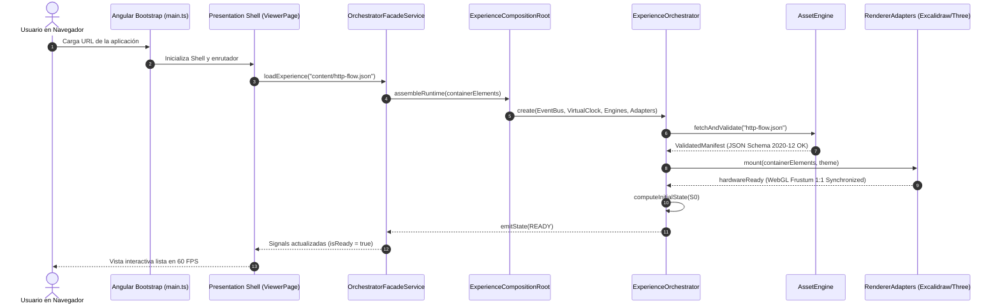

---

## 6. Arquitectura de Registros de Plugins (Zero Switch)

Cada familia de plugins se registra en su **Registry tipado**. Quedan estrictamente prohibidos los `switch (type)`:

```
┌────────────────────────────────────────────────────────────────────────┐
│                        REGISTRY ARCHITECTURE                           │
├──────────────────────────┬─────────────────────────────┬───────────────┤
│ Familia de Extensión     │ Registro Físico             │ Método SPI    │
├──────────────────────────┼─────────────────────────────┼───────────────┤
│ Simulation Providers     │ `SimulationProviderRegistry`│ `register()`  │
├──────────────────────────┼─────────────────────────────┼───────────────┤
│ Visual Behaviors         │ `BehaviorRegistry`          │ `register()`  │
├──────────────────────────┼─────────────────────────────┼───────────────┤
│ Renderer Adapters        │ `RendererRegistry`          │ `register()`  │
├──────────────────────────┼─────────────────────────────┼───────────────┤
│ Camera Transitions       │ `CameraTransitionRegistry`  │ `register()`  │
├──────────────────────────┼─────────────────────────────┼───────────────┤
│ Evaluation Rules         │ `EvaluationRuleRegistry`    │ `register()`  │
├──────────────────────────┼─────────────────────────────┼───────────────┤
│ Asset Parsers            │ `AssetParserRegistry`       │ `register()`  │
└──────────────────────────┴─────────────────────────────┴───────────────┘
```

### Protocolo de Registro sin Switch:
```typescript
export class BehaviorRegistry {
  private readonly handlers = new Map<string, BehaviorHandler>();

  register(handler: BehaviorHandler): void {
    if (this.handlers.has(handler.actionType)) {
      throw new Error(`Behavior handler already registered for type: ${handler.actionType}`);
    }
    this.handlers.set(handler.actionType, handler);
  }

  resolve(actionType: string): BehaviorHandler {
    const handler = this.handlers.get(actionType);
    if (!handler) throw new UnsupportedActionException(actionType);
    return handler;
  }
}
```

---

## 7. Guía Oficial de Convenciones y Nomenclatura

Para que el código hable la misma lengua arquitectónica durante los próximos 5 años, se establecen los siguientes sufijos y semánticas obligatorias:

```
┌────────────────────────────────────────────────────────────────────────┐
│                    TABLA OFICIAL DE NOMENCLATURA                       │
├─────────────┬──────────────────────────────────────────────────────────┤
│ Sufijo      │ Propósito y Significado Arquitectónico                   │
├─────────────┼──────────────────────────────────────────────────────────┤
│ `*Engine`   │ Motor especializado de subsistema (`SimulationEngine`).  │
├─────────────┼──────────────────────────────────────────────────────────┤
│ `*Port`     │ Contrato o interfaz abstracta en el dominio (`CameraPort`│
├─────────────┼──────────────────────────────────────────────────────────┤
│ `*Adapter`  │ Implementación concreta de hardware (`ThreeJsAdapter`).  │
├─────────────┼──────────────────────────────────────────────────────────┤
│ `*Provider` │ Proveedor enchufable de simulación (`HttpProvider`).     │
├─────────────┼──────────────────────────────────────────────────────────┤
│ `*Handler`  │ Procesador desacoplado de un behavior (`PacketHandler`). │
├─────────────┼──────────────────────────────────────────────────────────┤
│ `*Facade`   │ Fachada reactiva hacia Angular (`OrchestratorFacade`).   │
├─────────────┼──────────────────────────────────────────────────────────┤
│ `*Registry` │ Contenedor dinámico de plugins (`BehaviorRegistry`).     │
├─────────────┼──────────────────────────────────────────────────────────┤
│ `*Action`   │ Intención atómica declarada en timeline (`CameraAction`).│
├─────────────┼──────────────────────────────────────────────────────────┤
│ `*Command`  │ Instrucción de bajo nivel para renderers (`RenderCmd`).  │
├─────────────┼──────────────────────────────────────────────────────────┤
│ `*Event`    │ Hecho inmutable ocurrido en el pasado (`SimEvent`).      │
├─────────────┼──────────────────────────────────────────────────────────┤
│ `*Snapshot` │ Fotograma inmutable de estado (`SimulationSnapshot`).    │
├─────────────┼──────────────────────────────────────────────────────────┤
│ `*Policy`   │ Regla de gobierno o reintento (`EvaluationPolicy`).      │
└─────────────┴──────────────────────────────────────────────────────────┘
```

---

## 8. Matriz de Propiedad de Carpetas (Folder Ownership)

El principio de responsabilidad única se traslada a la propiedad de los directorios:

```
┌────────────────────────────────────────────────────────────────────────┐
│                     PROPIEDAD FORMAL DE DIRECTORIOS                    │
├───────────────────────┬──────────────────────┬─────────────────────────┤
│ Directorio Físico     │ Dueño Exclusivo      │ Prohibición Expresa     │
├───────────────────────┼──────────────────────┼─────────────────────────┤
│ `engine/kernel/`      │ Orchestrator Team    │ Sin código gráfico.     │
├───────────────────────┼──────────────────────┼─────────────────────────┤
│ `engine/simulation/`  │ Systems Dynamics Team│ Sin referencias visuales│
├───────────────────────┼──────────────────────┼─────────────────────────┤
│ `infrastructure/`     │ Graphics & I/O Team  │ Sin lógica de negocio.  │
├───────────────────────┼──────────────────────┼─────────────────────────┤
│ `presentation/`       │ Frontend UX Team     │ Sin acceso a WebGL raw. │
├───────────────────────┼──────────────────────┼─────────────────────────┤
│ `application/`        │ Integration Team     │ Sin imports de React.   │
└───────────────────────┴──────────────────────┴─────────────────────────┘
```

---

## 9. Estrategia de Build y Empaquetado a 5 Años

```
┌────────────────────────────────────────────────────────────────────────┐
│                        EVOLUCIÓN DEL BUILD SYSTEM                      │
├────────────────────┬───────────────────────────────────────────────────┤
│ Fase               │ Estrategia Técnica                                │
├────────────────────┼───────────────────────────────────────────────────┤
│ Fase 1 (Actual)    │ Angular CLI 20 Zoneless + ESBuild + Chunks Lazy.  │
│                    │ Three.js (~688 kB) y Excalidraw cargados mediante │
│                    │ `import()` dinámico. Bundle inicial: < 400 kB.    │
├────────────────────┼───────────────────────────────────────────────────┤
│ Fase 2 (Sprint 4)  │ Aislamiento del `engine/` como biblioteca pura TS │
│                    │ sin empaquetado Angular, compilable con `tsup`.   │
├────────────────────┼───────────────────────────────────────────────────┤
│ Fase 3 (Año 2027)  │ Migración a Monorepo Nx:                          │
│                    │ • `@case/core-engine` (NPM Package multiplataforma│
│                    │ • `@case/simulation-providers` (Paquetes SPI)     │
│                    │ • `@case/visual-lab-web` (Cliente Angular web)    │
│                    │ • `@case/visual-lab-desktop` (App nativa Tauri)   │
└────────────────────┴───────────────────────────────────────────────────┘
```

---

## 10. Estrategia de Testing en Siete Niveles

```
┌────────────────────────────────────────────────────────────────────────┐
│                      PIRÁMIDE DE TESTING DE RUNTIME                    │
├──────────────────────┬──────────────────────┬──────────────────────────┤
│ Nivel de Prueba      │ Herramienta / Runner │ Alcance y Cobertura      │
├──────────────────────┼──────────────────────┼──────────────────────────┤
│ 1. Unit Tests Puros  │ Vitest               │ Motores matemáticos,     │
│                      │                      │ StateMachine, EventBus.  │
├──────────────────────┼──────────────────────┼──────────────────────────┤
│ 2. Determinismo DES  │ Vitest (10,000 runs) │ Ejecución de simulación  │
│                      │                      │ validando hash SHA-256.  │
├──────────────────────┼──────────────────────┼──────────────────────────┤
│ 3. Golden Event Stream│ Vitest + Fixtures   │ Comprobación de streams  │
│                      │ JSON                 │ de eventos contra oro.   │
├──────────────────────┼──────────────────────┼──────────────────────────┤
│ 4. Snapshot Tests    │ Vitest Snapshot      │ Serialización de estados │
│                      │                      │ y esquemas AST.          │
├──────────────────────┼──────────────────────┼──────────────────────────┤
│ 5. Integration Tests │ Vitest               │ CompositionRoot, montaje │
│                      │                      │ y ciclo Load -> Destroy. │
├──────────────────────┼──────────────────────┼──────────────────────────┤
│ 6. Visual Regression │ Playwright Headless  │ Captura de pixel diff    │
│                      │                      │ de canvas 2D y 3D.       │
├──────────────────────┼──────────────────────┼──────────────────────────┤
│ 7. Memory Leaks Test │ Chromium Headless    │ 50 ciclos Load/Destroy   │
│                      │ performance.memory   │ verificando 0 fugas GPU. │
└──────────────────────┴──────────────────────┴──────────────────────────┘
```

---

## 11. Pipeline de CI/CD (GitHub Actions)

Todo Pull Request debe superar obligatoriamente los ocho pórticos de calidad:

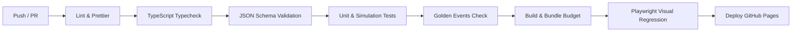

### Presupuesto de Rendimiento Innegociable:
- Initial JS Bundle: $\le 450\text{ kB}$ (gzip transfer $\le 110\text{ kB}$).
- Three.js WebGL Chunk: $\le 750\text{ kB}$ (lazy loaded).
- Tiempo de ejecución de test suite unitaria: $\le 5\text{ segundos}$.

---

## 12. Estrategia de Migración Continua de Manifiestos

Para asegurar la promesa de **inmutabilidad de contenidos a 5 años**, el `AssetEngine` incorpora el pipeline de migraciones encadenadas puras:

```
┌────────────────────────────────────────────────────────────────────────┐
│                      PIPELINE DE MIGRACIÓN DE DATOS                    │
├────────────────────────────────────────────────────────────────────────┤
│                       Raw Input JSON Manifest                          │
│                                  │                                     │
│                     ¿schemaVersion == "1.0.0"?                         │
│                         /              \                               │
│                      (Sí)              (No)                            │
│                       ▼                 ▼                              │
│              LegacyLessonAdapter     ¿schemaVersion == "2.0.0"?        │
│              (ADR-004 -> ADR-008)        /              \              │
│                       │               (Sí)              (No)           │
│                       │                ▼                 ▼             │
│                       └────────▶  Canonical v2   Execute Migration Chain│
│                                        │         (v2 -> v3 -> vN)      │
│                                        ▼                 │             │
│                               ExperienceOrchestrator ◀───┘             │
└────────────────────────────────────────────────────────────────────────┘
```

---

## 13. Checklist de Implementación Secuencial (Sprint 3)

El equipo de desarrollo ejecutará la construcción física siguiendo estrictamente este orden de dependencias:

```
┌────────────────────────────────────────────────────────────────────────┐
│               CHECKLIST DE CONSTRUCCIÓN FÍSICA (SPRINT 3)              │
├───────┬──────────────────────────────────┬─────────────────────────────┤
│ Paso  │ Archivo / Componente             │ Justificación de Orden      │
├───────┼──────────────────────────────────┼─────────────────────────────┤
│ [ ] 1 │ `engine/event-bus/`              │ Sustrato de comunicación    │
│       │ • `runtime-event-bus.ts`         │ sobre el cual dialogarán    │
│       │ • `event-envelope.ts`            │ todos los motores.          │
├───────┼──────────────────────────────────┼─────────────────────────────┤
│ [ ] 2 │ `engine/kernel/clock/`           │ Reloj maestro que marca el  │
│       │ • `virtual-clock.ts`             │ pulso temporal discreto.    │
├───────┼──────────────────────────────────┼─────────────────────────────┤
│ [ ] 3 │ `engine/kernel/state-machine/`   │ La máquina de 11 estados    │
│       │ • `runtime-state-machine.ts`     │ que protege el ciclo.       │
├───────┼──────────────────────────────────┼─────────────────────────────┤
│ [ ] 4 │ `engine/simulation/`             │ Core determinístico puro    │
│       │ • `simulation-runtime.ts`        │ y provider HTTP de prueba   │
│       │ • `http-simulation.provider.ts`  │ con pruebas unitarias.      │
├───────┼──────────────────────────────────┼─────────────────────────────┤
│ [ ] 5 │ `engine/behaviors/`              │ Handlers desacoplados y     │
│       │ • `behavior-registry.ts`         │ `PacketFlowHandler`.        │
├───────┼──────────────────────────────────┼─────────────────────────────┤
│ [ ] 6 │ `engine/timeline/`               │ Scheduler de acciones       │
│       │ • `parallel-action-scheduler.ts` │ concurrentes por fotograma. │
├───────┼──────────────────────────────────┼─────────────────────────────┤
│ [ ] 7 │ `engine/assets/migrations/`      │ Adaptador que lee lecciones │
│       │ • `legacy-lesson.adapter.ts`     │ existentes de ADR-004.      │
├───────┼──────────────────────────────────┼─────────────────────────────┤
│ [ ] 8 │ `engine/kernel/orchestrator/`    │ El supervisor central que   │
│       │ • `experience-orchestrator.ts`   │ orquesta los pasos 1 al 7.  │
├───────┼──────────────────────────────────┼─────────────────────────────┤
│ [ ] 9 │ `engine/kernel/composition/`     │ Ensamblador único de todos  │
│       │ • `composition-root.ts`          │ los motores del runtime.    │
├───────┼──────────────────────────────────┼─────────────────────────────┤
│ [ ] 10│ `infrastructure/renderers/`      │ Conexión de Three.js y      │
│       │ • `threejs.adapter.ts`           │ Excalidraw al ciclo formal  │
│       │ • `excalidraw.adapter.ts`        │ de INITIALIZE y DESTROY.    │
├───────┼──────────────────────────────────┼─────────────────────────────┤
│ [ ] 11│ `application/`                   │ Fachada reactiva Angular    │
│       │ • `orchestrator-facade.ts`       │ (Signals zoneless).         │
├───────┼──────────────────────────────────┼─────────────────────────────┤
│ [ ] 12│ `presentation/canvas-viewer/`    │ Conexión de UI al Facade y  │
│       │ • `canvas.page.ts` (Refactor)    │ validación de lección HTTP. │
└───────┴──────────────────────────────────┴─────────────────────────────┘
```

---

## 14. Los Diez Diagramas de Arquitectura Física (Mermaid)

### 14.1 Diagrama 1: Arquitectura Física del Repositorio

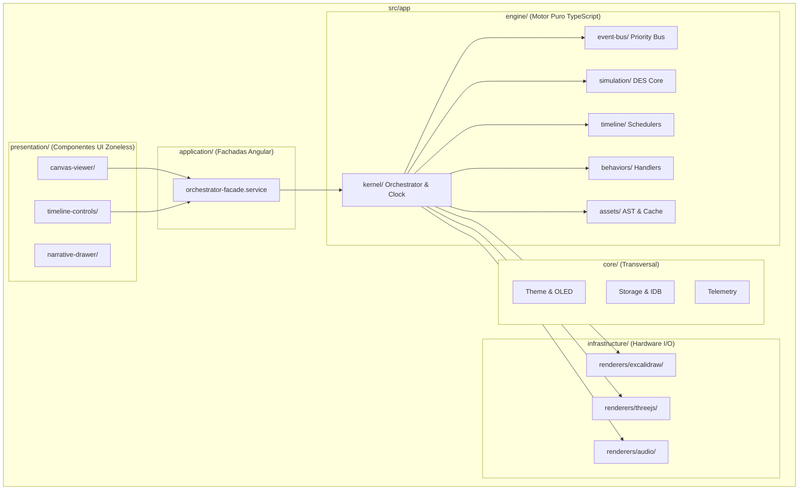

### 14.2 Diagrama 2: Jerarquía de Ownership (Propiedad de Memoria)

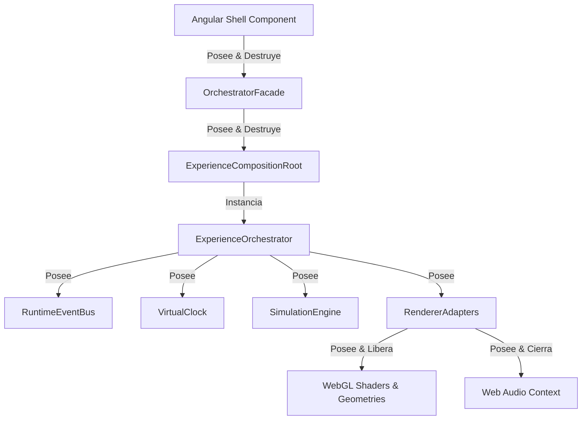

### 14.3 Diagrama 3: Pipeline de Bootstrap Físico

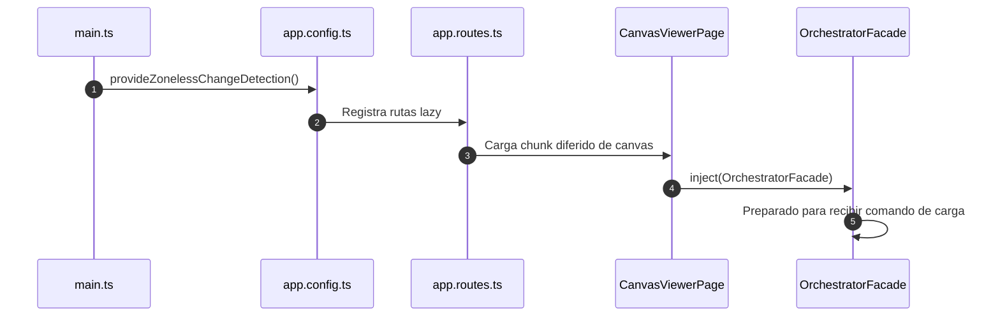

### 14.4 Diagrama 4: Matriz de Imports Permitidos vs Prohibidos

```mermaid
flowchart TD
    subgraph "Capas Físicas"
        Presentation[presentation/ (Angular UI)]
        Application[application/ (Fachadas)]
        Engine[engine/ (Puro TypeScript)]
        Infra[infrastructure/ (Three/React Adapters)]
    end

    Presentation -->|Permitido| Application
    Application -->|Permitido| Engine
    Application -->|Permitido| Infra
    Infra -->|Permitido Contratos| Engine

    Presentation x--x|PROHIBIDO| Engine
    Presentation x--x|PROHIBIDO| Infra
    Engine x--x|PROHIBIDO| Presentation
    Engine x--x|PROHIBIDO| Application
    Engine x--x|PROHIBIDO| Infra
```

### 14.5 Diagrama 5: Grafo de Dependencias Hexagonal

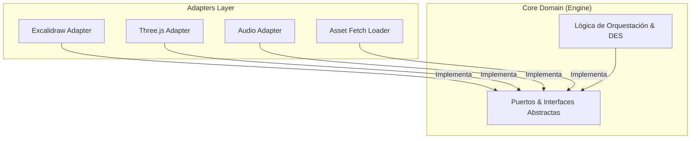

### 14.6 Diagrama 6: Composition Root Wiring

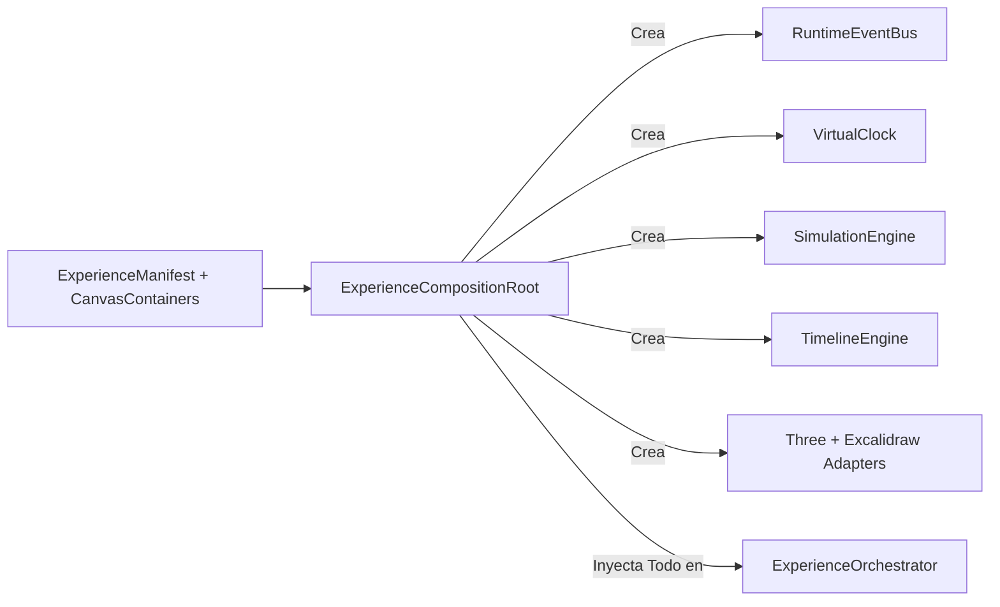

### 14.7 Diagrama 7: Flujo de Plugin Registration

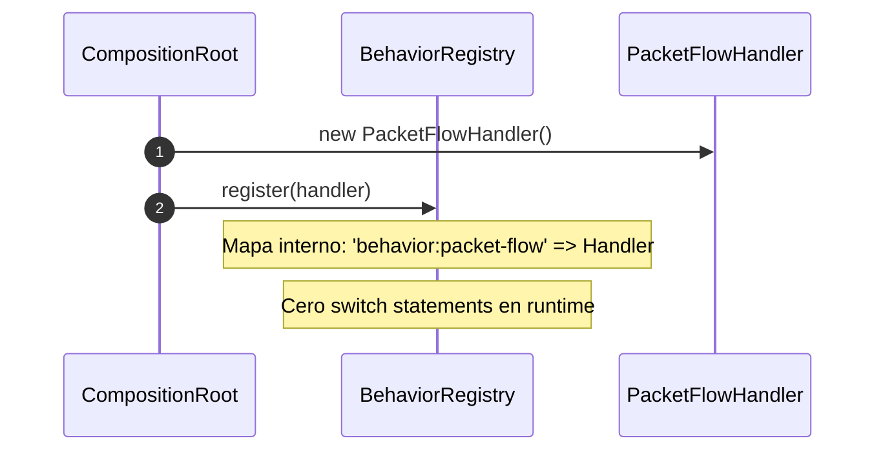

### 14.8 Diagrama 8: Secuencia de Inicio del Runtime

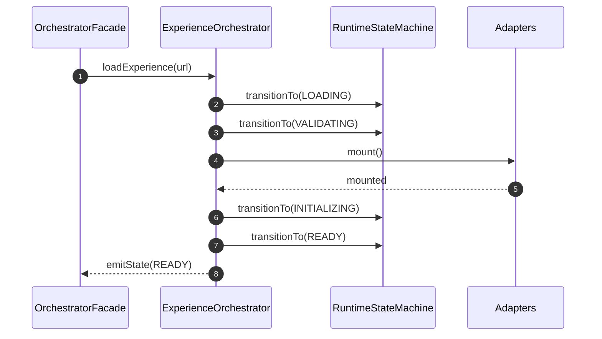

### 14.9 Diagrama 9: Mapa de Carpetas y Dominios

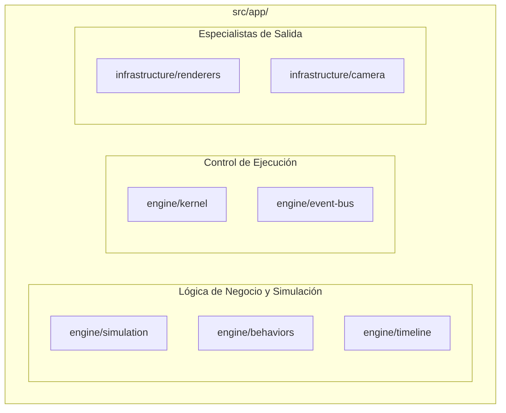

### 14.10 Diagrama 10: Build Pipeline & Chunk Splitting

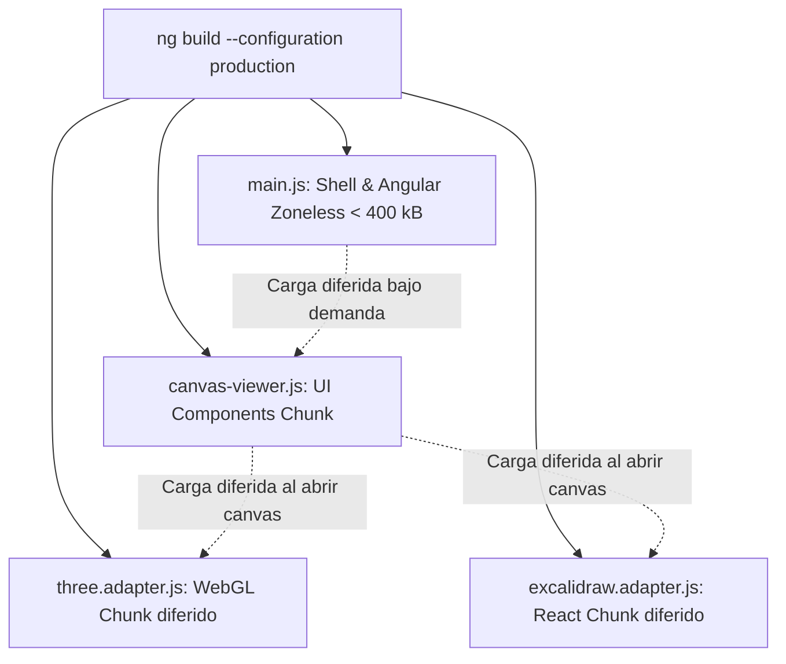

---

## 15. Decisión Final y Veredicto Arquitectónico

Se aprueba y adopta de forma vinculante **ADR-009: Implementation Strategy & Physical Architecture**.

Con esta decisión:
1. **La fase de arquitectura queda oficialmente cerrada al 100%.**
2. Se declara formalmente iniciado el **Sprint 3 (Implementación Física del Core)**.
3. Se prohíbe taxativamente la creación de código que viole la estructura de carpetas, reglas de imports o nomenclatura estipulada en este documento.
4. Se mantiene el cumplimiento innegociable de las restricciones de esta sesión: **cero código TypeScript modificado o generado, cero commits y cero push**.
