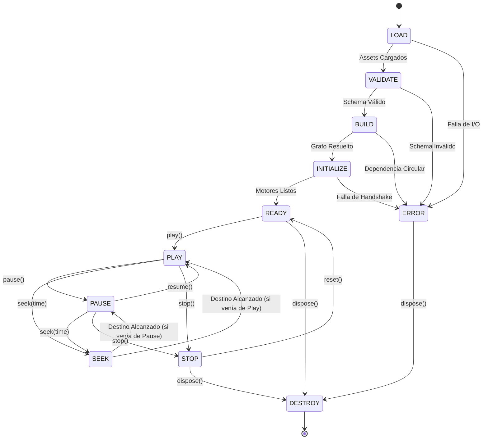
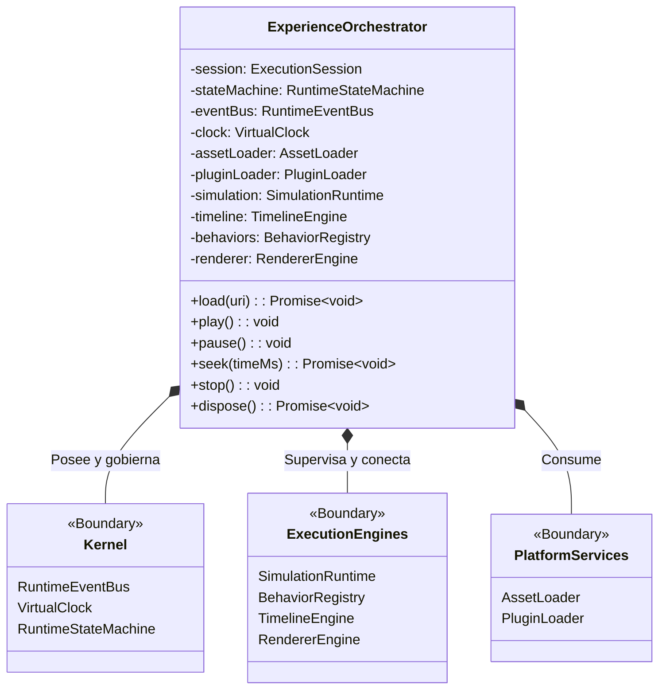
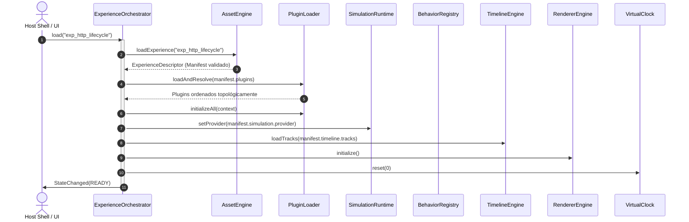
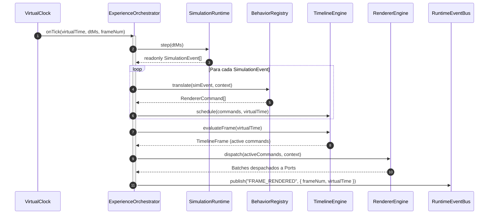
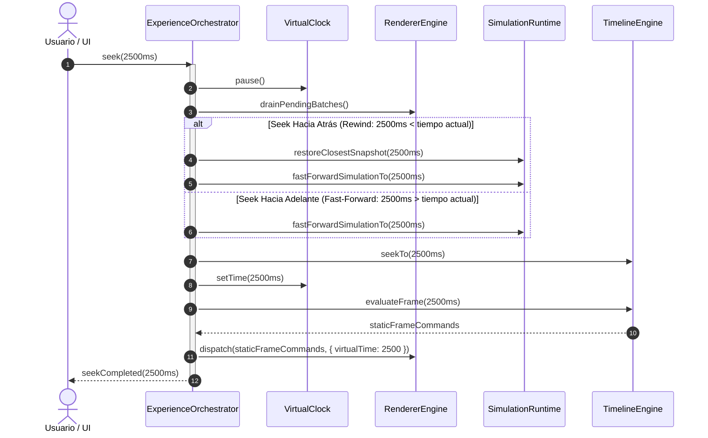
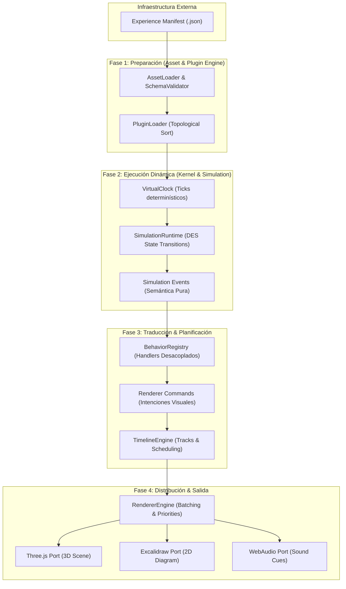
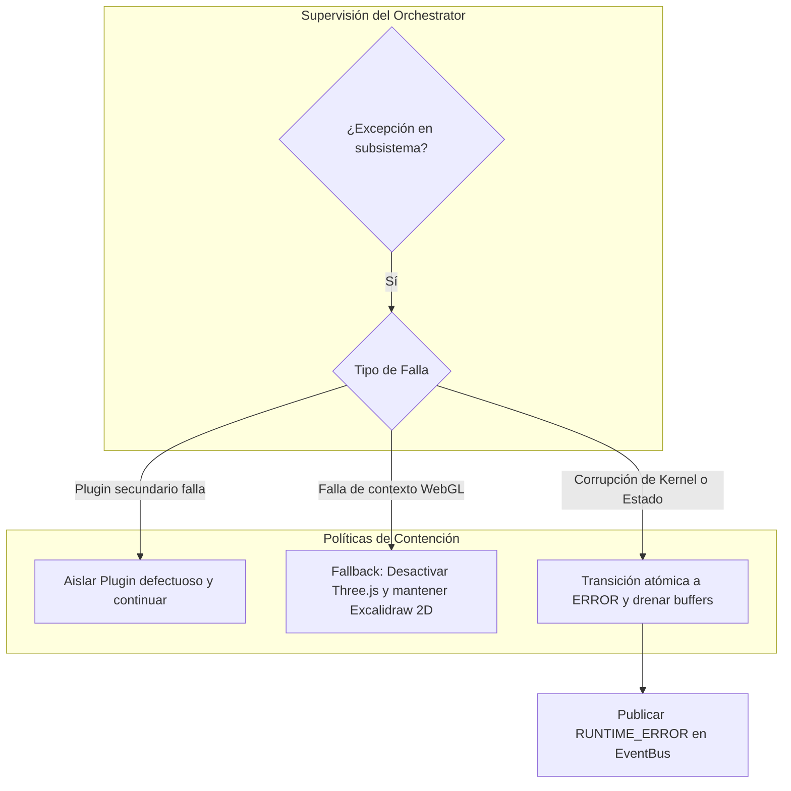
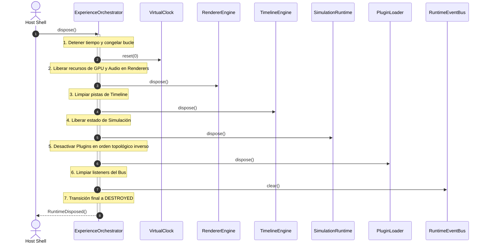
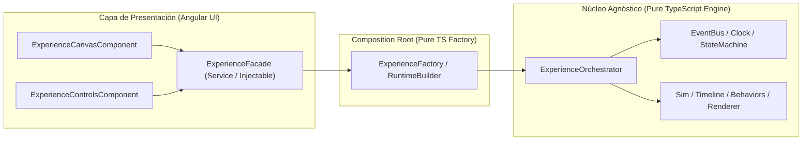

# ADR 010: Experience Orchestrator Runtime — Coordinación y Ciclo de Vida del Motor Vivo

- **Estado:** Propuesto / Aceptado
- **Fecha:** 2026-10-05
- **Sprint:** Sprint 3 — Cierre de Arquitectura de Runtime y Plataforma
- **Autores / Decisores:** Principal Software Architect, Distinguished Engineer, Runtime Systems Architect, Game Engine Architect, Clean Architecture Reviewer
- **Contexto:** Habiendo completado y verificado físicamente el **Engine Core** (`v0.3-engine-core`: EventBus, VirtualClock, StateMachine, Simulation, Behaviors, Timeline, Renderer) y la **Plataforma de Infraestructura** (`v0.4-runtime-platform`: AssetEngine, ExperienceLoader, PluginEngine), este documento define el plano formal del **Runtime Vivo**. Especifica cómo cooperan todos los subsistemas sin acoplarse, cómo se garantiza el determinismo temporal absoluto, cómo se controlan las barreras de ejecución y cómo se previene cualquier fuga de memoria (RAM, GPU, Audio, Workers) en la orquestación de experiencias interactivas.

---

## 1. Contexto y Declaración del Problema

Hasta el Sprint 3 (Paso 10), CASE Visual Lab ha implementado sus subsistemas como módulos aislados y determinísticos en TypeScript puro (`src/app/engine/`):

```text
Platform Runtime (v0.4-runtime-platform)
│
├── Kernel
│   ├── RuntimeEventBus       (ADR-007: Prioridades, desacoplamiento pub/sub)
│   ├── VirtualClock          (ADR-002, ADR-005: Tiempo determinístico, ticks, speed, seek)
│   └── RuntimeStateMachine   (ADR-003, ADR-007: Máquina de estados atómica, tabla de transiciones)
│
├── Domain Execution Engines
│   ├── SimulationRuntime     (ADR-006: Discrete Event Simulation, providers SPI, snapshots)
│   ├── BehaviorRegistry      (ADR-002, ADR-005: Traductores semánticos Open/Closed, commands)
│   ├── TimelineEngine        (ADR-005: Scheduler paralelo, pistas concurrentes, marcadores)
│   └── RendererEngine        (ADR-001, ADR-005: Universal pipeline, dispatching, batches, ports)
│
└── Platform Infrastructure Engines
    ├── AssetEngine           (ADR-004, ADR-008: Manifest loading, cache, validator, migrations)
    └── PluginEngine          (ADR-006, ADR-009: Inverted index, orden topológico, extensions SPI)
```

### El Desafío Arquitectónico:

Los motores están construidos y probados al 100%, pero **no interactúan entre sí por sí mismos**.

- El `VirtualClock` avanza ticks, pero no sabe qué simulación avanzar.
- La `SimulationRuntime` emite eventos de dominio, pero no sabe qué handlers de comportamiento invocarlos.
- Los `BehaviorHandlers` producen `RendererCommands`, pero no saben en qué pista del `TimelineEngine` programarlos ni a qué puerto del `RendererEngine` despacharlos.
- El `AssetEngine` entrega un `ExperienceDescriptor`, pero no sabe quién debe inicializar las escenas o los plugins.

Se requiere un **Supervisor de Ejecución Central**: el `ExperienceOrchestrator`.
Si este orquestador se diseña incorrectamente, se convertirá instantáneamente en un **God Object** monolítico lleno de llamadas directas, fugas de memoria y dependencias circulares.

Este ADR define con rigor matemático y de sistemas el **Experience Orchestrator Runtime**: el plano maestro de cooperación, sincronización temporal, control de estados y gestión de ciclo de vida.

---

## 2. Principios de Diseño y Límites Estrictos de Responsabilidad

El `ExperienceOrchestrator` es un **Supervisor**, no un ejecutor de tareas de bajo nivel.

```
┌────────────────────────────────────────────────────────────────────────┐
│                   FRONTERAS DEL EXPERIENCE ORCHESTRATOR               │
├───────────────────────────────────┬────────────────────────────────────┤
│ LO QUE HACE (Responsabilidades)   │ LO QUE TIENE PROHIBIDO HACER       │
├───────────────────────────────────┼────────────────────────────────────┤
│ 1. Orquesta el ciclo de vida      │ 1. NUNCA ejecuta lógica de dominio │
│    formal de 12 estados.          │    (cero parsing de HTTP, JWT...). │
│ 2. Sincroniza el tick del reloj   │ 2. NUNCA dibuja, renderiza ni toca │
│    con el pipeline de ejecución.  │    Canvas, WebGL o Three.js.       │
│ 3. Enlaza eventos de salida de un │ 3. NUNCA genera eventos de         │
│    motor con entradas del otro.   │    simulación por su cuenta.       │
│ 4. Supervisa barreras de tiempo   │ 4. NUNCA importa Angular (@angular)│
│    (Seek, Pause, Resume).         │    ni RxJS ni componentes web.     │
│ 5. Gestiona el orden topológico   │ 5. NUNCA accede al DOM, window o   │
│    de encendido y apagado.        │    localStorage.                   │
│ 6. Contiene fallas y aísla        │ 6. NUNCA almacena estado visual ni │
│    errores de plugins/renderers.  │    mallas 3D en su memoria.        │
└───────────────────────────────────┴────────────────────────────────────┘
```

---

## 3. Entidades Arquitectónicas y Contratos del Runtime

Para evitar acoplamientos, el orquestador trabaja con cinco estructuras fundamentales de datos y composición:

### 3.1 `ExperienceContext`

Información inmutable y metadatos de la experiencia cargada, derivada del `ExperienceDescriptor`:

```typescript
export interface ExperienceContext {
  readonly manifest: ExperienceManifest;
  readonly sessionKey: string;
  readonly originalFormat: 'experience' | 'legacy-lesson';
  readonly schemaVersion: string;
  readonly loadedAt: number;
}
```

### 3.2 `RuntimeContext`

Acceso unificado que el orquestador entrega a componentes autorizados (como plugins o inspectores de depuración):

```typescript
export interface RuntimeContext {
  readonly clock: IVirtualClock;
  readonly eventBus: IRuntimeEventBus;
  readonly stateMachine: IRuntimeStateMachine;
  readonly extensions: IExtensionAccessor;
  readonly sessionId: string;
}
```

### 3.3 `ExecutionSession`

Representa una sesión viva de reproducción. Contiene contadores determinísticos, snapshots acumulados y métricas:

```typescript
export interface ExecutionSession {
  readonly id: string;
  readonly experienceId: string;
  readonly startedAtTicks: number;
  frameSequence: number;
  lastTickVirtualTime: number;
  activeProfile: ExperienceProfileType;
}
```

### 3.4 `EngineComposition` & `EngineOwnership`

Define la jerarquía estricta de propiedad de los motores. **El Orchestrator posee los núcleos**, pero delega la ejecución interna:

```
ExperienceOrchestrator (Owner)
│
├── Kernel Components (Owned)
│   ├── RuntimeEventBus
│   ├── VirtualClock
│   └── RuntimeStateMachine
│
├── Pipeline Coordinators (Owned)
│   ├── SimulationRuntime
│   ├── BehaviorRegistry
│   ├── TimelineEngine
│   └── RendererEngine
│
└── Platform Managers (Owned)
    ├── AssetLoader
    └── PluginLoader
```

---

## 4. El Ciclo de Vida Formal de 12 Estados

El orquestador implementa una máquina de estados determinística gobernada por `RuntimeStateMachine` con 12 estados atómicos:

```
  ┌─────────┐
  │  LOAD   │ ──► [AssetLoader resuelve y recupera JSON/recursos]
  └────┬────┘
       ▼
 ┌───────────┐
 │ VALIDATE  │ ──► [SchemaValidator + Compatibility check de Plugins]
 └─────┬─────┘
       ▼
   ┌───────┐
   │ BUILD │ ──► [PluginResolver: orden topológico + Wiring de motores]
   └───┬───┘
       ▼
┌──────────────┐
│  INITIALIZE  │ ──► [Lifecycle: initialize() en Plugins, Simulation, Renderer]
└──────┬───────┘
       ▼
   ┌───────┐
   │ READY │ ◄──────────────────────┐
   └───┬───┘                        │
       ▼                            │
   ┌───────┐      Pause Barrier     │ Stop
   │ PLAY  │ ─────────────────► ┌───┴───┐
   └───┬───┘                    │ PAUSE │
       ▲                        └───┬───┘
       │          Resume Barrier    │
       ├────────────────────────────┘
       ▼
   ┌───────┐
   │ SEEK  │ ──► [Seek Barrier: Rewind determinístico de Simulación y Timeline]
   └───┬───┘
       │ Retorna a PLAY o PAUSE
       ▼
   ┌───────┐
   │ STOP  │ ──► [Flush de pipelines + Reset a tiempo 0]
   └───┬───┘
       ▼
  ┌─────────┐
  │ DESTROY │ ──► [Teardown inverso: liberación de GPU, Audio, Memory]
  └─────────┘
```

### 4.1 Matriz de Operaciones por Estado

| Estado           | Motores que Participan     | Eventos Publicados en `RuntimeEventBus`     | Dependencias que se Inicializan         | Posibles Errores / Fallas                             |
| :--------------- | :------------------------- | :------------------------------------------ | :-------------------------------------- | :---------------------------------------------------- |
| **`LOAD`**       | `AssetEngine`              | `EXPERIENCE_LOADING`, `ASSET_LOADED`        | `AssetProvider`, `AssetCache`           | Archivo no encontrado, I/O timeout, formato corrupto. |
| **`VALIDATE`**   | `AssetEngine.Validator`    | `EXPERIENCE_VALIDATED`                      | Reglas de schema, checks de versión     | `INVALID_SCHEMA`, `UNSUPPORTED_VERSION`.              |
| **`BUILD`**      | `PluginEngine.Resolver`    | `TOPOLOGY_RESOLVED`, `ENGINES_WIRED`        | Grafo de dependencias de plugins        | `CIRCULAR_DEPENDENCY`, `MISSING_DEPENDENCY`.          |
| **`INITIALIZE`** | Todos los motores          | `PLUGINS_INITIALIZED`, `SYSTEM_INITIALIZED` | Ports de Render, Provider de Simulación | Falla en handshake de WebGL/WebAudio.                 |
| **`READY`**      | StateMachine               | `EXPERIENCE_READY`                          | Frame 0 preparado en Timeline           | Estado inválido de inicio.                            |
| **`PLAY`**       | Clock, Sim, Timeline, Rend | `EXPERIENCE_STARTED`, `TICK_EMITTED`        | Loop de frames activo                   | Excepción no capturada en Behavior.                   |
| **`PAUSE`**      | Clock, Renderer            | `EXPERIENCE_PAUSED`                         | Reloj congelado en VirtualTime actual   | Desincronización de barrera.                          |
| **`SEEK`**       | Clock, Sim, Timeline, Rend | `SEEK_STARTED`, `SEEK_COMPLETED`            | Restauración de snapshots históricos    | Time delta negativo no soportado por simulación.      |
| **`RESUME`**     | Clock                      | `EXPERIENCE_RESUMED`                        | Descongelamiento de reloj               | Reanudación sin estar pausado.                        |
| **`STOP`**       | Todos los motores          | `EXPERIENCE_STOPPED`                        | Reseteo a tiempo virtual 0              | Falla en drenado de comandos pendientes.              |
| **`DESTROY`**    | Todos los motores          | `RUNTIME_DISPOSED`                          | Destrucción en orden inverso            | Memory leak o recurso colgado.                        |
| **`ERROR`**      | StateMachine, EventBus     | `RUNTIME_ERROR`                             | Aislamiento de fallas / Degradación     | Falla crítica irrecuperable.                          |

---

## 5. Barreras de Ejecución y Sincronización Temporal

Una **Barrera** es un mecanismo determinístico que congela temporalmente la tubería de datos para garantizar consistencia antes de permitir que el sistema avance.

### 5.1 Seek Barrier (Rewind y Fast-Forward Determinístico)

El seek temporal es una de las operaciones más complejas en un motor interactivo. No basta con cambiar el número del reloj; el estado del mundo debe reconstruirse fielmente:

```text
Usuario solicita seek(T_destino)
    │
    ▼
1. Emitir 'SEEK_STARTED' (Pausar virtual clock inmediatamente)
    │
    ▼
2. Drenar comandos en tránsito en RendererEngine y TimelineEngine
    │
    ▼
3. Si T_destino < T_actual (Rewind):
   a. Restaurar SimulationSnapshot del punto de control previo más cercano
   b. Ejecutar micro-ticks de simulación rápida sin renderizar hasta alcanzar T_destino
   Si T_destino >= T_actual (Fast-Forward):
   a. Avanzar simulación determinísticamente hasta T_destino
    │
    ▼
4. Reposicionar TimelineEngine en T_destino y evaluar marcadores
    │
    ▼
5. Generar RendererBatch para el frame estático en T_destino
    │
    ▼
6. Despachar al RendererEngine para pintar el frame congelado
    │
    ▼
7. Emitir 'SEEK_COMPLETED' y restaurar estado previo (PLAY o PAUSE)
```

### 5.2 Pause Barrier

- Congela el `VirtualClock` inmediatamente.
- Permite que los comandos que ya se encuentran en los `RendererPorts` terminen su fotograma actual.
- No descarta el estado de animación; solo detiene la generación de nuevos deltas de tiempo.

### 5.3 Resume Barrier

- Valida que el runtime se encuentre en estado `PAUSED`.
- Recalcula el `lastFrameTimestamp` real para evitar saltos temporales gigantes (time leap).
- Reactiva el `VirtualClock` y continúa la emisión fluida de ticks.

---

## 6. El Ciclo de Tick Determinístico (Frame Generation Pipeline)

Durante el estado `PLAY`, cada fotograma o paso temporal recorre una tubería unidireccional y estrictamente desacoplada:

```
VirtualClock.tick(dtMs)
      │
      ▼ (virtualTime, deltaTimeMs, frameNumber)
SimulationRuntime.step(deltaTimeMs)
      │
      ▼ Emite SimulationEvents (e.g. PACKET_SENT, NODE_RECEIVED)
BehaviorRegistry.translate(simulationEvent, context)
      │
      ▼ Traduce a RendererCommands (e.g. SPAWN_PARTICLE, FOCUS_CAMERA)
TimelineEngine.schedule(commands, virtualTime)
      │
      ▼ Agrupa y programa en tracks concurrentes
RendererEngine.dispatch(timelineBatch, renderContext)
      │
      ▼ Particiona por target renderer y crea RendererBatches
RendererPorts (ExcalidrawPort, ThreePort, AudioPort)
      │
      ▼ Ejecución de lotes sin conocimiento del motor
FRAME COMPLETE ──► Notifica 'FRAME_RENDERED' en RuntimeEventBus
```

---

## 7. Secuencia de Inicialización (Startup) y Destrucción (Shutdown)

Para prevenir fugas de memoria en WebGL, WebAudio o WebWorkers, el encendido y el apagado siguen órdenes algebraicamente opuestos:

### 7.1 Secuencia de Inicialización (Forward Topological)

```text
1. Kernel Base: RuntimeEventBus + RuntimeStateMachine
2. Clock: VirtualClock (congelado en 0)
3. Platform: AssetEngine + PluginEngine
4. Extension Registration: Plugins registran capacidades y namespaces
5. Domain Engines: SimulationRuntime + TimelineEngine + BehaviorRegistry
6. Render Engine: RendererEngine registra RendererPorts
7. Handshake: Todos los puertos ejecutan initialize()
8. State: Transición a READY
```

### 7.2 Secuencia de Destrucción (Reverse Topological)

```text
1. Stop: Clock se apaga, loop de frames se detiene.
2. Flush: RendererEngine y TimelineEngine vacían batches pendientes.
3. Renderers Teardown: RendererEngine.dispose() -> Ports liberan WebGL contexts, texturas y Canvas.
4. Behavior Teardown: BehaviorRegistry.clear().
5. Timeline Teardown: TimelineEngine.dispose().
6. Simulation Teardown: SimulationRuntime.dispose() -> Providers cierran conexiones de red mock/sockets.
7. Plugins Teardown: PluginLoader.dispose() -> Plugins ejecutan dispose() en orden inverso a sus dependencias.
8. Cache Cleanup: AssetCache.clear().
9. Bus Teardown: RuntimeEventBus.clear().
10. State: Transición final e irreversible a DESTROYED.
```

---

## 8. Diagramas Mermaid Arquitectónicos (10 Diagramas)

### Diagrama 1: Máquina de Estados del Runtime (12 Estados)



---

### Diagrama 2: Jerarquía de Propiedad y Composición (Ownership Tree)



---

### Diagrama 3: Secuencia de Inicio y Ensamblaje (Startup Sequence)



---

### Diagrama 4: El Bucle de Tick Determinístico (Tick Loop)



---

### Diagrama 5: Barrera de Seek y Rebobinado Determinístico (Seek Barrier)



---

### Diagrama 6: Sincronización de Pausa y Reanudación (Pause / Resume Barriers)

```mermaid
sequenceDiagram
    autonumber
    actor Host as Host Shell
    participant Orch as ExperienceOrchestrator
    participant Clock as VirtualClock
    participant Time as TimelineEngine
    participant Rend as RendererEngine
    participant Bus as RuntimeEventBus

    rect rgb(30, 40, 60)
    note right of Host: BARRERA DE PAUSA
    Host->>Orch: pause()
    activate Orch
    Orch->>Clock: pause()
    Orch->>Time: freeze()
    Orch->>Rend: flushCurrentFrame()
    Orch->>Bus: publish("EXPERIENCE_PAUSED", { time: Clock.time })
    deactivate Orch
    end

    rect rgb(40, 50, 30)
    note right of Host: BARRERA DE REANUDACIÓN
    Host->>Orch: resume()
    activate Orch
    Orch->>Clock: resume()
    Orch->>Time: unfreeze()
    Orch->>Bus: publish("EXPERIENCE_RESUMED", { time: Clock.time })
    deactivate Orch
    end
```



---

### Diagrama 7: Flujo de Datos Extremo a Extremo (End-to-End Pipeline)



---

### Diagrama 8: Aislamiento de Fallas y Recuperación (Error Recovery)



---

### Diagrama 9: Secuencia de Apagado y Prevención de Fugas (Shutdown Sequence)



---

### Diagrama 10: Vista Previa del Composition Root y Facade de Angular



---

## 9. Materialización de ADR-001 a ADR-009

| Documento   | Principio Arquitectónico             | Cómo lo Materializa ADR-010                                                                          |
| :---------- | :----------------------------------- | :--------------------------------------------------------------------------------------------------- |
| **ADR-001** | Canvas Renderer Adapter agnóstico    | El orquestador nunca conoce Canvas; solo despacha comandos a través de `RendererEngine`.             |
| **ADR-002** | Cinematic Learning Engine            | Integra el tiempo virtual con la narrativa y la traslación de cámaras de forma declarativa.          |
| **ADR-003** | Runtime State Machine & Transiciones | Gobierna la sesión con la máquina atómica formal de 12 estados sin booleanos ad-hoc.                 |
| **ADR-004** | Pedagogical DSL & Lesson Manifest    | Admite lecciones legacy transformadas transparentemente vía `LegacyLessonAdapter`.                   |
| **ADR-005** | Universal Canvas & Parallel Timeline | Coordina la ejecución simultánea de múltiples pistas y canales de renderizado.                       |
| **ADR-006** | Simulation Engine (DES)              | Conecta la salida de `SimulationRuntime` con el `BehaviorRegistry` en cada tick.                     |
| **ADR-007** | Experience Orchestrator (Visión)     | Convierte la especificación de supervisor de ADR-007 en un diseño físico y ejecutable.               |
| **ADR-008** | Experience Manifest Contract         | Consume exclusivamente `ExperienceDescriptor` con validación y versionado dinámico.                  |
| **ADR-009** | Implementation Strategy              | Respeta la frontera física estricta: TypeScript puro en `engine/`, adaptadores en `infrastructure/`. |

---

## 10. Estrategia de Implementación para el Paso 11

En el **Paso 11 (Sprint 3 — Paso 11)**, se implementará el `ExperienceOrchestrator` físico en `src/app/engine/orchestrator/`:

```text
src/app/engine/orchestrator/
├── contracts/
│   ├── experience-context.interface.ts     # ExperienceContext
│   ├── runtime-context.interface.ts        # RuntimeContext
│   ├── execution-session.interface.ts      # ExecutionSession
│   ├── orchestrator-options.interface.ts   # Configuración de composición
│   └── index.ts
├── barriers/
│   ├── seek-barrier.ts                     # Manejo determinístico de rewind y fast-forward
│   ├── pause-barrier.ts                    # Sincronización de pausa y congelamiento
│   └── index.ts
├── supervisor/
│   ├── fault-isolator.ts                   # Contención de errores y degradación elegante
│   └── index.ts
├── experience-orchestrator.ts               # Clase supervisora principal
├── experience-orchestrator.spec.ts          # Cobertura unitaria integral >95%
└── index.ts                                # Barrel export
```

### Reglas para la Implementación del Paso 11:

1. **Zero Framework Pollution**: 100% TypeScript puro, sin `@angular/*`, sin `three`, sin `excalidraw`.
2. **Inversión de Control Absoluta**: Los motores (`SimulationRuntime`, `TimelineEngine`, etc.) se inyectan en el constructor o se ensamblan mediante un factory limpio con defaults sensatos.
3. **Determinismo Temporal**: Toda la simulación y animación avanzan únicamente cuando el `VirtualClock` avanza. Cero `setInterval` o `Date.now()` en el bucle principal.

---

Este ADR sella formalmente el diseño del **Runtime Vivo** de CASE Visual Lab. Con este plano consolidado, la implementación del orquestador es directa, robusta y libre de ambigüedades.
