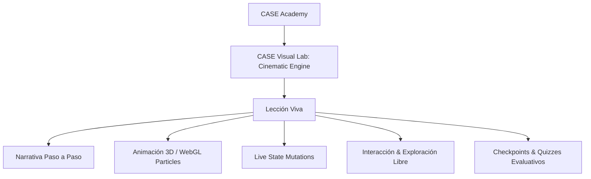
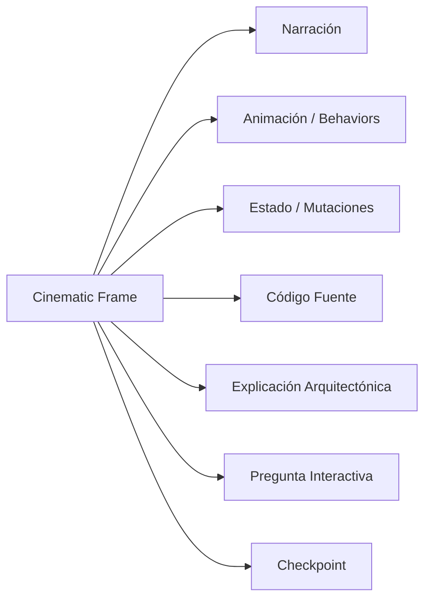

# 11 · Cinematic Learning Engine: Arquitectura & Visión a 5 Años

> **CASE Visual Lab · The Visual Engine of CASE OS**  
> _"No competimos con Excalidraw. Competimos con PowerPoint como herramienta para enseñar ingeniería de software."_

---

## 1. La Visión: De Editor de Diagramas a Motor Cinematográfico

Un instructor o arquitecto actual depende de una pila fragmentada:

```
PowerPoint + PDF + Draw.io + Excalidraw + Videos + GIFs + Código
```

El propósito de **CASE Visual Lab** es unificar todo en una **experiencia cinematográfica interactiva**:



---

## 2. Los 8 Subsistemas del Motor Cinematográfico

### 2.1 Catálogo Universal de Visual Behaviors

Los behaviors son descriptores de dominio independientes del motor gráfico:

```typescript
export type VisualBehaviorType =
  // Red & Protocolos
  | 'packet-flow'
  | 'request-response'
  | 'api-call'
  | 'retry'
  | 'timeout'
  | 'failure'
  // Almacenamiento & Caché
  | 'database-write'
  | 'database-read'
  | 'filesystem-read'
  | 'filesystem-write'
  | 'cache-hit'
  | 'cache-miss'
  // Event-Driven
  | 'event-publish'
  | 'event-consume'
  // Inteligencia Artificial & Agentes
  | 'agent-thinking'
  | 'planner-selection'
  | 'tool-call'
  | 'streaming-response'
  | 'token-generation'
  | 'embedding-search'
  | 'vector-match'
  | 'memory-retrieval'
  // Estados Nocionales
  | 'node-highlight'
  | 'node-pulse'
  | 'success'
  | 'warning'
  | 'error';
```

### 2.2 Timeline Cinemático & Cinematic Frame

Cada Frame es determinístico, reproducible y desacoplado:



### 2.3 Camera System (`CameraPort`)

Contratos formales para dirigir la atención del estudiante:

- `focus(nodeId)`: Centra el encuadre en el nodo de interés.
- `zoom(nodeId, level)`: Acerca cinematográficamente la cámara (1.5x a 3.0x).
- `highlight(nodeId)`: Ilumina el nodo atenuando los elementos adyacentes.
- `orbit(nodeId, angle)`: Giro orbital 3D para composiciones espaciales.
- `shake(intensity)`: Efecto de vibración para representar fallos, timeouts o excepciones.
- `follow(entityId)`: La cámara sigue una entidad animada a través de su trayectoria.
- `fitScene()`: Restaura el encuadre completo de la escena.

### 2.4 Animated Entities

Entidades que viajan por el sistema representando conceptos técnicos reales:

- **Networking:** `http-request`, `http-response`, `jwt-token`.
- **Database:** `sql-query`, `document-chunk`.
- **AI & RAG:** `vector-embedding`, `prompt-token`, `completion-stream`.
- **Agentic AI:** `agent-thought`, `tool-call-invocation`, `memory-context`.

### 2.5 Live State (Escena Viva)

La escena nunca es estática. A lo largo del timeline:

- Los nodos muestran badges dinámicos (`PENDING`, `RATE_LIMIT_EXCEEDED`, `200_OK`).
- Las métricas se actualizan visualmente (`latencia: 1.4ms`, `tokens: 340tps`).
- Los bordes emiten pulsos de éxito (verde) o error (rojo).

### 2.6 Narrative Engine

- Guión pedagógico estructurado (`NarrativeScript`) con tono y puntos de inflexión.
- Código fuente ejecutable con sintaxis destacada.
- Objetivos pedagógicos clasificados por la taxonomía de Bloom (`remember`, `apply`, `analyze`).
- Notas exclusivas para el instructor con preguntas sugeridas y errores conceptuales comunes.

### 2.7 Soporte Jerárquico para CASE Academy

Estructura de datos completamente normalizada y desacoplada:
$$\text{Lesson} \longrightarrow \text{Scenes} \longrightarrow \text{Timelines} \longrightarrow \text{Frames} \longrightarrow \text{Behaviors}$$

### 2.8 Three.js como Capa de Animación Overlay

- Three.js no almacena estado de negocio.
- Opera como una capa WebGL transparente con `pointer-events: none` sobre el lienzo.
- Se encarga exclusivamente de renderizar trayectorias parabólicas, partículas, halos y shaders de brillo.

---

## 3. Principio de Cero Dependencias Externas en Runtime

- **Sin LLMs en el cliente:** No se consumen APIs de OpenAI, Anthropic ni Gemini en tiempo de ejecución.
- **Determinismo Absoluto:** Cada simulación es reproducible exactamente igual 100 veces seguidas.
- **Offline-First:** Funciona sin conexión a internet directamente desde GitHub Pages o entornos locales.

---

## 4. Roadmap de Implementación (3 a 5 Años)

| Fase                           | Sprint                     | Entregables Principales                                                                                                                       |
| :----------------------------- | :------------------------- | :-------------------------------------------------------------------------------------------------------------------------------------------- |
| **Fase 1: Fundaciones**        | Sprint 1 & 2 (Completados) | React Island, ExcalidrawAdapter, Three.js WebGL overlay lazy, CameraPort, contratos de Visual Behaviors, CinematicTimeline y NarrativeEngine. |
| **Fase 2: Interactividad**     | Sprint 3                   | Badges de Live State renderizados dentro del canvas, panel de control de cámara y scrubber de frames avanzado.                                |
| **Fase 3: Contenido Dinámico** | Sprint 4                   | Loader de lecciones JSON externas sin recompilación, catálogo dinámico de lecciones de CASE Academy.                                          |
| **Fase 4: Multi-Renderer**     | Sprint 5                   | Adaptador de Mermaid y C4 Architecture Diagrams implementando el mismo `CanvasRendererPort`.                                                  |
| **Fase 5: Teacher Mode**       | Sprint 6                   | Modo proyector para clases en vivo con control por atajos de teclado y notas privadas para el instructor.                                     |
